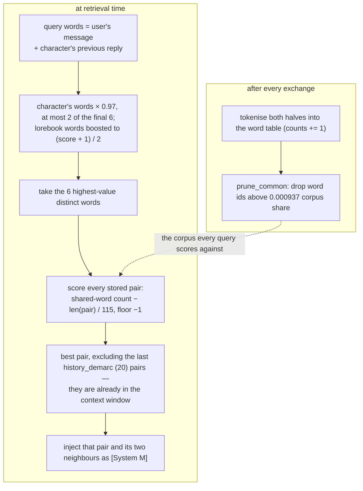
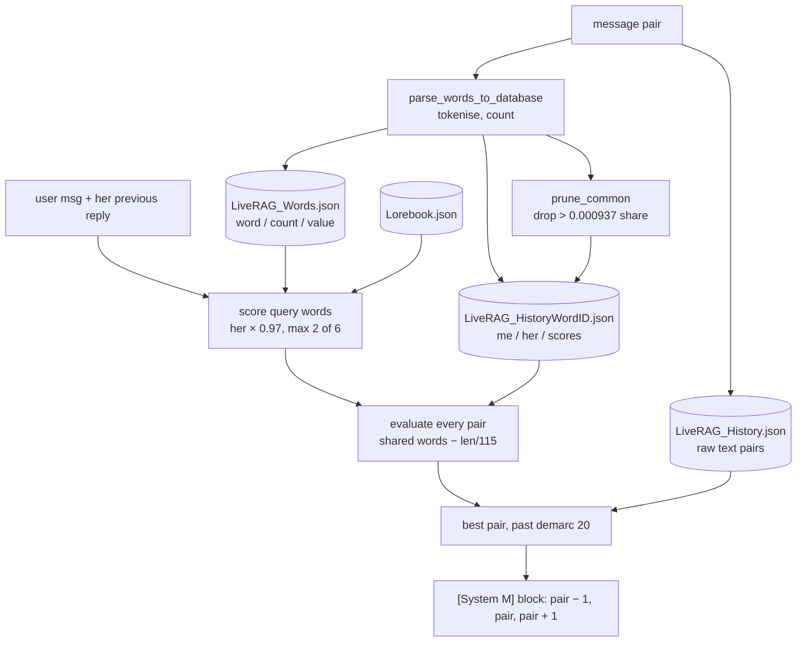

## 1. Executive Summary

Z-Waif is a local VTuber-style companion, and one mechanism in
`utils/based_rag.py` (628 lines) is why this report exists.

**Query terms are drawn from the user's message *and the character's own previous
reply*, and the character's contribution is deliberately clamped** — multiplied
by `0.97` and allowed to occupy at most **two of the six** query slots
(`:202`, `:237`). Without that cap, a character that says a distinctive word
retrieves the memory containing it, repeats it, and retrieves it again. The
self-reinforcement loop — an agent's own output biasing what it recalls, which
biases its next output — is a hazard this atlas names repeatedly and finds
addressed almost nowhere, including in systems with embeddings, rerankers and
far more machinery. Here it is closed by a multiplier and a counter.

Alongside it, one more idea with no counterpart elsewhere: a query word that
appears as a lorebook keyword is pulled halfway to a perfect score,
`(score + 1) / 2` (`:172`). Hand-authored knowledge biases the statistical
retrieval rather than running beside it, for the cost of a dictionary lookup.

The surrounding scorer is hand-rolled with no embedding model, no vector store
and no dependency heavier than `json`. It independently arrives at three of
BM25's ideas — a smoothed inverse-frequency weight `(1 / (count + 19)) * 20`
(`:431`), a stopword cutoff derived from corpus share rather than a list
(`:439`), and a subtractive length penalty its author named *"fillabustering"*
for long messages winning by mass (`:479`). That is worth knowing as context
rather than as praise: rediscovering IDF is not an achievement, the constants
`19`, `20`, `0.000937` and `115` are unexplained, and arriving at a
well-published result by hand is mostly evidence that the literature was not
consulted. **The two mechanisms above are the transferable content; the
archaeology is why they are surprising, not why they are good.**

Three findings run the other way. **`central_score` is computed and never read**
(`:280-282`) — three lines sum a candidate with its two neighbours while the
selection immediately below uses the bare single-message score, and the injection
format assumes exactly the window those three lines describe.
**`best_message_score` starts at `0` over a scorer that returns negatives**, so
an all-negative corpus leaves the index at `0` and injects
`history_database[-1]`, the newest exchange, labelled as a distant memory. And
the licence, presented on the reading list this repository came from as
open-source, is **not open source** — see section 9. There are no tests.

## 2. Mental Model

A memory is a **message pair** — one user turn, one character turn — stored twice:
as raw text in `history_database`, and as a pruned list of word ids in
`histories_word_id_database`.

There is no state a memory can be in. It is stored, it is scored, it is
retrieved or it is not. Nothing expires, nothing is superseded, nothing is
verified, and — apart from an undo of the most recent turn — nothing is deleted.
Memory is **fully automatic**: the user never writes to it and neither does the
model.

The one hand-authored surface is the lorebook, and it is worth reading next to
[SillyTavern's](../sillytavern/), because it is the same idea with the
interesting part removed. `Configurables/Lorebook.json` holds entries of
`{'0': keyword, '1': text, '2': cooldown}`, and a commented-out `lorebook_check`
(`utils/lorebook.py:15-35`) shows a working cross-turn lockout: fire, set the
counter to 9, decrement once per turn, refuse to fire while it is nonzero. The
live `lorebook_gather` **resets every counter to zero at the start of each call**
(`:50-51`) and sets `['2'] = 7` purely to prevent the same entry matching twice
within one pass. The cooldown survives as a field; its semantics were deleted,
and the 7 is now an arbitrary nonzero.

## 3. Architecture

Python, no server, no database. Three JSON files:

### Deployment and ergonomics

- **What has to be running:** the app. Storage is three JSON files in
  `RAG_Database/`.
- **Local and offline: completely, and more so than anything else in this
  atlas.** No embedding model, no GPU, no API key, no network. Retrieval is
  arithmetic over integer lists.
- **Cost: stated by the author, in a comment.** Enabling it makes things about
  10% slower, and the advice is to turn it on at roughly 60 message pairs
  (`:47-49`). A memory system that tells you its own overhead and its own
  cold-start threshold is rarer than it should be.
- **Hand-repairable: yes** — three readable JSON files, plus
  `manual_recalculate_database` (`:609`), which rebuilds everything from the raw
  history and is the designated repair for any drift.

## 4. Essential Implementation Paths

All references are `utils/based_rag.py` unless noted.

**State.** `word_database` (`:16`) seeded with `["", " ", "the", "it"]` at count 1
each; `histories_word_id_database` (`:24`) with parallel `me`, `her` and `scores`
lists, starting empty; `history_database` (`:30`) starting with one seed row;
`history_demarc = 20` (`:37`).

**Write.** `add_message_to_database` (`:489`) — reads the latest pair from the
API's history, returns early if it duplicates the last stored pair
(*"Preventing dupe in RAG!"*), walks backwards past any `[System D]` message,
tokenises both halves, appends the text, and prunes the new row. Its own comment
warns the two structures *"may not sync 1:1 to history due to system messages"*.

**Weights.** `calc_word_values` (`:427`) — `(1 / (count + 19)) * 20` over the
whole table. `prune_common` (`:439`) — removes word ids above the
`0.000937` corpus share, restarting its index at 0 after every removal, which
makes it quadratic in the pruned count.

**Retrieval.** `run_based_rag` (`:135`) — recompute weights on a
`random.randint(0, 100) > 70` coin flip (`:158-159`); score the user's words;
boost any word in the lorebook to `(score + 1) / 2` (`:172`, and `:199` for the character's); append the
character's previous reply's words at `× 0.97` (`:202`); select six distinct
highest-scoring words with the character capped at two (`:210-245`); score every
stored pair with `evaluate_message` (`:465`, called at `:266`); pick the best before the demarc
(`:285`); build the `[System M]` block from `best - 1`, `best`, `best + 1`
(`:298`).

**Dead code.** `:280-282` sums `scores[i-1] + scores[i] + scores[i+1]` into
`central_score`. The next statement selects on `scores[i]`. `central_score` is
never read again anywhere in the file.

**Delete.** `remove_latest_database_message` (`:529`) pops the last row from
`me`, `her` and `scores` — and not from `history_database`. Its comment states
the other half of the problem outright: it *"Does NOT uncount words"*, on the
reasoning that the corpus is large and a manual recalculate can fix it. Called
from `API/Oogabooga_Api_Support.py:624` and `API/api_controller.py:699` on undo.

**Persistence.** `store_rag_history` (`:547`) and `load_rag_history` (`:564`) —
whole-file JSON dumps and loads.

**Background.** `word_value_passive_calculation` (`:618`) — a thread sleeping 120
seconds and calling `calc_word_values`, labelled *"NYI"* in its own comment
because the intended smarter version was never written; the simple loop runs
regardless.

**Lorebook.** `utils/lorebook.py` — `lorebook_gather` (`:38`) matching keywords
against seven hand-written suffix forms (`" word "`, `" word'"`, `" words"`,
`" word!"`, `" word."`, `" word,"`, `" word?"`); `rag_word_check` (`:74`) the
coupling into the scorer.

## 5. Memory Data Model

Four parallel lists and a text list. There is no record, no id, no timestamp, no
author, no source, no confidence and no scope. A memory is an index into three
arrays that are expected to stay aligned.

They are not guaranteed to. `histories_word_id_database` starts empty while
`history_database` starts with a seed row; `add_message_to_database` appends to
both but its comment concedes the alignment is approximate; and the undo path
pops one and not the other. `manual_recalculate_database` exists precisely
because drift is expected — it is a **rebuild-from-source repair** treated as a
routine operation rather than a recovery, which is an honest response to a data
model that cannot maintain its own invariants.

**Scoping is absent entirely.** One corpus, one character, one installation. Not
withheld on the usual single-user grounds so much as never contemplated.

## 6. Retrieval Mechanics

The interesting comparison is not with the other companion apps but with BM25,
which this independently approximates:

| BM25 component | Z-Waif's version |
| --- | --- |
| IDF term | `(1 / (count + 19)) * 20`, capped at 1 |
| Stopword handling | corpus-share cutoff at `0.000937` |
| Document-length normalisation | `− len(hist_word_ids) / 115`, floored at −1 |
| Term frequency saturation | none — a term counts once per document |
| Query construction | top 6 distinct words by weight |

Three of the five are present. The missing one, term-frequency saturation,
matters least in a corpus of short chat turns.

Two mechanisms have no BM25 counterpart and are the better ideas:

**The self-citation cap.** Query words come from the user's message *and* the
character's own previous reply — sensible, since a reply carries the topic — but
the character's contribute at `0.97` and can occupy at most two of the six slots.
Without that cap, a character that says a distinctive word retrieves the memory
containing it, repeats it, and retrieves it again. This atlas records that loop
as a hazard in systems with far more machinery; here it is closed with a counter
and a multiplier.

**Lorebook coupling.** A query word that appears as a lorebook keyword is pulled
halfway to a perfect score: `(score + 1) / 2`. Hand-authored knowledge does not
enter the corpus — it biases the statistical retrieval toward the terms a human
declared important. That is a genuinely novel hybrid of the two shapes this atlas
usually finds separately, and it costs one dictionary lookup.

**The failure modes are real and mostly acknowledged.** Retrieval returns exactly
one pair per turn, plus its two neighbours, with no notion of returning nothing —
if every candidate scores badly, the least-bad one is still injected under the
header *"This is from your past memory, relevant to what is currently
happening"*. Worse, `best_message_id` is initialised to `0` and only replaced when
a score meets `best_message_score`, which starts at `0`; since
`evaluate_message` can return negative values, an all-negative corpus leaves the
index at `0`, and `history_database[0 - 1]` is Python's last element — the most
recent exchange, presented to the model as a distant memory.

And the neighbour window is injected without the neighbour scores being consulted,
because `central_score` — the three-message sum that would have done exactly that
— is computed and discarded.

## 7. Write Mechanics

**Zero-LLM capture, and zero-model retrieval.** No model is called on the write
path or the read path. Every exchange is tokenised and counted; nothing is
summarised, extracted, judged or embedded. This atlas has a
[zero-LLM capture](../../patterns/zero-llm-capture/) pattern; Z-Waif is the
furthest point along it, since even the ranking is arithmetic.

The advantages are exactly the ones that pattern predicts: no extraction error,
no hallucinated fact, no summarisation drift, no token cost, no lag — a pair is
retrievable on the next turn — and no failure mode that requires a model to be
available. The disadvantage is that nothing is ever condensed, so the corpus
grows without bound and every retrieval scans all of it.

**Maintenance is amortised by coin flip.** Recomputing every word's value is
`O(vocabulary)` and does not need to happen every turn, so it happens on a
`random.randint(0, 100) > 70` — roughly one turn in three — plus a background
thread every 120 seconds. Randomised amortisation instead of a counter or a
schedule is unusual, and for this purpose entirely sound: the work is idempotent
and slightly stale weights change nothing.

**Deletion is undo-only and knowingly incomplete.** The word counts are not
decremented, and the comment says so and says why. The reasoning is defensible at
scale, and the consequence is that a deleted message keeps voting on every future
IDF weight for as long as the corpus lives. Set against
[RisuAI](../risuai/), which drops any summary whose source message is gone, this
is the same problem answered in the opposite direction — and the difference is
that Z-Waif states its answer in a comment rather than leaving it to be
discovered.

### Operational cost

- **The write path is synchronous but trivial** — tokenising two strings.
- **Zero lag to retrievability.**
- **The read path is `O(corpus)` every turn**, in interpreted Python `while`
  loops. This is the real cost, and the author quantifies it: about 10% slower
  overall.
- **`prune_common` restarts its scan index after every removal**, making it
  quadratic in the number of pruned words on each new message.
- **The injection is a fixed three-pair block** at a stable position — small,
  bounded, and the one place this design is cheaper than an embedding system.

## 8. Agent Integration

None. `call_rag_message` (`:313`) returns the prepared string and the app splices
it into the prompt. No API, no tools, no agency.

## 9. Reliability, Safety, and Trust

**None of the seven rubric capabilities is present**, and for most of them the
concept has no place to live in four parallel lists.

**The licence is the finding that matters most here, because it is a fact a
reader would act on.** The file is headed *"Modified MIT License"* and the
modifications are substantial:

- **A 2% royalty** on all gross income of any entity using the software in whole
  or in part, once cumulative gross from products involving it exceeds $100,000,
  with distribution among contributors at the author's sole discretion.
- **A data-collection clause** requiring explicit consent and terms of service
  that the user must accept on opening any derivative.
- **An "Ethical Treatment" clause** forbidding the licensee from subjecting the AI
  to neglect or mistreatment, *"DEFINED AT SugarcaneDefender's SOLE DESCRECION"*,
  with licence revocation and legal action as remedies.

A field-of-use restriction whose meaning is set unilaterally by the licensor, plus
a royalty, is **source-available, not open source** under any standard reading.
The list this repository was drawn from described it as an open-source
repository; that is wrong, and anyone considering the code should read the
licence first. This is not a criticism of the software.

**Prompt injection is structurally absent on the write path** — no model reads the
memory to write it — but the retrieved block is injected as `[System M]` text and
contains whatever was said in a past exchange, so a poisoned turn stays retrievable
forever with no way to remove it.

**Data loss:** whole-file JSON rewrites with no atomic replace and no backup. A
crash during `store_rag_history` truncates the corpus.

## 10. Tests, Evals, and Benchmarks

**No tests of any kind exist in the repository.**

For a system whose entire behaviour is arithmetic over lists, this is the most
avoidable gap in this atlas — every property is a pure function of data:

- `evaluate_message` with no shared words and a 115-word candidate returns −1.
- A word at exactly `0.000937` corpus share is not pruned; above it, it is.
- Six query words are returned distinct, with at most two from the character.
- With all-negative scores, retrieval does not return the most recent exchange.
- `remove_latest_database_message` leaves the two databases at consistent
  lengths.

The fourth and fifth are live bugs, and both would have been caught by writing the
test. `negative_eval` is withheld.

No benchmarks, and the ones in [this atlas's survey](../../benchmarks/) do not
apply — nothing is extracted, so there are no facts to recall.

## 11. For Your Own Build

### Steal

- **Cap how much the agent's own output contributes to its own query.** Two of six
  slots at `× 0.97` closes the self-reinforcement loop for the cost of a counter.
  Systems with embeddings and rerankers have this problem and no guard.
- **Let hand-authored keywords bias statistical retrieval instead of competing
  with it.** `(score + 1) / 2` on a lorebook hit is a one-line way to say *"a human
  told me this word matters"* without maintaining a second retrieval path.
- **Penalise candidate length explicitly.** Whatever your scorer, long documents
  win on shared-term counts. A subtractive length term with a floor is the
  cheapest correction, and the author's name for the failure — long messages
  winning by mass — is the clearest statement of it in this atlas.
- **Derive your stopwords from your corpus.** A share threshold adapts to the
  domain and needs no list to maintain.
- **Amortise idempotent maintenance randomly.** A coin flip per turn needs no
  scheduler and no counter, and slightly stale weights are harmless.
- **Say what your memory costs and when to turn it on.** *"About 10% slower"* and
  *"enable at ~60 message pairs"* in a comment is more operational guidance than
  most systems here publish anywhere.

### Avoid

- **Parallel arrays as a memory model.** Three structures that must stay aligned,
  seeded at different lengths, with a delete path that pops one of them, and a
  rebuild-from-source function that exists because drift is expected. Give a
  memory an id.
- **A retrieval that cannot return nothing.** One result is always injected under
  a header asserting relevance, no matter how badly it scored. A floor below
  which you return nothing is nearly free and stops the model being told that
  something irrelevant is a memory.
- **An initial best-score of zero over a scorer that returns negatives.** The
  sentinel must be below the scale, or the untouched index is returned as a
  result — here, the newest exchange presented as an old one.
- **Leaving a computed score unused.** `central_score` looks like the neighbour
  smoothing the injection format already assumes; whether it was reverted or
  never finished, the code claims a behaviour it does not have.
- **A delete that does not decrement.** The reasoning is stated and defensible;
  the effect is that removed content votes on relevance forever.

### Fit

If you want a long-running local companion on a machine with no GPU budget, and
your corpus is chat turns rather than documents, this design is a legitimate
choice and cheaper than anything else in this atlas. It is also the best worked
example here of how far plain arithmetic gets you: three of BM25's five ideas,
plus two the literature does not emphasise.

Do not adopt the code. The licence is source-available with a discretionary
field-of-use clause and a royalty, the data model cannot maintain its own
invariants, and there are no tests. Adopt the scoring function — which is forty
lines you could rewrite over a proper store in an afternoon, and which contains
the two ideas worth having.

## 12. Open Questions

- **Was `central_score` reverted or never finished?** It computes exactly the
  neighbour-window score the injection format assumes, and the commit that
  introduced it would say which.
- **Where do `19`, `20`, `0.000937` and `115` come from?** All four are load-
  bearing, none is explained, and whether they were fitted to a real transcript or
  tuned by feel changes how portable the scorer is.
- **What is the practical corpus size at which the `O(corpus)` scan hurts?** The
  author's 10% figure presumably comes from their own history; the scaling was not
  measured.
- **Does the undo desync ever surface?** `history_database` keeps a row that the
  word-id lists drop, and only `manual_recalculate_database` restores alignment;
  whether users notice a wrong memory being quoted is not answerable from the
  code.
- **Why was the lorebook's cross-turn cooldown abandoned?** The working version is
  commented out immediately above the one that resets it every call.

## Appendix: File Index

**Retrieval and storage** — `utils/based_rag.py`

- State: `word_database` (16), `histories_word_id_database` (24),
  `history_database` (30), `history_demarc` (37), author's overview comment (47–49)
- `setup_based_rag` (52)
- `run_based_rag` (135) — random recompute (158–159), lorebook boost (172, 199),
  character's words at 0.97 (202), six-word selection with the two-word cap
  (210–245), per-pair scoring (266), **unused `central_score` (280–282)**,
  selection (285), `[System M]` assembly (298)
- `call_rag_message` (313), `parse_words_to_database` (318)
- `calc_word_values` (427), `prune_common` (439), `evaluate_message` (465)
- `add_message_to_database` (489), `remove_latest_database_message` (529)
- `store_rag_history` (547), `load_rag_history` (564)
- `manual_recalculate_database` (609), `word_value_passive_calculation` (618)

**Lorebook** — `utils/lorebook.py`

- Load (10–11), commented-out cross-turn lockout (15–35), `lorebook_gather` (38)
  with the per-call cooldown reset (50–51), `rag_word_check` (74)

**Undo callers**

- `API/Oogabooga_Api_Support.py:624`, `API/api_controller.py:699`

**Licence**

- `LICENSE` — "Modified MIT License": royalty clause (b), ethical-treatment clause
  (c)

**Tests**

- None.

## History

**2026-07-29** — [`aaf905c12efcbd2a709a3b2285f55e554d47484f`](https://github.com/SugarcaneDefender/z-waif/commit/aaf905c12efcbd2a709a3b2285f55e554d47484f) — first reading.
