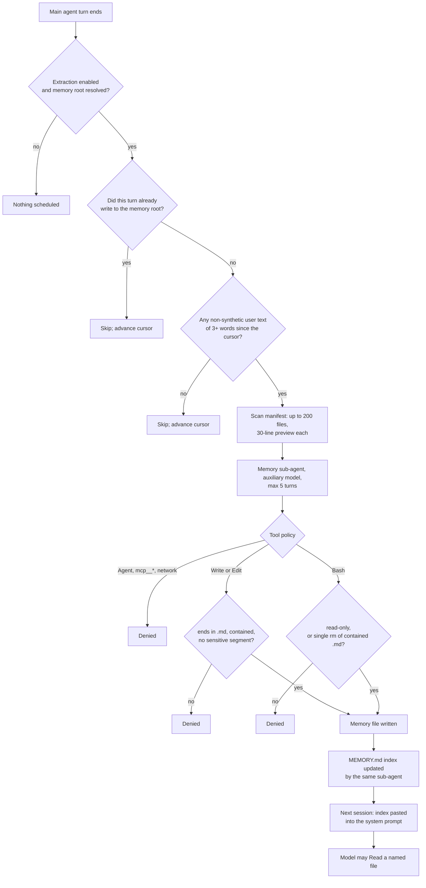

## 1. Executive Summary

ZCode is Z.ai's coding-agent harness, opened as a single `feat: open source`
commit under Apache-2.0: a TypeScript monorepo of roughly 126 MB spanning a CLI,
a desktop Electron app, a web client and a server. Its durable memory is a small
part of that — about 1,370 lines across two packages — and is worth reading
anyway, because the interesting engineering is not in the storage format but in
the **permission machinery wrapped around it**.

The memory itself is unremarkable by design: one Markdown file per fact, with
`name`, `description` and `metadata.type` frontmatter drawn from a closed set of
four types, and a `MEMORY.md` index whose entries are one line each. There is no
database, no embedding, no ranking. Recall is the index file pasted into the
system prompt; anything deeper happens because the model chooses to `Read` a
filename it saw there.

What surrounds that is careful. Memory Markdown writes are **auto-allowed** —
the confirmation a user would otherwise see is removed — and that grant is
conditioned on containment, an `.md` suffix, and a denylist of path segments
whose normaliser strips Unicode bidi controls, truncates at `:` for NTFS
alternate data streams, and trims trailing dots and spaces. The background
writer runs as a sub-agent under its own tool policy, and its delete path is a
parsed shell grammar rather than a string check.

The gap is verification. There is no test runner configured anywhere in the
repository, no manifest declares a `test` script, and there is no CI directory —
while `apps/zcode-cli/.husky/pre-commit` runs `pnpm test`. Four test files exist
in the entire tree, none of them touching memory. Every mechanism below has a
producer on a reachable path; none of them has a committed case proving it
holds.

## 2. Mental Model

A memory in ZCode is **a file the model wrote about the user, which the model
will later be reminded exists**.

That phrasing is exact, and the second half is where the design differs from
most of this corpus. Nothing retrieves. At session start the runtime reads one
file — `MEMORY.md` — formats it, and injects it into the request context under a
header stating that the instructions it contains override default behaviour.
Every other memory file is invisible until the model decides, from the index
line alone, that it is worth opening. Relevance is therefore judged by the model
against a 150-character hook, not by a scorer against a query.

Writing is separated from the conversation. After a turn, the runtime schedules
a **memory extraction sub-agent** on an auxiliary model, hands it the recent
messages and a manifest of existing memory files, and confines it: `Read`,
`Grep`, `Glob`, read-only Bash, `Write`/`Edit` restricted to Markdown inside the
memory root, and `rm` restricted to individual absolute `.md` paths inside the
same root. `Agent`, every `mcp__` tool and anything declaring a network side
effect are refused outright.

There is no epistemic state. A memory is not a candidate, is never verified, and
carries no confidence. The prompt handles staleness by instruction — check the
file exists, grep for the flag, trust what you observe now — and the store keeps
no record of whether that check happened.



## 3. Architecture

Two packages carry memory, and they do not talk to each other.

`apps/zcode-cli/packages/core/src/memory/` is the agent side, 1,003 lines across
eight files: path resolution and the sensitive-segment denylist
(`memory-file-path.ts`), the project directory derivation (`project-root.ts`),
the manifest scanner (`recall/manifest.ts`), the index formatter
(`index-content.ts`), the extraction scheduler (`extraction.ts`) and the
confined agent loop (`memory-agent-loop.ts`). Beside it,
`subagent/persistent-memory.ts` gives each declared sub-agent profile its own
memory root at one of three scopes.

`packages/services/src/memory/` is the desktop side, 370 lines, and is
**read-only**: `IMemoryService` declares exactly `listProjectMemories` and
`readProjectMemoryFile`. No write, update, delete or approve method exists on
that interface or anywhere calling it.

Operationally this costs nothing to stand up. There is no server, no queue, no
migration and no index to rebuild; the store is a directory, and an operator
who deletes it loses the memories and nothing else. The one runtime dependency
is a model — extraction issues its own provider requests, which `NOTICE.md`
states plainly as a cost consequence of enabling the feature.

Defaults differ by distribution. `NOTICE.md` records that the standalone CLI
enables memory by default while the desktop app ships it off; the desktop side
of that is visible in code, where `packages/services/src/node.ts:2253` reads
`settings.memoryEnabled === true` and `onboardingRecordService.ts:156` defaults
the same field to `false`. Headless CLI runs are a third case:
`prompt-command.ts:232` sets `extractionEnabled` from a `--memory-bench` flag,
so a non-interactive run reads memory and does not write it.

## 4. Essential Implementation Paths

**Where a memory lives.** `resolveProjectMemoryRoot` (`project-root.ts:10-24`)
joins `cliStorageRoot`, `memories`, `projects`, a `<slug>-<hash>` pair and
`memory`. The hash is the first 16 hex characters of a SHA-256 over either an
explicit `workspaceIdentity` or the resolved workspace path, lowercased on
`win32` only; the slug is the directory basename sanitised to 48 characters, or
the literal `project` when an identity was supplied.

**What may be written there.** `resolveContainedMemoryFilePath` resolves the
requested path through the workspace path policy and requires the result to be
a non-escaping relative path under the root. `resolveSafeMemoryFilePath` adds
the denylist. The distinction matters, because the two are used in different
places and the difference is load-bearing — see section 9.

**How a write stops asking.** `applyMemoryFilePermission`
(`tool/executor/memory-file-permission.ts:19-46`) is called from
`permission-flow.ts:93` and again from `permission-input-recheck.ts:56`. It
returns the incoming decision untouched unless the target is a memory `.md`
path that clears `resolveSafeMemoryFilePath`, then overrides to
`allow` with `ruleId: "memory.file.markdown"`.

**When extraction runs.** `scheduleProjectMemoryExtraction`
(`runtime/helpers/project-memory-extraction.ts:32-81`) returns early while
shutting down, when `extractionEnabled` is `false`, when no memory root
resolves, on a remote workspace, or without a session store. It captures the
active conversation branch — honouring a rewind's branch cut and kept message
ids — and schedules a snapshot ending at the latest message.

**What the writer may do.** `evaluateMemoryAgentToolPolicy`
(`memory-agent-loop.ts:121-163`) decides per tool call, on the execution
boundary rather than by narrowing the catalogue: the provider request keeps the
main agent's real tool list (`memory-agent-loop.ts:70-71`), and refusals come
back as tool errors the model can read.

## 5. Memory Data Model

A memory is a Markdown file with YAML frontmatter:

```markdown
---
name: <short-kebab-case-slug>
description: <one-line summary, used to decide relevance during recall>
metadata:
  type: user | feedback | project | reference
---
```

`MEMORY_RECALL_TYPES` (`recall/types.ts:1`) fixes the vocabulary at `user`,
`feedback`, `project`, `reference`, and the manifest parser accepts the type at
either `metadata.type` or a bare top-level `type`, discarding anything outside
the set. `MemoryManifestEntry` carries `description`, `filePath`, `filename`,
`mtimeMs` and `type` — five fields, of which exactly one is a timestamp.

That single timestamp is the whole temporal model, and it is filesystem
mtime rather than anything the system records. There is no validity interval, no
record time distinct from event time, and no supersession pointer. A memory that
stops being true is expected to be edited or removed in place.

Bodies are free text with two conventions the prompt asks for and nothing
enforces: `**Why:**` and `**How to apply:**` lines for the `feedback` and
`project` types, and `[[name]]` wiki-links between memories. No parser in the
tree reads either. The links are advisory — the prompt explicitly says a
`[[name]]` matching nothing is acceptable, marking a memory worth writing later
— so the graph they describe exists only in the model's reading.

`MEMORY.md` is excluded from the manifest by basename
(`recall/manifest.ts:77`) and is not a memory: the prompt calls it an index and
forbids putting content in it.

## 6. Retrieval Mechanics

There is no retrieval, in the sense this atlas usually means. Two code paths
read memory, and neither takes a query.

The first is context assembly. `loadProjectMemoryIndexContent`
(`runtime/methods/context.ts:168-195`) reads `MEMORY.md`, runs it through
`formatProjectMemoryIndexContent`, and — worth noting — seeds
`runtime.readFileState` with the result, so a later `Edit` of the index does not
fail the harness rule requiring a prior `Read`. `buildProjectMemoryIndexContent`
(`context/sections/request-user-context.ts:72-86`) then wraps it as *Contents of
.../MEMORY.md (user's auto-memory, persists across conversations)* inside a
block prefixed with the instruction that these contents override default
behaviour.

Truncation is by two limits at once (`index-content.ts:3-4`): 200 lines and
25,000 characters, whichever binds first, and the truncated text carries an
appended warning naming which limit was hit and telling the reader to move
detail into topic files. That warning is a genuinely good touch — the failure it
describes is silent everywhere else.

The second path is the manifest scan, and it exists **only for the writer**.
`scanMemoryManifest` walks the memory root, admits `.md` files and symlinks
resolving to files, reads the first 30 lines of each for frontmatter, sorts by
`mtimeMs` descending and slices to 200. Its single caller is
`executeProjectMemoryExtraction`, which passes the result to
`buildMemoryExtractionPrompt` under the heading *Existing memory files* so the
sub-agent updates rather than duplicates. The main agent never sees it.

## 7. Write Mechanics

Writes do not block the agent. `scheduleProjectMemoryExtraction` hands a promise
to a scheduler that coalesces: if a run is in flight, the new snapshot replaces
any pending one rather than queueing, so a fast conversation produces one
extraction per idle moment and not one per turn. The lag before a memory is
retrievable is therefore a model round-trip plus whatever the sub-agent spends
inside its five-turn budget, and a memory written after the next session already
began will not be in that session's index.

Two gates decide whether the model is invoked at all
(`extraction.ts:68-83`). `containsDirectMemoryWrite` skips when the main agent
already wrote to the memory root in this window — the user asked to remember
something and it was saved inline, so a second pass would duplicate it.
`containsEligibleUserProse` skips unless some non-synthetic, non-`model-only`
user message since the cursor carries at least three words. Both skips still
advance the cursor; a failed run does not.

Nothing rewrites the store wholesale. There is no consolidation pass, no
summarisation of old memories, no compaction. The only mutations are the ones
the sub-agent issues: `Write`, `Edit`, or `rm`.

The `rm` grammar (`memory-agent-loop.ts:182-211`) deserves quoting in full
because it is a parser, not a pattern. The command must analyse to exactly one
invocation, `argv[0]` must be `rm`, redirects and environment assignments are
rejected, `-r`, `-R` and `--recursive` are rejected by regex over short-option
clusters, any argument containing `*`, `?` or `[` is rejected, every remaining
argument must be absolute, end in `.md`, and resolve inside the memory root, and
at least one path must remain.

## 8. Agent Integration

Memory reaches the model in three distinct ways, which is one more than most
harnesses here.

`buildMemorySection` (`context/sections/memory.ts:8-23`) emits a system-target
section named `Memory` with `cacheHint: "dynamic"`, carrying the frontmatter
template, the four type definitions in one line each, the index convention, and
a short what-not-to-save rule. This is the main agent's copy, and it is terse.

`buildPersistentAgentMemoryPrompt` (`subagent/persistent-memory-prompt.ts`) is
the long form, 140 lines of template used for sub-agent profiles that declare a
`memory` scope. It carries XML-tagged type definitions with worked examples, a
what-not-to-save list, a *Before recommending from memory* section requiring the
model to check that a named file or flag still exists, and a passage separating
memory from plans and tasks. Scope guidance is appended per scope: `user`
memories should stay general, `project` memories are shared through version
control, `local` memories are machine-specific.

`buildMemoryExtractionPrompt` (`extraction.ts:42-66`) is the third, and it is
the operational one: it names the allowed tools, states that everything else
will be denied, and gives a turn-budget strategy — all reads in parallel on turn
one, all writes in parallel on turn two — because `Edit` requires a prior `Read`
and the budget is five.

This prompt material tracks the memory instructions Anthropic ships in Claude
Code closely enough to be worth stating as a fact about the tree: the same four
types, the same `MEMORY.md` index convention, the same `[[name]]` linking, the
same what-not-to-save categories and the same staleness warning, in largely the
same wording. Elsewhere in the repository
`packages/services/src/zcode-session/importedClaudeSessionRepair.ts` and
`packages/services/test/importedClaudeRecovery.test.ts` handle importing Claude
Code sessions. `NOTICE.md` section four states that the root Apache-2.0 licence
covers first-party code and does not extend to copied code or third-party
material, without identifying which files it means.

## 9. Reliability, Safety, and Trust

**The grant is the mechanism, and its guard is the right one.** Two resolvers
exist: `resolveContainedMemoryFilePath` checks containment, and
`resolveSafeMemoryFilePath` adds the sensitive-segment denylist. The permission
override calls the stricter one; the looser one is used only to *identify*
whether a call targets memory at all. That ordering is easy to get backwards and
is correct here.

The denylist itself (`memory-file-path.ts:5-25`) names `.git`, `hooks`,
`.husky`, `.githooks`, `node_modules`, `.vscode`, `.idea`, `head`, `config`,
`objects`, `refs`, `.zcode`, `skills`, `commands`, `agents`, `.cargo`,
`.devcontainer`, `.yarn` and `.mvn` — a list chosen so that a model writing
"memory" cannot write anything that later executes. `normalizeSensitiveSegment`
lowercases, strips `U+200C`–`U+200F`, `U+202A`–`U+202E`, `U+206A`–`U+206F` and
`U+FEFF`, takes the substring before the first `:`, and trims trailing dots and
spaces. Each of those three transformations answers a specific bypass: a bidi
override hiding a segment name, an NTFS alternate data stream suffix, and
Windows path normalisation of `hooks.` to `hooks`.

**The asymmetry.** The delete grammar calls `resolveContainedMemoryFilePath`
(`memory-agent-loop.ts:207`) — containment only. The write path calls the
denylist version. So a Markdown file already sitting under a denied segment
inside the memory root can be removed but not written. The blast radius is
confined to Markdown under the memory root, which is why this is a remark rather
than a finding, but the two paths disagree and only one of them was reasoned
through.

**A defended branch that cannot fire.** `preservesExistingPermissionDecision`
(`memory-file-permission.ts:74-86`) preserves an existing `deny` except
`mode.plan.nonReadOnly`, preserves `alwaysAsk`, and preserves two named `ask`
rules. Its comment states that the `alwaysAsk` branch is unreachable, since only
`Write` and `Edit` reach memory targets and neither declares the flag — and
keeps it anyway, naming the failure it would prevent if someone added it. That
is the opposite of the unwired mechanism this atlas usually finds: a guard
written for a state that does not exist yet, with the reasoning recorded beside
it.

**The desktop viewer reads carefully and only reads.**
`readProjectMemoryFileFromStableHandle`
(`packages/services/src/memory/projectMemoryStableRead.ts`) `lstat`s before
opening, opens with `O_NOFOLLOW`, `lstat`s again, compares `dev`, `ino`, `size`,
`mtimeNs` and `ctimeNs` across three snapshots including one taken after the
read completes, and bounds the read at 5 MiB. Its comments name the attack: a
path validated and then replaced by a symlink before the read. This is a viewer,
not a review surface — there is no approve, edit or delete on `IMemoryService` —
so it does not earn `human_review`, and the care is worth recording separately
from the mark.

**No capability marks.** Nothing records a rejected value, so there is no
tombstone; `rm` leaves no trace that would stop the next extraction re-asserting
the same fact. There is no discrete epistemic status, so no `trust_state`. One
mtime, so no `bitemporal`. Scoping is a filesystem partition rather than a key
on a record or a predicate on a read, which this atlas deliberately does not
count. Telemetry spans are emitted around extraction but are observability, not
an append-only record in the system's own store. And with no test runner, there
is no committed case of any kind, negative or otherwise.

## 10. Tests, Evals, and Benchmarks

There are four test files in the repository:
`packages/services/test/importedClaudeRecovery.test.ts`,
`nonCliAcpRetirement.test.ts`, `providerConfigMigration.test.ts` and
`packages/ui/test/nonCliAcpRetirement.test.ts`. They use `node:test` with
`node:assert/strict`, they are real tests with meaningful assertions, and none
of them touches memory.

Nothing runs them. Parsing every `package.json` in the tree outside
`node_modules` finds **zero** manifests declaring a `test` or `test:*` script.
No `vitest.config` or `jest.config` exists anywhere. There is no `.github`
directory, so no CI. Meanwhile `apps/zcode-cli/.husky/pre-commit` is two lines,
`pnpm lint` and `pnpm test`, invoking a script no manifest defines.

No paper, no benchmark, no evaluation harness and no committed result relate to
memory. `--memory-bench` exists as a CLI flag enabling extraction in headless
runs, and `drainMemoryExtractions` accepts a `null` timeout with the comment
that a benchmark waits for natural completion rather than the bounded
60-second cancel — so a benchmark was anticipated. None is in the tree.

The honest summary is that every mechanism in sections 5 through 9 was read, not
verified. The denylist normaliser, the `rm` grammar, the permission override and
the extraction skip conditions are each the kind of logic that is one inverted
condition away from doing the opposite, and each is uncovered.

## 11. Patterns Worth Stealing

### Steal

**Parse the command, do not match it.** `isContainedMarkdownBashRemoval` runs
the project's own shell analyser, requires a single invocation, rejects
redirects and environment assignments before looking at arguments, rejects
recursion by regex over option clusters, rejects glob metacharacters, and
requires every remaining argument to be an absolute contained `.md` path. An
allowlist on a command string is a different and much weaker artefact.

**Normalise before comparing against a denylist.** Three transformations,
each answering a named bypass, in three lines. Any project comparing path
segments against a forbidden set needs this and most do not have it.

**Confine the writer at the execution boundary, not in the catalogue.** The
memory sub-agent is offered the main agent's full tool list and refused per call,
with the refusal text explaining the rule. The model can learn the boundary
within its five turns instead of hallucinating around a truncated schema.

**Make the truncation say so.** When the index exceeds 200 lines or 25,000
characters, the injected text carries a warning naming the limit and prescribing
the fix.

### Avoid

**A permission rule that grants.** The mechanism here removes a confirmation
rather than adding one. It is correctly guarded, and it is also the single place
where a mistake in `resolveSafeMemoryFilePath` becomes an unprompted write. Any
design of this shape needs the guard covered by tests; this one has none.

**Two resolvers, one denylist.** Having a strict and a loose path-resolution
function in the same module invites using the wrong one, and the delete path
already uses the loose one.

**Injecting memory as an override instruction.** Memory content is model-written
text about the user, wrapped in a header stating the contents override default
behaviour. Anything that reaches a memory file reaches the model with that
framing.

### Fit

This design suits a harness whose memory should be inspectable and disposable:
files you can read, diff, and delete with no index to rebuild and no service to
run. It is a poor fit for anyone who needs to *find* a memory rather than be
reminded one exists — at 200 index lines the model is choosing from hooks, and
there is no fallback when the hook is wrong. It is also a poor fit where a
memory's correctness matters more than its presence, because nothing in the
store can express doubt. Adopters wanting either property should read the
denylist and the `rm` grammar here, and build retrieval and trust elsewhere.

## 12. Antipatterns / Risks

**Verification is absent, not thin.** Not one manifest defines a test script and
no runner is configured, while a git hook calls one. The four committed tests
cover session import and config migration.

**The delete path is less strict than the write path.** Stated precisely in
section 9. It is a small window and it is real.

**A declared status with no producer.** `MemoryExtractionExecutionStatus`
(`extraction.ts:8`) admits `"no-op"`, and the only executor returns
`"success"`, `"aborted"` or `"error"`. The scheduler treats `"no-op"` exactly as
it treats `"success"`, so nothing currently depends on the gap — but a reader
comparing the type to the behaviour will find a state that cannot occur.

**Extraction can outlive the user's attention.** `shutdown()` aborts through an
`AbortController`, and the comment beside it
(`extraction.ts:172-174`) records the bug it fixed: closing a session left the
process running, so a pending extraction could still call the model and write
files after the user had moved on. The bounded 60-second drain is the
containment.

**Memory writes are model-authored text under an override header.** No trust
field, no review, no provenance beyond mtime. A wrong memory is a wrong
instruction until someone reads the directory.

**The store has no forgetting policy.** Files accumulate; the only pressure is
the 200-entry manifest cap and the index truncation warning, both of which cut
off what the model *sees* rather than what is kept.

## 13. Build-vs-Borrow Takeaways

Borrow the guards, not the store. `memory-file-path.ts` and the `rm` grammar in
`memory-agent-loop.ts` are 300 lines that solve a problem most agent harnesses
solve badly or not at all: letting a model write to disk on its own initiative
without letting it write anything that runs. They transplant cleanly into any
harness with a path policy and a shell parser.

Do not borrow the retrieval story unless the constraints match. An index in the
prompt plus model-issued reads works when memories are few, hooks are
well-written and the model is strong. It degrades quietly: the failure is a
memory that exists, is listed, and is never opened, and nothing in the system
reports that.

Build the tests you adopt this with. The mechanisms are sound as read and
entirely unverified. A project taking this design should port
`memory-file-path.ts` together with the cases it does not have — a bidi-hidden
segment, an NTFS stream suffix, a trailing-dot segment, a relative escape, a
non-Markdown target, and an `rm` carrying a glob.

## 14. Open Questions

- Is the delete path's use of the containment-only resolver deliberate? The two
  call sites are eight lines apart in different modules and the asymmetry is not
  commented, unlike most decisions in this code.
- What was `"no-op"` meant to distinguish? Its handling suggests an intended
  status for a run where the model output *Nothing to save.*, which the executor
  does not detect.
- Does `pnpm test` fail the pre-commit hook, or is the hook not installed in
  practice? The husky payload is inert in a fresh clone until `prepare` runs, and
  nothing in the tree answers what happens after it does.
- Is there a benchmark behind `--memory-bench` and the `null` drain timeout that
  was not opened with the rest of the source?

## 15. Appendix: File Index

| Path | Lines | What it holds |
| --- | --- | --- |
| `apps/zcode-cli/packages/core/src/memory/extraction.ts` | 301 | Extraction prompt, skip conditions, coalescing scheduler |
| `apps/zcode-cli/packages/core/src/memory/memory-agent-loop.ts` | 292 | Confined sub-agent loop and per-call tool policy, including the `rm` grammar |
| `apps/zcode-cli/packages/core/src/memory/recall/manifest.ts` | 137 | Manifest scan, frontmatter parse, 200-file and 30-line limits |
| `apps/zcode-cli/packages/core/src/memory/memory-file-path.ts` | 83 | Two resolvers, the sensitive-segment denylist and its normaliser |
| `apps/zcode-cli/packages/core/src/memory/index-content.ts` | 67 | Index truncation at 200 lines and 25,000 characters, with the warning |
| `apps/zcode-cli/packages/core/src/memory/origin-session.ts` | 51 | Origin-session bookkeeping for an extraction snapshot |
| `apps/zcode-cli/packages/core/src/memory/project-root.ts` | 33 | `<slug>-<sha256[0:16]>` directory derivation |
| `apps/zcode-cli/packages/core/src/memory/directory.ts` | 26 | Non-fatal memory-directory creation |
| `apps/zcode-cli/packages/core/src/memory/recall/types.ts` | 11 | `MEMORY_RECALL_TYPES` and `MemoryManifestEntry` |
| `apps/zcode-cli/packages/core/src/subagent/persistent-memory-prompt.ts` | 169 | The long memory prompt and per-scope guidance |
| `apps/zcode-cli/packages/core/src/subagent/persistent-memory.ts` | 110 | Three-scope sub-agent memory roots and tool projection |
| `apps/zcode-cli/packages/core/src/tool/executor/memory-file-permission.ts` | 86 | The auto-allow rule and what it refuses to override |
| `apps/zcode-cli/packages/core/src/runtime/helpers/project-memory-extraction.ts` | 178 | Scheduling, telemetry, five-turn cap, 60-second drain |
| `apps/zcode-cli/packages/core/src/context/sections/memory.ts` | 50 | The main agent's memory system-prompt section |
| `packages/services/src/memory/memoryService.ts` | 238 | Read-only listing and reading for the desktop viewer |
| `packages/services/src/memory/projectMemoryStableRead.ts` | 97 | `O_NOFOLLOW` stable-handle read with identity checks |
| `packages/services/src/memory/memory.ts` | 35 | `IMemoryService` and its two error codes |

### Recorded searches

Commands run at the repository root, for the absence claims above.

```sh
# No manifest anywhere declares a test script (0 results).
python3 -c 'import json,os
for dp,dn,fn in os.walk("."):
    dn[:] = [d for d in dn if d not in ("node_modules",".git")]
    if "package.json" in fn:
        p = os.path.join(dp,"package.json")
        try: s = json.load(open(p)).get("scripts",{})
        except Exception: continue
        t = [k for k in s if k == "test" or k.startswith("test:")]
        if t: print(p, t)'

# Every test-like file in the tree (4 results, none under a memory path).
find . \( -name "*.test.ts" -o -name "*.test.tsx" -o -name "*.spec.ts" \
  -o -name "*.spec.tsx" -o -name "*.test.mts" -o -name "*.test.js" \
  -o -name "*.spec.js" \) -not -path "*/node_modules/*"

# No test runner is configured (0 results).
find . \( -name "vitest.config*" -o -name "jest.config*" \) -not -path "*/node_modules/*"

# No CI directory.
ls -a .github

# No writer on the desktop memory service (0 results).
grep -rnE "writeProjectMemory|deleteProjectMemory|updateProjectMemory|approveMemory" \
  --include="*.ts" --include="*.tsx" . | grep -v node_modules

# "no-op" appears only in the type and the scheduler, never as a returned value.
grep -rn '"no-op"' --include="*.ts" . | grep -v node_modules
```

## History

**2026-09-21** — [`872ad960de7ec172591f7e1952f7849229f94521`](https://github.com/zai-org/ZCode/commit/872ad960de7ec172591f7e1952f7849229f94521) — first reading, at the repository's only commit. Screened before anything was read: 2 auto-run surfaces (`.vscode/settings.json` and `.vscode/tasks.json`, neither declaring `runOn: folderOpen`), 2 build-time execution points (`prepare: husky` and a `postinstall` rebuilding node-pty prebuilds), 35 dependency surfaces inside the seven-day cooldown and 29 unpinned manifests; `.gitattributes` was read before checkout and carries no `filter=`, and there is no `.gitmodules`. `AGENTS.md` is present and was treated as data. Nothing was installed, built or executed — which matters more than usual here, because no test runner is configured in the tree and the mechanisms described above are read rather than exercised. No capability marks.
