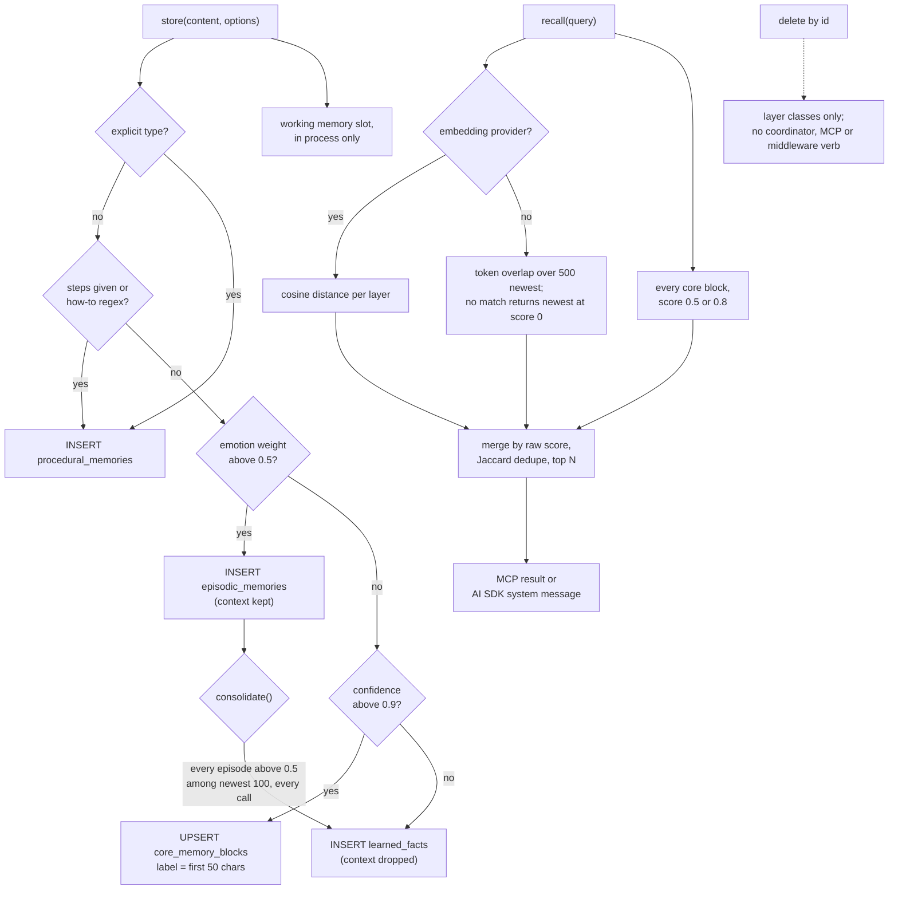

## 1. Executive Summary

ZenBrain is a TypeScript monorepo with two halves that the README presents as
one system. `@zensation/algorithms` is a dependency-free library of pure
functions named for memory research — FSRS scheduling, Hebbian strengthening,
Ebbinghaus curves, emotional tagging, sleep replay, Bayesian propagation and
ten newer modules.
`@zensation/core` is a `MemoryCoordinator` that stores text into four SQL tables
and recalls it, served by an MCP server, a Vercel AI SDK middleware and SQLite
or Postgres adapters.

What is notable is how little of the first half the second one calls. The
coordinator and its layers import four modules: the emotion lexicon for routing,
FSRS to fill a review queue, a string similarity for a cross-context layer, and
a context-similarity boost whose input nothing writes. No stored row decays,
strengthens, or is replayed. The project's own engineering hygiene is high: the
lexical fallback, the SQLite adapter and the MCP entry point each carry a
comment naming the defect they fixed and how it was measured.

What is weak is the memory contract. No agent-facing surface can delete or
correct a memory. `consolidate()` copies the same episodes into new facts on
every call. Every core block is returned by every recall, and the paper's
headline ablation runs on a simulation in which each mechanism is a hand-set
multiplier.

The paper is [arXiv:2604.23878](https://arxiv.org/abs/2604.23878), submitted 26
April 2026, v3 dated 9 August 2026. No capability mark is awarded; section 9
names all seven and why.

## 2. Mental Model

A memory is a string that `store()` routes into one of four tables and that
`recall()` finds later. It becomes a belief at the INSERT: there is no candidate
state, no extraction on the write path, and no check against what is already
stored. It stops being one only when a library caller deletes its row by id, or
when a core block is overwritten under the same label. Nothing expires.

**The layer is chosen by heuristic, in a fixed order.** An explicit `type` wins;
then `steps` or a regex such as `/^how to /i` makes a procedure; then an emotion
weight above 0.5 — from a keyword lexicon, or the caller's number — makes an
episode; then a caller `confidence` above 0.9 makes a core block; everything
else is a fact at confidence 0.7 (`packages/core/src/coordinator.ts:600-627`,
`:268-276`). The MCP tool exposes `confidence` with the description *"Above 0.9
routes to core memory"*, so the model chooses permanence by choosing a number.

**Core blocks are the one layer with identity.** The label is the first 50
characters of the content with non-alphanumerics stripped, and `upsertBlock`
overwrites on a label conflict (`coordinator.ts:260-266`;
`layers/core.ts:47-57`). Two different statements that open with the same 50
characters are one block, and the second replaces the first.

**Consolidation duplicates rather than promotes.** `consolidate()` reads the 100
newest episodes and writes a new fact for each whose emotional weight exceeds
0.5, with no marker on the episode (`coordinator.ts:403-444`). Every
auto-routed episode passed that threshold to become an episode, so every call
copies all of them again. Recall's Jaccard deduplication hides exact copies
(`:765-816`); an LLM summary that varies between passes does not collapse.

**The FSRS state is a flashcard schedule, not a retention signal.** Each fact is
stored with difficulty, stability and next-review time, and `recordReview`
updates them from a 1–5 grade (`layers/semantic.ts:143-171`). No read path uses
them for ranking or filtering; they feed `getReviewQueue` only (`:174-182`).
The only decay that runs is on the in-process working memory, which multiplies
slot relevance by `exp(-0.05 × minutes)` and drops slots below 0.01
(`layers/working.ts:97-111`).

## 3. Architecture

Six npm packages in one Turborepo. `@zensation/algorithms` has no runtime
dependencies and no storage. `@zensation/core` holds the coordinator, the seven
layer classes and four provider interfaces — `StorageAdapter`,
`EmbeddingProvider`, `LLMProvider`, `CacheProvider` — plus in-memory fakes for
tests (`packages/core/src/interfaces/`, `testing.ts`). The layers write
Postgres-dialect SQL with `$N` placeholders, `gen_random_uuid()`, `NOW()` and
the pgvector `<=>` operator.

`@zensation/adapter-postgres` runs that SQL on `pg` against the schema in
`sql/001_init.sql`: `vector(1536)` columns with HNSW indexes, a generated
`tsvector` on facts that no query reads, and an optional `schema` that issues
`SET search_path` before every query (`packages/adapters/postgres/src/index.ts:116-119`).
`@zensation/adapter-sqlite` rewrites the dialect in `translateQuery`, including
`embedding <=> ?1` into a registered `zb_cosine_dist` UDF over JSON-array
embeddings, and creates its schema on open
(`packages/adapters/sqlite/src/index.ts:48-81`, `:120-134`, `:228-309`).

`@zensation/mcp` wires a file-backed SQLite store to a coordinator with no
embedding or LLM provider and speaks MCP over stdio
(`packages/mcp/src/index.ts:65-74`). `@zensation/ai-sdk` is a middleware object
for `wrapLanguageModel`.

Working memory (seven slots) and short-term memory (a 50-message window) live in
the coordinator's process and die with it. Cross-context memory reads a
`knowledge_entities` table and writes `cross_context_links`.

`backend/` is not a server. It is the reproduction package for the paper's
Tables 7–9: four Vitest suites, the reference JSON, and 888 lines of algorithm
files whose headers say they are *"NOT yet published"* in the library, which
at this pin ships modules of the same names (`backend/README.md`,
`backend/src/algorithms/fsrs-vmPFC.ts:4`).

### Deployment and ergonomics

The MCP path needs Node 22 or newer and nothing else: `npx @zensation/mcp`
creates `./zenbrain.db`. No API key is needed to store or recall, and nothing
calls a model unless a library caller passes an `LLMProvider`. Without an
`EmbeddingProvider` recall is lexical. The store is an ordinary SQLite file,
readable and repairable with `sqlite3`; the Postgres path needs pgvector and
`pg_trgm` and a manual run of the schema file.

## 4. Essential Implementation Paths

**Store.** `MemoryCoordinator.store` → `resolveStoreType` → one of
`ProceduralMemory.record`, `EpisodicMemory.store`, `CoreMemory.upsertBlock` or
`SemanticMemory.storeFact`, then `WorkingMemory.add` with relevance 1.0
(`coordinator.ts:231-283`). Each layer embeds the text if a provider is set and
logs, rather than fails, on an embedding error (`layers/semantic.ts:61-85`,
`layers/episodic.ts:34-55`, `layers/procedural.ts:58-78`). `context` reaches
only the episode branch (`coordinator.ts:247-258`).

**Recall.** `MemoryCoordinator.recall` fans out to the requested layers —
default episodic, semantic, procedural and core — in parallel, each catching
its own error to a warning (`coordinator.ts:299-353`, `:660-758`). Then an
optional context boost, an optional `minConfidence` filter on the float, Jaccard
deduplication at 0.9, a sort on raw score, and the limit.

**Per-layer search.** With an embedding provider, each layer runs
`ORDER BY embedding <=> $1::vector LIMIT $2` with `1 - distance` as score
(`layers/semantic.ts:88-106`). Without one, it reads the 500 newest rows and
ranks them with `rankByLexicalRelevance`; if nothing scores above zero it
returns the newest rows at score 0 (`:118-131`; `layers/episodic.ts:76-87`).
Procedures scale lexical score by success rate (`layers/procedural.ts:81-102`).

**Lexical ranking.** `scoreCandidates` folds umlauts and accents, drops a short
German and English stop list, weights each query token by
`log(1 + N / (1 + df))` over the candidate set, caps coverage at 0.8 and adds
0.2 for the whole folded query as a substring (`packages/core/src/lexical.ts:83-123`).

**Core blocks in recall.** `recallFromCore` pushes every block, at 0.8 if any
query word longer than two characters appears in it and 0.5 otherwise, with
confidence 1.0 (`coordinator.ts:731-758`).

**Consolidate.** `coordinator.ts:403-444`, section 2.

**Review queue.** `getReviewQueue` → `getDueForReview`; `recordReview` →
`recordRecall` (`coordinator.ts:479-497`). The Mastra example calls
`recordReview(due[0].id, 4)` itself, grading the recall as good without a
person (`examples/with-mastra.ts:166-169`).

**Delete.** `SemanticMemory.delete`, `EpisodicMemory.delete`,
`ProceduralMemory.delete` and `CoreMemory.deleteBlock` issue a single `DELETE`
(`layers/semantic.ts:185-191`, `layers/core.ts:60-66`). Nothing in the
coordinator, the MCP server or the middleware calls them.

**MCP.** Four registered tools: `zenbrain_store`, `zenbrain_recall`,
`zenbrain_consolidate`, `zenbrain_health` (`packages/mcp/src/server.ts:69-251`).
A test pins that list exactly (`packages/mcp/__tests__/server.test.ts:42-50`).

**AI SDK middleware.** `transformParams` recalls on the last user message and
prepends the results as a `system` message; `wrapGenerate` and `wrapStream`
store the user turn, and the assistant turn only when asked
(`packages/ai-sdk/src/index.ts:115-130`, `:135-169`, `:171-209`).

## 5. Memory Data Model

| Table | Key fields | Written by | Read by |
| --- | --- | --- | --- |
| `learned_facts` | content, confidence, source, embedding, FSRS difficulty, stability and next review, access_count, created_at, last_accessed | `storeFact` | search, review queue, count |
| `episodic_memories` | content, context, embedding, emotional_weight, metadata JSON, created_at | `EpisodicMemory.store` | search, getRecent, getByTimeRange |
| `procedural_memories` | trigger, steps, tools, outcome, embedding, success_rate, execution_count | `record`, `feedback` | recall, list |
| `core_memory_blocks` | label (unique), content, pinned, updated_at | `upsertBlock` | getBlocks, recall |
| `knowledge_entities` | name, type, embedding | nothing in the tree | `detectMergeCandidates` |
| `cross_context_links` | entity_a, entity_b | `createLink` | nothing |

Schemas: `packages/adapters/postgres/sql/001_init.sql` and
`packages/adapters/sqlite/src/index.ts:228-309`.

**Provenance is one free-text column on one table.** `source` is `'user'` by
default, `'consolidation'` for promoted facts, or whatever the MCP caller
passes (`coordinator.ts:271`, `:431`). Episodes carry it inside `metadata`;
procedures and core blocks have none.

**Temporal fields are record times only.** `created_at`, `updated_at` and
`last_accessed`. `getByTimeRange` filters episodes on `created_at`
(`layers/episodic.ts:107-116`), which is when the row was written.

**Scope.** `context` is a column on episodes with an index, and a predicate in
`getRecent(limit, context)` (`layers/episodic.ts:58-73`). No in-tree caller
passes a context: `consolidate` and the lexical search call `getRecent` with a
limit only. Facts, procedures and core blocks have no scope column.

**The cross-context layer compares a table with itself.**
`detectMergeCandidates` loops over the configured contexts and runs the same
`SELECT id, name FROM knowledge_entities LIMIT 500` for each, with no context
predicate, then labels each result set with the loop's context
(`layers/cross-context.ts:43-74`). Against a real store every entity appears
once per context and pairs with itself at similarity 1.0. The unit tests mock
a different row set per call, which is the predicate the query lacks
(`packages/core/__tests__/cross-context-memory.test.ts:31-47`). No code in the
tree inserts into `knowledge_entities`, so in a running deployment the layer
reads an empty table.

## 6. Retrieval Mechanics

**Scores from different layers are not on one scale.** Cosine similarity,
lexical coverage capped at 1.0, lexical score times success rate, and the
constants 0.5 and 0.8 for core blocks are merged and sorted together
(`coordinator.ts:350-352`). Without embeddings, a fact matching half the query's
weight scores 0.4 and sorts below every unrelated core block.

**Recall is never empty while the store is not.** Each lexical layer returns its
newest rows at score 0 when nothing matches, and every core block is added
regardless. The comment states the choice: *"Recency keeps a recall from coming
back empty for a reason the caller cannot see"* (`layers/semantic.ts:128-130`). The MCP
payload keeps the scores, so a client can tell. The AI SDK middleware drops them
and injects every result as a bullet (`packages/ai-sdk/src/index.ts:151-153`).

**Two recall options do nothing.** `includeContext` multiplies each result's
score by a similarity computed from `metadata.encodingContext`
(`coordinator.ts:327-340`). No layer writes that key: the metadata objects built
in `recallFromEpisodic`, `recallFromSemantic` and the others carry context,
timestamps, source and counts, and nothing calls `captureEncodingContext` on
store. The MCP tool advertises both `includeContext` and `taskType`.

**Candidate window.** The lexical path ranks the 500 newest rows per layer
(`lexical.ts:154`); anything older is invisible without embeddings. The vector
path has no window but, on SQLite, a full scan through a JavaScript UDF.

**Injection.** The middleware defaults to five results under *"Relevant
memories from earlier sessions:"*, prepended as a system message ahead of the
caller's own (`packages/ai-sdk/src/index.ts:68-69`, `:162-168`). A stored user
turn therefore returns in a later call with system-role standing.

## 7. Write Mechanics

Writes are synchronous INSERTs on the caller's path, with two embedding calls
when a provider is set — the layer's and the working-memory slot's — and no
model call. There is no deduplication on write:
the same sentence stored twice is two facts. The middleware stores every user
message by default, each routed by the same heuristics, so a chat produces a
fact or episode per turn.

Updates exist in two places: `upsertBlock` for core blocks and the success-rate
average in `ProceduralMemory.feedback` (`layers/procedural.ts:120-131`), which
nothing in the coordinator or MCP server calls. Facts and episodes are
immutable once written, apart from FSRS fields.

Nothing filters content. Agent-generated text arrives through `zenbrain_store`
with whatever `source` and `confidence` the model supplies, and the middleware
stores assistant replies when `store.assistant` is true, labelled `'ai'`.

### Operational cost

- Write: synchronous, one INSERT and up to two embedding calls; visible to the
  next recall at once.
- Background: none scheduled. `consolidate()` is O(100) reads and up to 100
  INSERTs, plus one LLM call per promoted episode when a provider is set, on
  every invocation.
- Read: one query and one query embedding per layer, plus every core block; the
  middleware injects up to
  five bullets per call, as a leading system message, which changes the prompt
  prefix whenever the recalled set changes.

## 8. Agent Integration

The MCP server gives the model store, recall, consolidate and health. It cannot
delete, update, list by id, or grade a review. Routing hints, `confidence`,
`emotionalWeight` and `source` are all model-supplied.

The AI SDK middleware is the automatic path: recall before every call, store
after it, errors swallowed unless `onError` is passed (`packages/ai-sdk/src/index.ts:60-66`).
It has no session boundary; working and short-term memory are not used by it.

The examples wire the library into LangChain, CrewAI, LlamaIndex, Mastra and a
Claude chat loop. The CrewAI example applies Hebbian strengthening to a `Map`
it keeps itself, which is the pattern for every algorithm module: the caller
owns the state (`examples/with-crewai.ts:43-57`).

Adapting it to another agent is easy at the MCP level and requires library code
for anything the four tools do not cover, including every correction.

## 9. Reliability, Safety, and Trust

**No correction path for an agent or a user of the shipped surfaces.** A wrong
fact stored through MCP stays until someone opens the SQLite file. A wrong core
block can be overwritten only by storing text whose first 50 characters
reproduce its label.

**Core blocks are a permanent injection channel.** Any `zenbrain_store` call
with `confidence` above 0.9 creates a block that every later recall returns at
confidence 1.0, whatever the query. A prompt-injected instruction stored that
way reaches every session.

**Errors are quiet.** Layer searches catch and log, the middleware swallows, and
a failed embedding stores the row without one — after which the vector branch's
`WHERE embedding IS NOT NULL` never returns it (`layers/semantic.ts:62-70`,
`:96-103`).

**Postgres isolation is a schema name.** `SET search_path TO ${this.schema}`
interpolates the configured string unquoted (`packages/adapters/postgres/src/index.ts:118`).
It is operator configuration, not user input, and it is the only tenant boundary
the package offers. The adapter retries every query on a retryable error code,
INSERTs included (`:110-148`).

**SQLite due dates compare as text.** Facts store `fsrs_next_review` as an ISO
string with a `T`, and `getDueForReview` compares it to `datetime('now')`, which
uses a space; on the due date itself the ISO string sorts later, so a fact
becomes due up to a day late. This was read, not reproduced.

**Uncertainty is a float.** `confidence` is stored and can threshold a recall
through `minConfidence`; nothing can say a memory is disputed or unverified.

Capability marks:

- `tombstone` — no record of a rejected value; deletion is a row `DELETE` on
  the layer classes and is not reachable from MCP or the middleware.
- `trust_state` — `confidence` is a number, and `minConfidence` is a caller's
  threshold on it. No discrete status exists on any table.
- `bitemporal` — record times only; `getByTimeRange` filters write time.
- `scope_enforced` — withheld on the rubric's read-path test. The `context` key
  exists on episodes and a predicate exists in `EpisodicMemory.getRecent`, but
  `recall`, every layer `search`, the MCP tool and the middleware never apply
  it, facts drop the key, and no in-tree caller passes one to `getRecent`. The
  Postgres `search_path` option is a physical partition.
- `audit_log` — no mutation record. `cross_context_links` is append-only and
  records links, not changes to memory, and nothing writes it outside the
  layer's own method.
- `human_review` — the "review queue" is FSRS spaced repetition: a grade
  reschedules a fact and admits or withholds nothing. No memory waits in any
  state.
- `negative_eval` — the near-miss is `packages/core/__tests__/lexical.test.ts:39-54`,
  which ranks three facts and asserts that `Leuchtturm` returns only the matching
  one and `Quantenchromodynamik` returns nothing. It runs the pure ranker over an
  array, not a read path, and the layers that consume it put unrelated rows back
  by design: `semantic-memory.test.ts:85-93` and `episodic-memory.test.ts:94-102`
  assert that an unmatched query **does** return the stored row, at score 0.

## 10. Tests, Evals, and Benchmarks

Nothing was installed, built or run for this report; everything below is from
reading the tree at the pin.

**What the suite covers.** 673 `it`/`test` calls by my grep in 43 files. The
algorithm library has 389, mostly numeric properties of each function. Core has
116, none against a database: the layer suites mock `StorageAdapter` with
`vi.fn` returning rows the test chose, and the rest use the in-memory fakes in
`testing.ts` or pure functions. The SQLite adapter has 33 on a real in-memory database, including a
coordinator round trip through the cosine UDF and a regression on parameter
order in `getRecent(limit, context)`
(`packages/adapters/sqlite/__tests__/coordinator-integration.test.ts:141-170`).
The README states 528; I did not reconcile the two counts.

**Postgres is never exercised.** All 38 adapter tests mock `pg`
(`packages/adapters/postgres/__tests__/postgres-adapter.test.ts:1-30`), and CI
runs no database service (`.github/workflows/ci.yml`). The pgvector SQL, the
HNSW indexes and the `search_path` isolation run only in production.

**Two suites skip themselves on old Node.** The MCP and AI SDK SQLite
integration files switch to `describe.skip` when the native module does not
load, and print that a local green run *"proves nothing about it"*
(`packages/mcp/__tests__/sqlite-integration.test.ts:20-43`). CI runs Node 22, 24
and 26, where they run.

**Weak assertions.** The cross-context "sorts candidates" case asserts inside
`if (candidates.length >= 2)`, and "detects merge candidates" asserts inside
`if (candidates.length > 0)` after a `>= 1` check
(`cross-context-memory.test.ts:31-47`, `:88-104`).

**The paper.** [arXiv:2604.23878](https://arxiv.org/abs/2604.23878), *ZenBrain:
A Neuroscience-Inspired 7-Layer Memory Architecture for Autonomous AI Systems*,
submitted 26 April 2026, v3 of 9 August 2026. Its abstract claims fifteen
mechanisms under one `MemoryCoordinator`. The README states that six are
proprietary Predictive Memory Architecture components that *"run in the
production system"*; the coordinator in this tree calls none of the fifteen by
the paper's names.

**The ablation measures its own constants.** `ablation-study.test.ts` builds a
`SimulatedMemorySystem` in which each mechanism is a multiplier chosen in the
file: vmPFC-FSRS is `decayRate *= 0.7`, iMAD debate is `sim *= 1.02`, TripleCopy
is `strength *= 1.15` (`backend/src/__tests__/experiments/ablation-study.test.ts:165`,
`:197`, `:321`). Strength decays as `exp(-decayRate × days)` floored at 0.01, and
Quality is mean strength times P@5 (`:228`, `:341-344`, `:538`). The suite
imports no package from `packages/`. The abstract's "cooperative masking" — nine
mechanisms turning critical when decay rises to 0.25 a day over 60 days — is what
multipliers inside an exponent do as rate times duration grows. That reading is
my inference from the code; I did not run it.

**The reproduction is enforced.** CI runs the suites, extracts the JSON and
diffs every point estimate against `backend/results/`, failing on drift
(`.github/workflows/ci.yml`, the "Ablation tables" step). That makes the tables
reproducible; it does not make them measurements of the shipped coordinator.

**LongMemEval.** No runner is in the tree; the README points to a Zenodo
deposit. The CHANGELOG entry for 0.4.7, dated 21 September 2026, retracts the
claim that ZenBrain *"wins all nine head-to-head answer-quality comparisons"*:
re-run with matched judge versions, three hold, all against A-Mem, and six are
ties. The arXiv v3 abstract still carries "wins all nine".

**Missing.** A test that a stored memory can be removed through any shipped
surface; a test that `consolidate()` is idempotent; a recall test over a
populated SQLite store asserting an unrelated fact stays out; a Postgres
integration run.

## 11. For Your Own Build

### Steal

- **Make "nothing matched" visible in the score.** A fallback that returns
  recent rows is defensible only if the caller can tell; a score of exactly 0
  does that for free.
- **Fold before you tokenize.** Umlaut, accent and `ß` folding in application
  code keeps lexical recall working across spellings and across SQL dialects.
- **Run one dialect everywhere.** Writing Postgres SQL once and translating it
  in the SQLite adapter, including a cosine UDF for `<=>`, kept one code path
  for both stores.
- **Diff reproduced numbers in CI.** A published table re-derived on every push
  and compared value by value cannot drift unnoticed.

### Avoid

- **Promotion without a marker.** A consolidation pass must record what it has
  promoted, or every pass is a copy.
- **A pinned layer that joins every recall.** Constant-score results merged
  with relevance scores crowd out real matches, and a writer who can reach that
  layer controls every prompt.
- **Recall options with no writer behind them.** `includeContext` reads a key
  no store path writes, and the tool still offers it to the model.
- **Mocks that return what the missing predicate would have filtered.** The
  cross-context test passes because each mocked call returns different rows.
- **Ablating a simulation and reporting it as the architecture.** If the
  mechanism is a constant multiplier in the harness, the ablation measures the
  constant.

### Fit

This suits someone who wants the algorithm library: small, dependency-free,
well-documented functions for FSRS scheduling, forgetting curves and Hebbian
edges, with the state kept by the caller. As a memory system for an agent it is
an append-mostly SQL store with heuristic routing and no correction verb,
adequate for one person's notes behind MCP and not for anything where a wrong
memory must be removed or kept out of another context. A reader drawn by the
paper should read `packages/core/src/coordinator.ts` first; it is 817 lines and
settles quickly which mechanisms are running.

## 12. Open Questions

- What does the production system behind the paper run that this tree does not,
  and does the coordinator there persist decay, strength or replay state?
- Is `knowledge_entities` populated by anything outside this repository?
- Do the LongMemEval figures come from this coordinator, the production system,
  or another pipeline? The Zenodo deposit would answer it and was not read.
- Would the maintainers accept `consolidate()` marking promoted episodes, or is
  re-promotion intended as reinforcement?

## Appendix: File Index

- **Coordinator and types:** `packages/core/src/coordinator.ts`,
  `packages/core/src/types.ts`, `packages/core/src/interfaces/`.
- **Layers:** `packages/core/src/layers/semantic.ts`, `episodic.ts`,
  `procedural.ts`, `core.ts`, `cross-context.ts`, `working.ts`,
  `short-term.ts`.
- **Retrieval:** `packages/core/src/lexical.ts`.
- **Storage:** `packages/adapters/sqlite/src/index.ts`,
  `packages/adapters/postgres/src/index.ts`,
  `packages/adapters/postgres/sql/001_init.sql`.
- **Integration:** `packages/mcp/src/server.ts`, `packages/mcp/src/index.ts`,
  `packages/ai-sdk/src/index.ts`, `examples/`.
- **Algorithms:** `packages/algorithms/src/` (20 modules),
  `backend/src/algorithms/`.
- **Tests and experiments:** `packages/core/__tests__/`,
  `packages/adapters/*/__tests__/`, `packages/mcp/__tests__/`,
  `packages/ai-sdk/__tests__/`, `backend/src/__tests__/experiments/`,
  `backend/results/`, `.github/workflows/ci.yml`.
- **Paper and claims:** `README.md`, `CITATION.cff`, `CHANGELOG.md`,
  `backend/README.md`.

### Recorded searches

Checked against the checkout at the pinned revision, from the tree root.

- `rg -n "from '@zensation/algorithms" packages/core/src packages/mcp/src packages/ai-sdk/src` — four modules: `emotional`, `context-retrieval`, `fsrs`, `similarity`.
- `rg -n 'encodingContext' --glob '!**/node_modules/**' .` — one match, the read at `coordinator.ts:331`; no writer.
- `rg -n 'knowledge_entities' --glob '!**/node_modules/**' .` — the two schemas, a test assertion, a test call and the reader; no INSERT.
- `rg -n 'INSERT INTO|UPDATE \$\{|DELETE FROM' packages/core/src packages/adapters/sqlite/src packages/adapters/postgres/src` — writers in the four storage layers and `createLink` only.
- `rg -n '\.delete\(|deleteBlock\(|forget\(' packages/core/src/coordinator.ts packages/mcp/src packages/ai-sdk/src` — no match.
- `rg -n 'registerTool\(' packages/mcp/src` — four registrations in `server.ts`.
- `rg -n -i 'tombstone|audit|valid_from|valid_to|approve|pending|verified|tenant|user_id|agent_id' packages/core/src packages/mcp/src packages/ai-sdk/src packages/adapters/sqlite/src packages/adapters/postgres/src packages/adapters/postgres/sql` — one match, a comment on `search_path` in the Postgres adapter.
- `rg -n 'getRecent\(' --glob '!**/__tests__/**' packages` — `coordinator.ts:408` and `layers/episodic.ts:81`, neither passing a context.
- `rg -n '@zensation|packages/' backend/src` — comments only; the experiment suites import nothing from `packages/`.
- `rg -n 'vi.mock\(.pg.' packages/adapters/postgres/__tests__` — the adapter suite mocks `pg`; `ci.yml` declares no `services:`.
- `grep -rliE 'arxiv|bibtex|@article|@misc|doi\.org' . --exclude-dir=.git --exclude-dir=node_modules` — `README.md`, `CITATION.cff`, `CHANGELOG.md`, `llms.txt`, package READMEs and several algorithm source headers.
- `grep -rniE 'renamed|formerly|previously known' . --exclude-dir=.git` — no match.

## History

**2026-09-30** — [`9854155a9bf3860016f739f213bf34ca06cda7a9`](https://github.com/zensation-ai/zenbrain/commit/9854155a9bf3860016f739f213bf34ca06cda7a9) — first reading, at the head of `main`, a commit dated 26 September 2026. No mark awarded; section 9 names all seven. Screened before reading: no auto-run surface, no build-time execution point, eleven dependency files inside the cooldown — every file in a depth-1 clone dates to the tip — and nine floating ranges, eight of them without a lockfile beside the manifest; `AGENTS.md` was recorded as data. Read with `rg` and `sed`; nothing installed, built or run. The paper's abstract was read from the arXiv API; the Zenodo deposits were not read.
