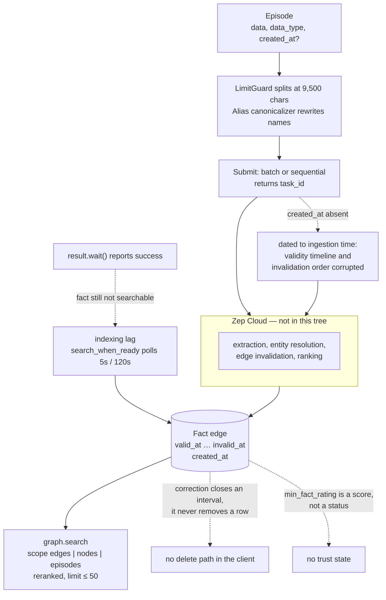

## 1. Executive Summary

This repository is not Zep. Its own README says so in the third paragraph: it
"is **not** Zep's product or service", but example code, framework integrations
and tooling for Zep Cloud, the hosted agent-memory platform. The engine that
used to be here — Zep Community Edition — sits deprecated and unsupported in
`legacy/`, and the open engine that powers the hosted product is a different
repository, analyzed separately as [Graphiti](../graphiti/).

So the honest description of what a reader can inspect at this commit is: a
**client contract** for a closed temporal knowledge graph, plus the measurement
apparatus its vendor points at it. That sounds like a thin subject for a report,
and for the memory mechanism it is — extraction, entity resolution, edge
invalidation and ranking all happen on the other side of an HTTP call. Two
things make the tree worth reading anyway.

The first is `benchmarks/locomo/experiments/`, which holds **five LoCoMo
experiments of ten runs each — fifty runs, 77,000 graded question instances,
with per-run standard deviations, context-token distributions and retrieval
latency percentiles all committed to git.** Almost nothing else in this atlas
publishes variance at all; the [benchmarks page](../../benchmarks/) exists partly
to complain about that. The sweep varies one thing, the retrieval budget, and it
answers a question the field usually leaves as vibes: *how much retrieval is
enough, and what does the last increment buy?*

The second is `ingestion/`, a bulk-loading library whose warning strings are the
most candid public documentation of the hosted service's failure modes. It warns
that an episode submitted without a timestamp is silently dated to ingestion
time, "which corrupts fact validity timelines and invalidation ordering on
backfills". It ships a helper whose entire reason to exist is that a fact is not
searchable when the API says the write succeeded. It refuses to let you register
"Will" as an entity alias, because rewriting it would corrupt "he will go".
These are not marketing claims; they are a vendor's engineers writing down where
the sharp edges are, in code, next to the guard rails.

The weakness is the obvious one and it is not fixable by reading harder: nothing
in this tree stores, extracts, ranks or forgets anything. An API key is required
before a single fact can be written, there is no local mode, and the
correction semantics that make Zep interesting — bitemporal edge invalidation —
are asserted at the API boundary and executed somewhere you cannot see.

## 2. Mental Model

From inside this repository a memory has two forms and a gap between them.

The form you write is an **episode**: a string, a `data_type` of `text`, `json`
or `message`, an optional RFC3339 `created_at`, and at most ten metadata keys
(`ingestion/src/zep_ingest/types.py`). The form you read is a **fact edge**: a
typed relationship between two named nodes, carrying `fact`, `fact_name` in
SCREAMING_SNAKE_CASE, and three timestamps — `valid_at` and `invalid_at` for
when the claim held in the world, `created_at` for when the graph learned it
(`ingestion/src/zep_ingest/triples.py`). Between the two sits the vendor's
extraction, which the client never observes.

The states a client can distinguish are therefore states of *submission*, not of
belief:

```text
episode constructed   -> validated locally against documented API limits
submitted             -> task_id returned, or untracked_items incremented
result.wait()         -> the task reports done
                      -> but the fact is still not searchable
search_when_ready()   -> polls every 5s up to 120s until something comes back
retrieved             -> a fact edge with valid_at / invalid_at / created_at
```

Belief states are the vendor's. There is no candidate, no verified, no rejected;
the closest thing is `min_fact_rating`, a floating-point threshold on a hosted
score that `search_graph` accepts as a filter. A score is not a state, so this
report withholds the `trust_state` mark, and the near-miss is worth naming
because Zep is often described as if it had one.

How a memory dies is the more interesting half. Nothing in the ingestion library
deletes. The only correction primitive a client can assert is `invalid_at` on a
`FactTriple`, which closes a validity interval rather than removing a row — the
same move [Graphiti](../graphiti/) makes, and for the same reason: a graph that
overwrites cannot answer *what did we believe last March*. The consequence is
that a wrong fact does not disappear; it becomes a fact that was true until a
date. Whether the hosted extractor will re-derive it from the same episode on a
later pass is not answerable from this tree, and there is no record of a
rejected value anywhere, so the `tombstone` mark is withheld too.

The one place the client can *cause* a durable epistemic error is the timestamp.
`_MissingTimestampCounter` in `pipeline.py` exists to count episodes with no
`created_at`, and its warning is the sharpest sentence in the repository:

> Zep silently defaults to the ingestion time, which corrupts fact validity
> timelines and invalidation ordering on backfills.

Bitemporality is only as good as the event clock it is fed. Backfill a year of
Slack history without timestamps and every fact in it becomes true as of the
afternoon you ran the import, in an order determined by your loader rather than
by history — and because invalidation is ordered by that same clock, the
corrections land backwards.



## 3. Architecture

Four independent things share the tree.

- **`ingestion/`** — `zep-ingest`, about 4,900 lines of Python. A
  `Loader → Transform* → LimitGuard → Submitter` pipeline with loaders for Slack
  exports, `.eml` mail, WebVTT and speaker-labelled transcripts, text/Markdown
  files, and JSONL/CSV/JSON records. This is the only substantial
  memory-adjacent implementation in the repository.
- **`benchmarks/`** — a LoCoMo harness (about 1,800 lines plus tests) with five
  committed experiments, and a LongMemEval harness with no committed results.
- **`integrations/`** — one package per framework per language, released
  independently: Google ADK, Microsoft Agent Framework, AutoGen, AG2, CrewAI,
  LangGraph, LiveKit, Pydantic AI and Strands in Python; ADK, Mastra and Vercel
  AI SDK in TypeScript; ADK in Go.
- **`legacy/`** — Zep Community Edition, a Go server on Postgres via `bun`,
  with `docker-compose.ce.yaml` and a `Dockerfile.ce`. Deprecated and
  unsupported, per the README and the linked strategy post.

`ontology/default_ontology.py` is a single 139-line file of Pydantic models
defining the entity types the hosted extractor is asked to classify into: `User`
and `Assistant` (both declared singletons), `Preference`, `Location`, `Event`,
`Object`, and the rest. The prompt engineering is in the docstrings —
`Preference` instructs "Prioritize this classification over ALL other
classifications except User and Assistant" and "Use LOW THRESHOLD for
sensitivity", with trigger patterns listed. It is a useful artifact precisely
because it shows what a production memory vendor decided to bias its extractor
toward: user preferences, aggressively, at the expense of everything else.

`mcp/zep-mcp-server/` contains `README.md`, `docs/TOOLS.md` and `docs/DOCKER.md`
documenting thirteen tools — and no source. The MCP server is described here and
implemented elsewhere.

### Deployment and ergonomics

There is nothing to stand up and nothing to back up, which is either the whole
appeal or a disqualification depending on the reader.

- **An API key is required to store anything at all.** `Pipeline.preview()` runs
  the full loader-and-transform chain with no API calls, so you can validate a
  corpus offline; `Pipeline.run()` cannot do anything without a `Zep` client.
- **No local mode, no offline degradation, no self-host** on the supported path.
  The Community Edition in `legacy/` is the only self-hostable artifact and it
  is explicitly unsupported.
- **The store is not human-readable or hand-repairable.** Inspection goes
  through `graph.search` and the getters in `zep_graph_inspect.py`.
- Install is `pip install zep-cloud` for the SDK; `zep-ingest` and each
  integration package are separate installs.

The screen of this checkout on 13 August 2026 found one auto-run surface, 47
dependency surfaces inside the seven-day cooldown, 14 build-time execution
points and 29 unpinned surfaces across 93 files. Nothing here was installed or
run; the analysis is a read of the tree.

## 4. Essential Implementation Paths

- **Write path** — `Pipeline.run()` in `ingestion/src/zep_ingest/pipeline.py:164`.
  Builds a `Destination`, streams loader output through transforms and
  `LimitGuard`, materializes the whole stream through `_validated_replay()`
  (a `SpooledTemporaryFile` that spills past 8 MB, so a mid-run failure has
  resumable handles), then calls `submit_episodes()`.
- **Submitters** — `ingestion/src/zep_ingest/submitters/batch.py` and
  `sequential.py`, selected by `method="auto"`. Documented limits in
  `types.py`: 350 items per add, 50,000 per batch, 30 messages per
  `thread.add_messages` call.
- **Chunking and limits** — `transforms/chunker.py` and `transforms/limits.py`.
  `LimitGuard` targets `SAFE_EPISODE_CHARS = 9_500` against a documented
  `MAX_EPISODE_CHARS = 10_000`, leaving headroom for context prefixes the
  contextualizer may prepend.
- **Alias canonicalization** — `transforms/canonicalizer.py`, the most
  interesting single file in the repository (see section 9).
- **Explicit fact assertion** — `ingest_fact_triples()` in `triples.py:162`,
  which bypasses LLM extraction entirely and posts `graph.add_fact_triple`
  sequentially, because "the Batch API does not accept triples".
- **Retrieval** — `search_when_ready()` in `verify.py:23`, wrapping
  `client.graph.search`. The benchmark's own two-scope retrieval is
  `LocomoEvaluator._graph_search_with_retry` in
  `benchmarks/locomo/evaluation.py:63`, which fires a node search and an edge
  search concurrently.
- **Context assembly** — `CONTEXT_TEMPLATE` in `benchmarks/locomo/prompts.py`,
  a `<FACTS>` block and an `<ENTITIES>` block with an instruction that
  timestamps mean event time and not mention time.
- **Delete path** — none exists in `zep-ingest`.
- **Legacy purge** — `purgeDeleted()` in `legacy/src/store/purge_common.go`
  hard-deletes soft-deleted rows in one transaction; the CE build's
  `tableCleanup()` in `purge_ce.go` is a thirteen-line no-op, so the
  two-tier soft-delete-then-purge design has an empty second tier in the open
  edition.

## 5. Memory Data Model

`Episode` (`types.py`) validates in `__post_init__`: non-empty string data, a
`data_type` in the three-value enum, an RFC3339 `created_at`, and a metadata map
of scalars capped at `MAX_METADATA_KEYS = 10`. A fifth field, `document`, is
internal plumbing — the chunker stores the full source document on each chunk so
the contextualizer can read it, and it is never sent to the API.

Provenance is structured rather than free text, and this is done well. Every
loader stamps `source_type` (`document`, `slack`, `transcript`, `email`,
`json_record`) plus source-specific keys: a document's `file_name`, a Slack
message's `channel` and `thread_ts`. Ten keys is a tight budget for that, and it
is a documented service limit rather than a library choice.

`Destination` is a frozen dataclass whose `__post_init__` rejects any
construction that is not exactly one of `graph_id` or `user_id`
(`bool(graph_id) == bool(user_id)` raises). Every write and every read carries
one, which is what earns the `scope_enforced` mark: the scope is not a tag that
happens to be stored, it is a required argument that the read path cannot omit.

`FactTriple` is the richest type and the clearest window into the hosted schema,
because every documented API limit is re-validated client-side so a bad triple
fails as a Python error naming the field rather than an HTTP 400 mid-run:

| Field | Constraint |
| --- | --- |
| `fact` | ≤ 250 chars, required |
| `fact_name` | ≤ 50 chars, must match `^[A-Z][A-Z0-9_]*$` |
| `source_node_name`, `target_node_name` | ≤ 50 chars, required |
| `source_node_summary`, `target_node_summary` | ≤ 500 chars |
| `source_node_labels`, `target_node_labels` | list of **at most one** label |
| `source_node_uuid`, `target_node_uuid` | valid UUID, pins an endpoint by identity |
| `valid_at`, `invalid_at`, `created_at` | RFC3339 |
| `attributes`, `metadata` | scalar maps, metadata ≤ 10 keys |

Two details carry weight. The single-label cap is enforced with the comment that
"extraction assigns one best-match type per node" — the hosted ontology is
single-inheritance, so an entity cannot be both a `Person` and an `Organization`.
And the UUID endpoints exist specifically so "a re-run cannot resolve a slightly
different name to a new node", which is a plain admission that name-based entity
resolution is the fragile part.

The three timestamps are what earn the `bitemporal` mark. `valid_at`/`invalid_at`
are world time and `created_at` is record time, they are independently settable
on the same edge, and the library's own warning text treats the distinction as
load-bearing. The caveat a reader should hold: this is bitemporality observed at
an API contract, not read out of a schema, because the schema is not here.

## 6. Retrieval Mechanics

The surface is `graph.search`, documented in `mcp/zep-mcp-server/docs/TOOLS.md`
and exercised in the benchmark: a query string, a `scope` of `edges`, `nodes` or
`episodes`, a `limit` capped at 50, and a `reranker` chosen from `rrf`, `mmr`,
`node_distance`, `episode_mentions` and `cross_encoder`. Filters are
`min_fact_rating`, `node_labels`, `edge_types`, and `center_node_uuid` for
node-distance reranking; `mmr_lambda` tunes diversity.

Retrieval is application-driven. There is no automatic injection: the caller
searches, formats and places the result. The benchmark's pattern is the one to
copy — two searches in parallel, edges and nodes, with independent limits and
independent rerankers, assembled into `<FACTS>` and `<ENTITIES>` blocks.

The observable failure mode is under-recall at small budgets, and the repository
measures it rather than guessing. See section 10.

The unobservable ones stay unobservable. Whether two aliases merged into one
node, whether an edge was invalidated correctly, whether the cross-encoder saw
the right candidate set — none of it is inspectable from a client. The
`zep_graph_inspect.py` script in the eval harness exists because reading your
own graph back is otherwise awkward.

## 7. Write Mechanics

**The write path is asynchronous end to end, and the repository is unusually
explicit about the two separate lags this creates.**

`Pipeline.run()` "submits the transformed stream and returns immediately". The
docstring instructs the caller to bind the result before waiting, so the resume
handles survive a timeout:

```python
result = pipeline.run(client, graph_id="company_kb")
result.wait(timeout=600)
```

That is lag one: the extraction task is queued and `wait()` blocks on it. Lag
two is the one that matters and is almost never documented anywhere in this
atlas — from `verify.py`:

> Ingestion is asynchronous end to end: even after `IngestResult.wait()`
> reports success, just-written facts take a few more seconds to become
> searchable.

`search_when_ready` polls `graph.search` every 5 seconds for up to 120 seconds,
returning the first response with any hits in `context`, `edges`, `nodes`,
`episodes`, `observations` or `thread_summaries`, and returning the final empty
response rather than raising, because "nothing matched" is a legitimate answer.
A read-your-writes window measured in seconds, with a documented 120-second
worst case, is a real constraint on any agent that writes a fact and then
reasons about it in the same turn.

Nothing here blocks the agent on an LLM call — but nothing here is on an agent's
turn at all. `zep-ingest` is a bulk backfill tool. The per-turn write path is
`thread.add_messages`, capped at 30 messages per call.

Deduplication, consolidation and conflict handling are the vendor's. The client
contributes exactly one pre-ingestion normalization, the alias canonicalizer,
and one explicit path around extraction, `ingest_fact_triples`. No background
pass in this tree re-reads or rewrites the store; whether one runs on the other
side is not knowable here.

On the read side the benchmark measures the injection budget directly: at the
default-ish 20/20 setting the assembled context has a median of 1,378 tokens and
a p95 of 1,451 — a tight, predictable distribution, and small enough that the
prompt-prefix cache question turns on where the caller places it rather than on
its size.

## 8. Agent Integration

Thirteen integration packages, framework-first then language, each built and
released independently: `integrations/<framework>/<language>/`. Python covers
Google ADK, Microsoft Agent Framework, AutoGen, AG2, CrewAI, LangGraph, LiveKit,
Pydantic AI and Strands; TypeScript covers ADK, Mastra and the Vercel AI SDK; Go
covers ADK. That breadth is the product's real distribution strategy, and it is
maintained as thirteen release trains rather than one adapter layer.

The MCP surface is thirteen read-oriented tools — `search_graph`,
`get_user_context`, `get_user`, `list_threads`, `get_user_nodes`,
`get_user_edges`, `get_episodes`, `get_thread_messages`, `get_node`, `get_edge`,
`get_episode`, `get_node_edges`, `get_episode_mentions`. Every one of them
reads. There is no `add_memory` or `delete_memory` in the documented tool set,
so under MCP the agent is a consumer of memory that something else wrote. Its
source is not in this tree.

Agency over memory is consequently low by construction. The model does not
decide what to remember; the application ingests, the vendor extracts, and the
agent searches. For a reader who wants an agent that curates its own memory,
this is the wrong shape entirely.

## 9. Reliability, Safety, and Trust

**The alias canonicalizer is the safety mechanism worth the trip.** Zep resolves
entities by the names it sees in text, so "PROTOTYPE-202" and "ROBOT-202" do not
merge, and the recommended fix is to rewrite aliases before ingestion. That fix
is a text-substitution pass over a corpus about to become a permanent knowledge
graph, which is a data-corruption engine if it is naive. It is not naive:

- Aliases shorter than three characters, or matching a built-in 150-word
  `DEFAULT_RISKY_WORDS` set of common English words and word-like given names
  (`will`, `mark`, `bill`, `art`, `page`, `chase`, `hope`, `may`, `dot`),
  are **rejected at construction** with an error explaining that "sentence-start
  capitalization defeats case-sensitive matching for word-like aliases".
- URLs and backtick code spans are matched first in the same scan and passed
  through untouched.
- Existing canonical mentions are protected, longest-literal-first, so an alias
  containing its canonical still wins.
- Word boundaries use `(?<!\w)`/`(?!\w)` rather than `\b`, with the comment that
  `\b` would make aliases starting or ending in punctuation — `.NET`, `C++` —
  silently never match.
- A term declared as both an alias and a canonical name raises, rather than
  silently killing the alias.
- Per-alias replacement counts surface in `preview()` warnings, so a runaway
  alias is visible before any API call.

That is six distinct failure modes anticipated in one 227-line file, in a
transform most teams would write as a `str.replace` loop. It is the strongest
example in this atlas of treating pre-ingestion normalization as a hazard rather
than a convenience.

Against that: **there is no defence against prompt-injected false memory
anywhere in the tree.** Anything a loader reads — a Slack message, an inbound
`.eml`, a document — is submitted as an episode and becomes graph content. The
Slack loader defaults to public channels only and reports unselected private
channels and DMs in warnings, which is a privacy boundary rather than a trust
one. `min_fact_rating` filters at read time on a score assigned by the vendor,
so a caller can decline low-rated facts but cannot mark one rejected.

Provenance is a genuine strength: structured `source_type` plus source-specific
keys on every episode, and `IngestResult` collects `node_uuids`, `edge_uuids`
and `task_ids` so a run's outputs can be tied back to its inputs. Errors are
collected per item as `AddError(index, item_count, error)` rather than aborting
the run, and `untracked_items` counts submissions that came back without a task
id — a small, honest counter for "we sent this and cannot prove what happened
to it".

The multi-tenancy boundary is the vendor's. `Destination` enforces the client
side of it and nothing more.

## 10. Tests, Evals, and Benchmarks

`ingestion/tests/` holds about thirty test modules covering loaders,
transforms, submitters, validation, limits, threads, triples and the example
ontology — a well-tested client library. `benchmarks/locomo/tests/` adds tests
for config, persistence and common utilities. There are no tests for the
Community Edition in this tree.

The benchmark harness is the contribution. `benchmarks/locomo/` runs LoCoMo-10
(1,540 questions per run, pulled from `snap-research/locomo`) and grades each
answer on **two independent axes** with two separate LLM calls made
concurrently (`evaluation.py:154`):

1. **Accuracy** — a generous CORRECT/WRONG grader against the gold answer
   (`prompts.py`, `GRADER_PROMPT`).
2. **Context completeness** — COMPLETE, PARTIAL or INSUFFICIENT, judging
   *whether the retrieved context contained what was needed*, with
   `missing_elements` and `present_elements` recorded per question
   (`evaluation.py:251`).

That second axis is the methodological move, and it is rare. It measures the
memory layer directly instead of measuring a pipeline and attributing the score
to memory. The derived metric `accuracy_with_complete_context` then answers the
question the first axis cannot: *given that retrieval worked, how often is the
answer right?*

Five experiments sweep the retrieval budget, ten runs each, all committed:

| edge / node limit | Accuracy | σ | Context COMPLETE | Accuracy given COMPLETE | Median context tokens | Median retrieval |
| --- | ---: | ---: | ---: | ---: | ---: | ---: |
| 5 / 2 | 0.6962 | 0.0047 | 0.574 | 0.928 | 347 | 0.149 s |
| 10 / 2 | 0.7372 | 0.0041 | 0.628 | 0.923 | 504 | 0.161 s |
| 15 / 5 | 0.7706 | 0.0041 | 0.700 | 0.925 | 756 | 0.199 s |
| 20 / 20 | 0.8006 | 0.0033 | 0.758 | 0.917 | 1,378 | 0.241 s |
| 30 / 30 | 0.8032 | 0.0043 | 0.765 | 0.915 | 1,997 | 0.189 s |

All five runs use `gpt-4o-mini` at temperature 0 for both answering and grading,
with `cross_encoder` reranking on both scopes.

Three things fall out of that table, and they are worth more than the headline
number.

**Accuracy given a complete context is flat.** It sits at 0.92 ± 0.01 across a
5.8x swing in retrieved tokens. Every point of end-to-end accuracy the sweep
buys comes from *completeness rising* — 0.574 to 0.765 — and none of it comes
from the answering model doing better with more material. The memory layer and
the reader are cleanly separated by this design, and the separation holds.

**The residual 8% is not a memory problem.** When the grader confirms the
context contained everything needed, the pipeline still gets one answer in
twelve wrong. No amount of retrieval improvement touches that ceiling; it is the
reader and the grader. A team optimizing memory against end-to-end LoCoMo
accuracy is, past a point, optimizing against someone else's error bar.

**The budget saturates before the top of the sweep.** Going from 20/20 to 30/30
costs 45% more context tokens for 0.26 points of accuracy — a gap smaller than
the sum of the two runs' standard deviations, and accompanied by
accuracy-given-complete *falling* slightly, 0.917 to 0.915, the shape a mild
distraction effect makes. The knee is at 20/20.

What is not here: `zep-eval-harness/runs/` contains only a `.gitkeep`, so the
ingestion-and-retrieval harness has no committed output. `benchmarks/longmemeval/`
ships a runner, a dataset analysis script and a notebook, but no results. And no
committed result compares Zep to anything else — the sweep is Zep against its
own configuration, which is the right experiment for choosing a limit and the
wrong one for choosing a vendor.

The tests a reader would want before trusting this and cannot find: anything
asserting that `invalid_at` actually stops a superseded fact from being
retrieved, anything measuring how long the post-`wait()` indexing lag really is,
and any negative case asserting that deleted or scoped-out material must not
appear in a search result.

## 11. For Your Own Build

### Steal

**Grade retrieval sufficiency separately from answer correctness, with a second
judge on the same question.** COMPLETE / PARTIAL / INSUFFICIENT over the
retrieved context, plus `missing_elements`, turns an opaque end-to-end score
into an attribution. It costs one extra LLM call per eval question and it is the
cheapest way to stop shipping retrieval changes that were really prompt changes.

**Report accuracy conditioned on complete context.** It is one extra line in an
aggregation and it exposes your own ceiling. If that number is flat across your
retrieval sweep, more retrieval is not your problem.

**Run the sweep ten times and publish σ.** The gaps in the table above are two
to nine standard deviations at the bottom and less than one at the top. Without
the repeats, the 20/20-to-30/30 step reads as a real 0.26-point improvement.

**Validate a corpus against the service's documented limits before the first API
call.** `preview()` runs the entire loader-and-transform chain with zero network
calls and returns warnings; `preview(limit=None)` does it exhaustively. Every
limit is re-checked client-side so failures name a field instead of returning an
HTTP 400 halfway through a 50,000-item batch.

**Treat pre-ingestion text rewriting as a hazard with a deny-list.** If you
canonicalize entity names before they reach an extractor, ship the risky-words
guard, the URL and code-span protection, the punctuation-safe boundaries and the
per-alias replacement counts. All four exist because all four failures happen.

**Count the episodes with no event timestamp, and say what it will cost.** A
loader that silently dates history to import time produces a graph that is
internally consistent and historically wrong.

### Avoid

**Do not assume a write is readable when the write API says it succeeded.** Two
lags, not one: task completion, then indexing. If your agent writes a fact and
reasons about it in the same turn, you need the poll loop or you need a
read-your-writes guarantee in writing.

**Do not let a scope be a tag.** `Destination` raising unless exactly one of
`graph_id` and `user_id` is set is a one-line invariant that makes leaking
across users a construction error rather than a filter someone forgot.

**Do not read a rating as a status.** A float on a fact tells you how confident
something was; it does not tell you the fact was checked, and it cannot stop the
extractor from re-deriving something you rejected.

**Do not benchmark a memory system only against itself.** Five well-run
experiments on one vendor's own configuration establish where its knee is and
nothing about whether the knee is in a good place.

### Fit

Adopt this if memory is not the product you are building and you would rather
buy the hard parts — entity resolution, temporal invalidation, reranking — than
maintain them. The integration breadth is real, thirteen packages across three
languages, and the client library is better engineered than most of the systems
in this atlas that ship an actual engine.

Walk away if any of three things is true. If you need to inspect or repair the
store, you cannot: the mechanism is on the other side of an API and this
repository is the map, not the territory. If you need offline or air-gapped
operation, there is no local mode and the self-hostable edition is deprecated.
And if you want an agent that decides what to remember, the documented MCP
surface is thirteen read tools — this design assumes the application ingests and
the model only asks.

The reader who gets the most from this repository may be one who never adopts
Zep at all, and takes `benchmarks/locomo/` to point at their own system instead.

## 12. Open Questions

- How long is the post-`wait()` indexing lag in practice? The client polls at a
  5-second interval with a 120-second ceiling, which brackets it but does not
  measure it.
- Does the hosted extractor re-derive a fact whose validity interval was closed?
  Nothing in the client can express "never assert this again", so a
  re-extraction loop is possible and undetectable from here.
- What does `min_fact_rating` actually score, and on what scale? It appears only
  as a filter parameter.
- Is `tableCleanup()` a no-op only in the Community Edition build, or was the
  second tier of the purge never implemented? The build tag split says the
  former; the tree cannot confirm it.
- Why is the LoCoMo sweep's 30/30 retrieval median (0.189 s) *lower* than
  20/20's (0.241 s)? Most likely load rather than budget, but the harness does
  not record enough to say.
- Where is the MCP server implemented, and does it expose any write tool that
  `docs/TOOLS.md` omits?

## Appendix: File Index

**Write path**

- `ingestion/src/zep_ingest/pipeline.py` — `Pipeline`, `preview()`, `run()`, `_validated_replay()`, `_MissingTimestampCounter`.
- `ingestion/src/zep_ingest/submitters/batch.py`, `sequential.py` — submission and retry.
- `ingestion/src/zep_ingest/triples.py` — `FactTriple`, `ingest_fact_triples()`.
- `ingestion/src/zep_ingest/transforms/limits.py`, `chunker.py`, `_splitting.py` — size guards.
- `ingestion/src/zep_ingest/transforms/canonicalizer.py` — `AliasCanonicalizer`, `DEFAULT_RISKY_WORDS`.
- `ingestion/src/zep_ingest/transforms/contextualizer.py` — optional LLM chunk contextualization.

**Data model**

- `ingestion/src/zep_ingest/types.py` — `Episode`, `Destination`, documented API limits.
- `ingestion/src/zep_ingest/result.py` — `IngestResult`, `AddError`, `untracked_items`.
- `ontology/default_ontology.py` — the extractor's entity types.

**Loaders**

- `ingestion/src/zep_ingest/loaders/` — `slack.py`, `email.py`, `transcript.py`, `text.py`, `json_records.py`.

**Retrieval**

- `ingestion/src/zep_ingest/verify.py` — `search_when_ready()`.
- `benchmarks/locomo/evaluation.py` — two-scope concurrent search, both graders.
- `benchmarks/locomo/prompts.py` — `CONTEXT_TEMPLATE`, `RESPONSE_PROMPT`, `GRADER_PROMPT`.
- `mcp/zep-mcp-server/docs/TOOLS.md` — the thirteen documented MCP tools.

**Evals**

- `benchmarks/locomo/experiments/` — five experiments, ten runs each, with configs and summaries.
- `benchmarks/locomo/benchmark.py`, `persistence.py`, `config.py`, `ontology.py`.
- `benchmarks/longmemeval/` — runner and notebook, no committed results.
- `zep-eval-harness/` — ingestion/retrieval harness; `runs/` holds only `.gitkeep`.

**Legacy Community Edition**

- `legacy/src/store/purge_common.go`, `purge_ce.go` — soft delete and the no-op cleanup.
- `legacy/src/store/schema_ce.go`, `memory_ce.go`, `sessionstore_ce.go` — the Postgres store.
- `legacy/docker-compose.ce.yaml`, `Dockerfile.ce` — the deprecated self-host path.

## History

**2026-08-13** — [`be263ee23085410185835e0d8508b47fd35e9abb`](https://github.com/getzep/zep/commit/be263ee23085410185835e0d8508b47fd35e9abb) — first reading. Screened before opening: one auto-run surface, 47 dependency surfaces inside the seven-day cooldown, 14 build-time execution points, 29 unpinned surfaces across 93 files. Nothing was installed and nothing was run; the committed benchmark artifacts were read from git, not reproduced.
