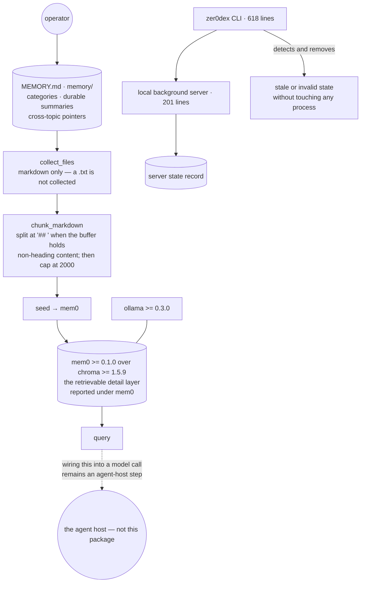

## 1. Executive Summary

zer0dex pairs two layers: a small Markdown index a person can read, and
semantic retrieval from a local vector store. Apache 2.0, Python, 38 files and
about a thousand lines of source across three modules — a CLI, a seeder and a
local server.

**One mark: `negative_eval`**, and it is narrow.

The retrieval layer is not this project's. `pyproject.toml` declares
`mem0ai>=0.1.0`, `chromadb>=1.5.9` and `ollama>=0.3.0`, and [mem0](../mem0/)
has its own report here. What zer0dex supplies is the layout, the chunker that
feeds it and the process lifecycle around the server.

The project says so itself, in the one place a project is least likely to
oversell — its `CITATION.cff` abstract: *"The markdown layer keeps categories,
durable summaries, and cross-topic pointers; the local mem0/Chroma layer holds
the retrievable details. The package supplies the CLI and local server; **wiring
the query into model calls remains an agent-host step**."* A memory system whose
citation metadata tells you which half you still have to build is doing
something most READMEs do not.

It is also explicit that it is early: *"0.1.1 continues the 0.1.x
developer-preview line. The project remains Alpha"*, with a compatibility policy
committing to migration notes ahead of documented breaking changes.

## 2. Mental Model

Durable summaries and pointers live in Markdown the user maintains. Details live
in a vector store the user never reads. Seeding is the bridge: the Markdown is
chunked at section boundaries and pushed into mem0, so the two layers describe
the same material at different resolutions.

Nothing here decides what is true, what is stale or who may read it. A memory
is a chunk of the operator's own notes.

## 3. Architecture



## 4. Essential Implementation Paths

**The collection boundary** — `src/zer0dex/seed.py`. `collect_files` walks the
given sources and takes Markdown; `tests/test_seed.py:20-27` pins it from both
sides, asserting `a.md` and `b.md` are collected and `c.txt` is not. The
must-include half is what stops a collector that returns nothing from passing.

**The chunker** — `seed.py:53-70`. Sections split on `## `, but only when the
accumulated buffer already holds a line that is non-empty and not itself a
heading:

```python
current_has_content = any(
    existing.strip() and not existing.lstrip().startswith("#")
    for existing in current
)
```

So a run of consecutive headings does not emit empty sections — the common bug
in heading-based splitters. Oversized sections are then split again against a
2,000-character cap.

**The lifecycle** — `cli.py`, which is most of the package. A background server
record can go stale, and the CLI removes it *"without touching any process"*
(`cli.py:159`), distinguishing an invalid record from a stale one in its output
(`:433`, `:441`, `:455`). For a local daemon that is the right care: a state
file outliving its process is the normal failure, and killing something on the
strength of a stale record is the dangerous fix.

## 5. Memory Data Model

Markdown sections on one side; whatever mem0 stores on the other. There is no
status field, no confidence, no supersession and no validity window — `grep -rl`
over the Python finds `tombstone`, `supersede`, `confidence`, `audit`, `review`
and `approve` in no file.

**One scope key does exist**, and it is not spelled `scope`. Every read and
write forwards a `user_id` into mem0 — `server.py:83` and `:120` on the read
side, `:136` on the write — and it comes from `--user-id`, whose default at
`server.py:152` is the literal string `agent`. So mem0's per-user partition is
wired up and then collapsed into one shared bucket for every operator who does
not set the flag. That is a single-tenant default in a component whose whole
purpose is to be embedded in somebody else's agent, and it is the one
configuration line worth changing before adopting this.

Two consequences follow, and they are the same consequence twice. A correction
means editing the Markdown and re-seeding; nothing reconciles the vector store
against a changed source, so a deleted paragraph's chunk remains retrievable
until the store is rebuilt.

## 6. Retrieval Mechanics

mem0's, over Chroma, with Ollama for local embeddings. All three are floating
constraints (`>=`), which matters more here than in most projects because the
dependency *is* the retrieval layer: what `mem0ai` resolves to on install day
decides the behaviour this package is a front end for.

## 7. Write Mechanics

Seeding. There is no capture path, no extraction and no write policy: the
operator writes Markdown and runs the seeder.

## 8. Agent Integration

A CLI, a local server, a skill under `.agents/skills/zer0dex/`, an `AGENTS.md`,
and a TypeScript hook example shipped as source rather than as a package.

## 9. Reliability, Safety, and Trust

**`negative_eval`** — section 10.

**Six marks are withheld together.** This package holds no memory object with
fields to carry them: no epistemic state, no rejected-value record, no second
clock, no append-only mutation record and nothing that waits for a person.
Where such properties exist at all they are mem0's, and are credited
[there](../mem0/) rather than counted twice.

**`scope_enforced` is withheld for that second reason rather than the first.**
A stored scope key is present and is forwarded on every read, but the filter it
drives is applied inside mem0; nothing in this repository consults it. Crediting
it here would count [mem0](../mem0/)'s partition twice. The finding that belongs
to this package is the default value, not the mechanism.

**The staleness gap is worth naming.** The Markdown is the source and the vector
store is a copy; nothing detects that the copy has drifted from it. The
project's own `stale` handling is about server state records, not about memory.

**Alpha, and labelled.** A 0.1.x developer preview with a compatibility policy
is a better disclosure than most projects at this maturity offer, and a reader
should take the version at its word.

## 10. Tests, Evals, and Benchmarks

Four test files, 853 lines, 122 assertions, with CI and a publish workflow.
Nothing was installed and nothing was run.

The must-not cases are about what enters the memory rather than what comes out
of it:

- `tests/test_seed.py:20-27` — a `.txt` beside two `.md` files is asserted
  absent from the collected set, with both `.md` files asserted present.
- `:84-87` — empty and whitespace-only Markdown chunk to `[]` rather than to a
  single empty section.

`tests/test_docs_consistency.py` is the file worth copying: thirty lines
asserting that the documentation still matches the code, which is the check that
stops a README drifting into fiction between releases.

No benchmark. A `CITATION.cff` with an abstract, and no paper behind it.

## 11. For Your Own Build

### Steal

- **State which half the user still has to build.** *"wiring the query into
  model calls remains an agent-host step"*, in the citation metadata. A reader
  evaluating this knows in one sentence what integrating it costs.
- **Guard the heading splitter against consecutive headings.** Checking that the
  buffer holds a non-heading line before emitting a section is three lines and
  removes the empty-section bug.
- **Remove a stale state record without touching the process.** A state file
  outliving its process is the normal failure; acting on it as though the
  process were alive is the dangerous one.
- **Test that the docs still match the code.** Thirty lines, and it catches the
  drift nobody reviews for.

### Avoid

- **A floating constraint on the component that is your memory.**
  `mem0ai>=0.1.0` means the retrieval semantics this package fronts are whatever
  installs today — and the lower bound is a 0.1 release.
- **A copy with no drift detection.** Editing the Markdown and forgetting to
  re-seed leaves the vector store answering from text that no longer exists.

### Fit

Take it if you already want mem0 locally and would rather curate a Markdown
index than an opaque store. Do not take it expecting retrieval to be wired into
your agent: the citation file tells you it is not.

## 12. Open Questions

- Nothing reconciles the vector store against edited Markdown. Is a re-seed
  meant to be destructive, and what marks a chunk whose source paragraph is gone?
- The dependencies are floating and the project is Alpha. Would pinning
  `mem0ai` be a compatibility commitment the 0.1.x policy could carry?
- `hook_example.ts` ships as source. Is the host wiring intended to become part
  of the package, or to stay an example on purpose?
- The Markdown layer holds *"cross-topic pointers"*. Does anything validate that
  a pointer still resolves after an edit?

## Appendix: File Index

| Path | What it holds |
| --- | --- |
| `src/zer0dex/seed.py` | `collect_files`, `chunk_markdown` and the mem0 seeding path |
| `src/zer0dex/cli.py` | most of the package: commands and the stale-state handling |
| `src/zer0dex/server.py` | the local background server |
| `src/zer0dex/hook_example.ts` | the host wiring, as an example rather than a package |
| `tests/test_seed.py` | the collection boundary and the chunker's empty cases |
| `tests/test_docs_consistency.py` | the documentation-matches-code check |
| `CITATION.cff` | the abstract stating which half the host must supply |
| `pyproject.toml` | `mem0ai>=0.1.0`, `chromadb>=1.5.9`, `ollama>=0.3.0` |

## Appendix: Recorded Searches

Run from the root of the checkout at the pinned commit.

| Claim | Command | Result at this pin |
| --- | --- | --- |
| Retrieval is the dependency's | read `pyproject.toml:23-27` | `mem0ai>=0.1.0`, `chromadb>=1.5.9`, `ollama>=0.3.0`, all floating |
| No epistemic vocabulary exists here | `grep -rl "tombstone\|supersede\|confidence\|audit\|review\|approve" --include='*.py' .` | Nothing for any of them |
| ~~No scope key exists here~~ — **withdrawn 2026-09-20** | `grep -n "user_id" src/zer0dex/server.py` | `server.py:152` `--user-id` defaults to `"agent"`, and lines 83, 120 and 136 forward it into mem0 on every read and write. The original search was for the word `scope`, which this package does not use for the thing it has. |
| The collection boundary is tested from both sides | read `tests/test_seed.py:20-27` | Two `.md` asserted present, one `.txt` asserted absent |
| The chunker guards against consecutive headings | read `src/zer0dex/seed.py:53-70` | A section is emitted only when the buffer holds a non-empty, non-heading line |
| The package is 1,006 lines of Python | `wc -l src/zer0dex/*.py` | 618 CLI, 201 server, 186 seeder, 1 init |
| The licence carries no rider | `head -3 LICENSE`; `grep -n -i 'anthropic\|may not' LICENSE` | Stock Apache 2.0; the only match is the standard compliance clause |

## History

**2026-09-20** — [`58776ccdef75bf1b26e0766fa21e9e14e1ac3e08`](https://github.com/hermes-labs-ai/zer0dex/commit/58776ccdef75bf1b26e0766fa21e9e14e1ac3e08) — first reading, at 38 files. Taken from an unreported scout shortlist entry dated 2026-09-17 rather than from a fresh triage selection, the day's selection allocation having been spent. Screened before reading; nothing was installed and nothing was run. Apache 2.0, and the project labels itself Alpha on a 0.1.x developer-preview line. One mark, `negative_eval`. The remaining six are withheld together because this package holds no memory object to carry them: retrieval is `mem0ai`, declared as a floating constraint, and is credited to the [mem0](../mem0/) report rather than counted twice — the fifth delegated-memory attribution in this batch. Corrected the same day, before the report had stood a full day: the first reading said there is no scope key, having grepped for the word `scope`. There is one, spelled `user_id`, forwarded into mem0 on every read and write, and defaulting at `server.py:152` to the literal `agent` — a single-tenant default in a component built to be embedded in another agent. The mark stays withheld, but now because the filter is mem0's rather than because the key is absent. The stale overview bullet saying this repository was examined without a report, written 547 commits before the report existed, was removed at the same time.
