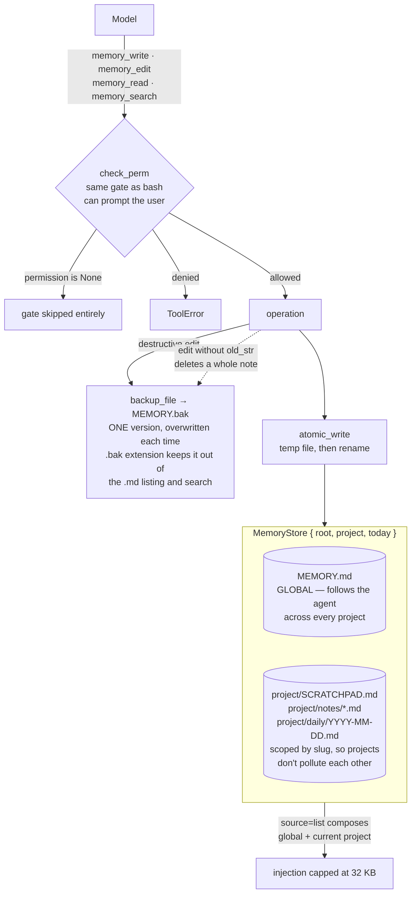

## 1. Executive Summary

ZeroStack is a GPL-3.0 Rust agent runtime, and its memory is a 1,266-line module
over Markdown files with 1,203 lines of tests beside it. There is no database, no
embedding and no extraction: four tools — `memory_write`, `memory_edit`,
`memory_read`, `memory_search` — over a small tree of `.md` files.

**The scope decision is the design.** A `MemoryStore` carries a `root` and a
`project` slug, and the comment says exactly what the slug is for: it *"scopes
SCRATCHPAD/daily/notes so different projects don't pollute each other.
MEMORY.md stays global (shared)."* So there are two tiers with opposite
intentions in one store — a global file the agent carries everywhere, and
per-project scratchpad, notes and daily logs that it does not. `source=list`
enumerates the global `MEMORY.md` plus *the current project's* files, composing
the two on the read path.

That split is a real answer to a question most notebook systems duck. Both
[Juggler](../juggler/) and [Basic Memory](../basic-memory/) pick one scope for
everything; ZeroStack says a convention you learned once should follow you and a
scratchpad should not, and encodes the difference in a path.

**The file mechanics are the other reason to read it**, and they are better than
the size suggests. `atomic_write` writes to a temporary file and renames, with a
comment explaining that rename is atomic on POSIX and same-volume Windows *"so
readers see either the old content or the new, never a partial/corrupt write"*.
`backup_file` copies the current file to a sibling `.bak` before any
content-destroying mutation, and the comment is careful about what that is and
is not: *"OVERWRITING any prior `.bak` (one version, not a history)"*, with the
extension chosen so the backup *"keeps it out of the `.md`-filtered list and
search"* — a rollback that cannot itself be recalled as memory.

The write cap behaves the same way. `MAX_WRITE_BYTES` is 64 KB and oversized
content is **truncated with a warning rather than rejected**, *"so the model
still gets something saved and can split oversized content across calls"*. A
hard rejection teaches a model nothing; a truncation with a message tells it what
to do next.

## 2. Mental Model

There is no epistemology at all — no status, no confidence, no provenance, no
supersession. A line is in a file or it is not, and correction is an edit. What
ZeroStack models instead is **operational safety around a file a model is allowed
to rewrite**: atomicity so a crash cannot corrupt, a backup so one bad edit is
recoverable, a byte cap on what reaches the context, and a permission check in
front of every tool.

The permission check is the unusual part. `check_perm(&self.permission,
&self.ask_tx, Self::NAME, &args.target)` runs before `memory_write` and
`memory_edit` — and also before `memory_read` and `memory_search`. Memory reads
go through the same gate as `bash`, with the same ability to prompt a user. That
is nearly [Cortex](../cortex/)'s read gate, arrived at from the opposite
direction: Cortex classifies the *content* it is about to return and shows the
approver a sample, while ZeroStack approves the *operation and its argument*. The
mark goes to the first and not the second, because approving "may this tool run
against this target" is not inspecting memory content — and the permission
checker can be `None`, in which case the gate is skipped entirely.

## 3. Architecture

Files under a store root, and nothing to run. The layout is
`MEMORY.md` at the root, then a per-project directory holding `SCRATCHPAD.md`,
notes and a `daily/` folder of `YYYY-MM-DD.md` logs. The daily selector walks
dates descending and skips empty or whitespace-only files, so an idle day costs
nothing at injection time.

`MAX_INJECT_BYTES` is 32 KB, documented as *"a token-budget guard, not a
memory-usage one — files are expected to be small"*, which is the right way to
name a limit: by what it protects rather than by what it measures.

## 4. Essential Implementation Paths

- `src/extras/memory/mod.rs` (1,266) — the store, the four tools, atomic write,
  backup, caps, the daily-log selector.
- `src/ui/slash/memory.rs` — the `/memory` command.
- `src/tests/memory_tests.rs` (1,203) — 65 functions.
- `src/agent/tools.rs` — `check_perm`, shared with every other tool.

## 5. Memory Data Model

A file, and its path is its meaning. There is no record, no id, no timestamp
beyond the daily log's filename, and no metadata — which makes the daily log the
only thing in the store with a clock, and that clock is a record clock.

The `.bak` sibling is the one piece of state that is not a memory, and the
decision to exclude it by extension from both the listing and the search is the
detail worth noticing: a rollback that can be recalled as context is a rollback
that will eventually be quoted back to the user as fact.

## 6. Retrieval Mechanics

`memory_read` takes a source selector; `memory_search` runs a case-insensitive
regex built with `RegexBuilder` over the visible `.md` files. No ranking, no
embedding, no relevance — grep with a budget, and `truncate_cjk` to cut
multi-byte text without splitting a character.

Scope on the read path is the global-plus-current-project composition described
above. It is a path partition rather than a query predicate, so the mark is
withheld on the same basis as [Juggler](../juggler/) and
[Mnemopi](../mnemopi/)'s banks — with the difference that this partition is
*deliberately leaky in one direction*, and the leak is the feature.

## 7. Write Mechanics

Writes block and are the model's tool calls. `memory_write` replaces or appends;
`memory_edit` replaces a fragment, and **an edit without `old_str` deletes a
whole note** — a warning string in the module says so. That is the sharp edge:
a required-argument omission is a destructive operation, mitigated by the
single-version backup rather than by the signature.

Nothing runs in the background.

## 8. Agent Integration

Four tools plus a `/memory` slash command in the UI, all inside the runtime
rather than exposed over MCP.

## 9. Reliability, Safety, and Trust

No capability marks, and the report's position is that this is a small,
well-built notebook rather than a memory system with gaps: there is no unit below
the file for a status, a scope key or a validity interval to attach to.

**No tombstone**, and here the absence has a specific consequence. `memory_edit`
without `old_str` deletes a note; the `.bak` holds one version; a second
destructive edit overwrites the backup. Two bad edits in a row lose the original,
and nothing records that either happened.

**No audit log.** The `.bak` is the whole history, and it is depth one.

**`human_review` withheld**, for the reason in §2 — and it is the closest
near-miss of the four systems in this batch, because the machinery to earn it is
already there. A gate that showed the approver the *content* about to be written
or returned, rather than the target string, would qualify on the same basis as
Cortex.

## 10. Tests, Evals, and Benchmarks

65 test functions in 1,203 lines, none run here — a test-to-code ratio just under
one to one for a module of this kind, which is high. There is a separate
`checker_tests.rs` covering the permission path, including the case that matters
most: `check_perm_skipped_when_permission_is_none`, which asserts the gate is a
no-op when no checker is configured. Testing the *disabled* path of a security
control is unusual and correct.

No memory benchmark, no retrieval measurement, no published numbers, none
claimed. No negative retrieval assertion was found.

## 11. For Your Own Build

### Steal

- **Split the scope by what should follow the user.** A global file for
  conventions and per-project files for everything else is one field and one
  path join, and it answers a question most notebook systems never ask.
- **Write atomically, and say why in the comment.** Temp file then rename, so a
  reader sees the old content or the new and never half of either.
- **Back up before a destructive edit, and keep the backup out of retrieval.**
  Choosing an extension the listing and search filter out means the rollback can
  never be quoted back as memory. Be as clear as this comment is that one version
  is not a history.
- **Truncate with a warning instead of rejecting.** The model still gets
  something saved and is told to split the rest; a hard error teaches it nothing.
- **Name a cap by what it protects.** "A token-budget guard, not a memory-usage
  one" tells the next reader which number to change and why.
- **Test that your security control is off when it is configured off.** The
  disabled path is the one that ships by default.

### Avoid

- **A destructive default on a missing argument.** An edit without `old_str`
  deleting the whole note is a signature problem solved with a warning string;
  a separate `memory_delete` would have cost nothing.
- **A one-deep undo presented as safety.** It covers exactly one mistake, and the
  second one takes the evidence of the first with it.

### Fit

Take this shape if you want a Markdown memory in a Rust agent and you care more
about not corrupting a file than about recalling the right line. The global-versus-project
split and the atomic-write-plus-backup pair are worth lifting wholesale into any
notebook system, in any language.

Look elsewhere if memory has to hold claims. There is nothing here to mark
uncertain, nothing to supersede, and no record that anything ever changed beyond
one overwritable `.bak`.

## 12. Open Questions

- **How often is the permission gate actually configured?** It can be `None`,
  and the default posture was not traced.
- **What does `/memory` expose to a person?** The slash command was identified
  and not read; whether it renders the files for editing is the difference
  between this earning the review mark and not.
- **How large does the global `MEMORY.md` get?** It follows the agent across
  every project with a 32 KB injection cap and no compaction path.

## Appendix: File Index

| Path | Lines | What it holds |
| --- | --- | --- |
| `src/extras/memory/mod.rs` | 1,266 | Store, four tools, atomic write, backup, caps |
| `src/tests/memory_tests.rs` | 1,203 | 65 test functions |
| `src/ui/slash/memory.rs` | — | The `/memory` command |
| `src/agent/tools.rs` | — | `check_perm`, shared with every tool |

## History

**2026-07-30** — [`90986c5c55631e0a372694e77fa69880ba39b31b`](https://github.com/gi-dellav/zerostack/commit/90986c5c55631e0a372694e77fa69880ba39b31b) — first reading.
