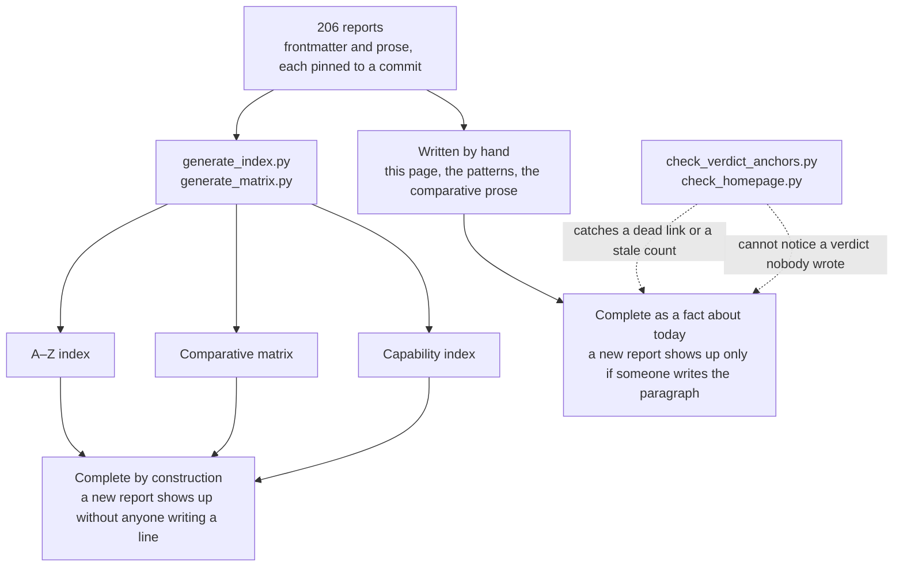

One entry per system: the best idea, the biggest risk, the component most worth
lifting, an impression of maturity, and who should and should not copy it. These
are judgements rather than marks — the evidence behind each is in that system's
own report, and the mechanisms are compared side by side in the
[comparative report](../compare/).

This page was part of the comparative report until 4 August 2026 and was split
out because it is a different thing: the comparison argues about mechanisms
across the corpus, and this argues about whether any one system is worth your
time. Reading it end to end is not the point; find the system you are weighing.

<!-- BEGIN GENERATED VERDICT COUNT -->
**This page covers all 206 reports.**
<!-- END GENERATED VERDICT COUNT --> Six judgements each: the best idea,
the biggest risk, the most reusable component, an impression of maturity, and
the two that matter most to a reader deciding — when to study it and when to
walk away.

It is hand-written, unlike the [capability index](../capabilities/) and the
[comparative matrix](../compare/#2-comparative-matrix), which is generated from every report's frontmatter
and complete by construction. So completeness here is a fact about today rather
than a guarantee: nothing fails the build if the next report arrives without an
entry, and `scripts/check_homepage.py` only notices the count in the sentence
going stale. A verdict missing in future means nobody wrote the paragraph,
not that a system was judged and found unremarkable — the same distinction the
[rubric](../methodology/atlas-rubric/) enforces for capability marks, where the
build *does* fail if a report omits the key.

That distinction runs through the whole site, and it is worth seeing once
because it decides how much weight a completeness claim on any page can carry:

The dotted edges are the honest part. A check can tell you that something
written went wrong; nothing tells you that something was never written. So the
generated pages are a guarantee and this one is a report on a state of affairs,
and the two should not be read with the same confidence.

  <label class="filter-legend" for="verdict-search">Find</label>
  <input class="matrix-search" id="verdict-search" type="search" autocomplete="off"
         placeholder="system name…" aria-describedby="verdict-count">

## System verdicts

### [`mem0`](../systems/mem0/)
- Best idea: pragmatic additive extraction plus hybrid retrieval/entity boost.
- Biggest risk: extracted facts are not strongly modeled as uncertain claims.
- Most reusable component: `Memory.add()` / `_add_to_vector_store()` pipeline.
- Maturity impression: practical SDK core, with some advanced features outside OSS.
- Study when: building a drop-in memory library.
- Do not copy when: you need rigorous trust/correction semantics.

### [`langmem`](../systems/langmem/)
- Best idea: memory as LangGraph store tools with schema-driven extraction.
- Biggest risk: it is a primitive layer, not a full memory policy.
- Most reusable component: `create_manage_memory_tool()` and namespace templates.
- Maturity impression: clean and framework-native.
- Study when: already building on LangGraph.
- Do not copy when: you need a standalone memory service with built-in quality controls.

### [`honcho`](../systems/honcho/)
- Best idea: event stream to derived working representation.
- Biggest risk: operational complexity and background consistency.
- Most reusable component: message ingestion plus deriver/representation flow.
- Maturity impression: serious service architecture with meaningful tests.
- Study when: modeling users/peers/sessions over time.
- Do not copy when: all you need is a local memory file.

### [`engram`](../systems/engram/)
- Best idea: local SQLite/FTS MCP memory with conflict-oriented writes.
- Biggest risk: lexical retrieval and agent-mediated judgment may hit limits.
- Most reusable component: `AddObservation()` and MCP `handleSave()`.
- Maturity impression: compact, inspectable, purpose-built for coding agents.
- Study when: building local developer-agent memory.
- Do not copy when: you need hosted multi-tenant vector retrieval.

### [`mempalace`](../systems/mempalace/)
- Best idea: verbatim drawers as the authoritative memory, with hybrid retrieval and extracted indexes as boosts.
- Biggest risk: raw stores get large/noisy and do not resolve contradictions by themselves.
- Most reusable component: `search_memories()` plus `_hybrid_rank()`, and the mining/write path around deterministic IDs.
- Maturity impression: operationally mature local system with broad tests, integrations, repair tooling, and benchmark artifacts.
- Study when: building local-first coding-agent memory or testing whether extraction is actually needed.
- Do not copy when: you need compact verified user facts as the primary memory surface.

### [`swafra`](../systems/swafra/)
- Best idea: compact source-diverse hybrid retrieval with explicit graph exploration and no required cloud model.
- Biggest risk: non-atomic global JSON state plus a benchmark that scores far more than the advertised `k`.
- Most reusable component: the conceptual `search_knowledge()` -> `graph_walk()` -> best-per-source composition, not the persistence implementation.
- Maturity impression: promising alpha prototype with significant code/docs/artifact drift and no ordinary tests.
- Study when: learning how little code a local MCP graph-RAG memory can require.
- Do not copy when: you need concurrency, trustworthy evals, scope isolation, correction, bounded prompts, or durable storage.

### [`llm-wiki-memory`](../systems/llm-wiki-memory/)
- Best idea: recoverable hook capture plus explicit federated write targets over inspectable Markdown/git memory.
- Biggest risk: LLM-distilled atoms become active guidance without candidate/verified/rejected state or contradiction protection.
- Most reusable component: `wiki-mutate.mjs` / `wiki-search*.mjs` with the flush, compile, scope, and commit orchestration around them.
- Maturity impression: operationally mature local coding-agent system with unusually broad failure-path and federation tests; retrieval quality is not benchmarked.
- Study when: building cross-agent local project memory, lifecycle capture, deterministic wiki placement, or self-healing maintenance.
- Do not copy when: you need high-stakes truth governance, large-corpus query performance, multi-tenant access control, or privacy-grade deletion.

### [`rainbox`](../systems/rainbox/)
Disclosure: RainBox is the atlas author's own project; this verdict is a self-assessment against the shared rubric.

- Best idea: claim/evidence memory tied to governed writes (single `record_belief` path, five-actor trust model, tombstones, conflict detection), review UI, retrieval telemetry, feedback, and eval gates.
- Biggest risk: active compact claims can steer behavior while losing nuance from original source context; no automatic candidate extraction means claims enter only through explicit writes.
- Most reusable component: `MemoryClaim`/`MemoryEvidence`/`MemoryRejectedValue`/`RetrievalEvent` model, `record_belief`/`correct_belief` governed write paths, `retrieve_memories_hybrid()`.
- Maturity impression: strong app-integrated memory subsystem with trust/correction machinery comparable to Verel's correctness properties, broad tests, and operator workflows.
- Study when: building an assistant product where memory must be inspectable, governable, and protected against model-write laundering.
- Do not copy when: you need a small embeddable library, raw transcript recall as the primary memory layer, or `epistemic_confidence`/`retrieval_strength` driving ranking (these columns are schema groundwork only; Tier-1 ranking still uses `confidence`).

### [`letta`](../systems/letta/)
- Best idea: core vs archival vs conversation memory inside the runtime.
- Biggest risk: agent-editable core memory without a strong truth model.
- Most reusable component: memory block compile/mutation and patch-style edits.
- Maturity impression: deep runtime integration with compatibility complexity.
- Study when: building an agent platform, not just a memory backend.
- Do not copy when: you want a small independent memory service.

### [`supermemory`](../systems/supermemory/)
- Best idea: product-grade API shape around documents, chunks, memory entries, spaces, profiles, SDKs, and MCP.
- Biggest risk: the hosted backend core is not visible here.
- Most reusable component: schemas and adapter surfaces.
- Maturity impression: polished integration surface; implementation evidence incomplete.
- Study when: designing public APIs and memory UX.
- Do not copy when: you need open implementation details for extraction/ranking.

### [`verel`](../systems/verel/)
- Best idea: explicit trust, confidence, retrieval strength, rejected tombstones, and defensive recall.
- Biggest risk: complexity.
- Most reusable component: `MemoryRecord`, `LocalMemory.write()`, and `recall_budgeted()`.
- Maturity impression: research-grade correctness focus with strong targeted tests.
- Study when: wrong memory is costly.
- Do not copy wholesale when: you need a fast MVP.

### [`hindsight`](../systems/hindsight/)
- Best idea: four independent recall arms plus task-specific fusion over evidence-backed facts and observations.
- Biggest risk: LLM-extracted and consolidated claims can become durable without an explicit truth state.
- Most reusable component: retain pipeline and `engine/search/` fusion/reranking stack.
- Maturity impression: service-grade implementation with unusually strong operational coverage.
- Study when: building a hosted retain/recall/reflect service.
- Do not copy when: a small local store can meet the evaluated retrieval need.

### [`graphiti`](../systems/graphiti/)
- Best idea: bi-temporal relationship edges that close validity intervals without erasing history.
- Biggest risk: entity-resolution or invalidation mistakes reshape a large portion of the graph.
- Most reusable component: episode/evidence model plus temporal edge maintenance.
- Maturity impression: substantial graph library with multiple drivers and deep search configuration.
- Study when: facts, relationships, and their validity change over time.
- Do not copy when: memory is mostly independent notes or stable preferences.

### [`mastra-observational-memory`](../systems/mastra-observational-memory/)
- Best idea: compute observation/reflection buffers early, persist exact coverage, and activate without blocking.
- Biggest risk: progressive summary drift and in-process-only locking.
- Most reusable component: marker/range-aware buffered activation.
- Maturity impression: deeply integrated and heavily tested framework feature.
- Study when: long agent conversations exceed model context.
- Do not copy when: exact evidence retrieval is the primary requirement.

### [`memos`](../systems/memos/)
- Best idea: mount textual, preference, skill, KV-cache, and parametric memory as one cube.
- Biggest risk: one abstraction hides uneven backend guarantees and maturity.
- Most reusable component: memory-cube packaging and textual-to-activation scheduling.
- Maturity impression: ambitious research/engineering substrate with many configurations.
- Study when: exploring model-native memory or deployable heterogeneous memory bundles.
- Do not copy when: a single audited text store is sufficient.

### [`basic-memory`](../systems/basic-memory/)
- Best idea: canonical human-editable Markdown with graph/search state treated as rebuildable projection.
- Biggest risk: bidirectional file/database synchronization and direct agent writes to canonical knowledge.
- Most reusable component: accepted-note transaction/reconciliation boundary and typed MCP client flow.
- Maturity impression: operationally serious local/cloud knowledge system with broad parity tests.
- Study when: people and agents must share portable project knowledge.
- Do not copy when: humans never edit memory and filesystem ownership adds no value.

### [`agentmemory`](../systems/agentmemory/)
- Best idea: zero-LLM hook capture plus compact-first hybrid search and explicit expansion.
- Biggest risk: a large optional surface and similarity-based supersession without an epistemic review state.
- Most reusable component: `mem::observe`, `HybridSearch`, and `mem::smart-search`.
- Maturity impression: ambitious, heavily tested coding-agent runtime with many operational paths.
- Study when: hooks, local capture, hybrid recall, and later consolidation need to coexist.
- Do not copy when: a small auditable store is enough or shared-by-default agent memory is unsafe.

### [`tencentdb-agent-memory`](../systems/tencentdb-agent-memory/)
- Best idea: progressive disclosure from raw evidence through records, scenes, persona, and navigable tool-output maps.
- Biggest risk: non-atomic JSONL/store updates and fail-open deduplication can create loss or contradictions.
- Most reusable component: L0/L1/L2/L3 context split and symbolic offload drill-down.
- Maturity impression: inventive OpenClaw/Hermes integration, but central lifecycle tests and reproducible benchmark evidence are thin.
- Study when: tool-heavy sessions exceed the context window and raw drill-down must remain possible.
- Do not copy when: authoritative cross-store consistency, multi-tenant boundaries, or verified memory are required.

### [`cognee`](../systems/cognee/)
- Best idea: source-preserving, ontology-aware graph/vector pipelines with provenance rollback behind a small remember/recall API.
- Biggest risk: probabilistic extraction and a large adapter/configuration surface create cross-store consistency and policy burden.
- Most reusable component: permanent `remember()` as add-plus-cognify, dataset authorization, and pipeline-run rollback.
- Maturity impression: substantial platform with broad tests and transparent but preliminary BEAM artifacts.
- Study when: agents need multimodal ingestion, typed knowledge graphs, ontologies, dataset permissions, and backend choice.
- Do not copy when: a small local evidence store and lexical/vector retrieval satisfy the requirement.

### [`claude-mem`](../systems/claude-mem/)
- Best idea: durable hook queue, canonical SQLite commit, then best-effort semantic/cloud projections and bounded timeline injection.
- Biggest risk: generated observations become active without epistemic review, and ordinary text search does not fuse its FTS and Chroma capabilities.
- Most reusable component: `pending_messages` lifecycle plus `ResponseProcessor` commit/acknowledgement ordering.
- Maturity impression: operationally mature coding-agent sidecar with broad failure-path tests; memory quality is not benchmarked.
- Study when: cross-session coding context must be captured automatically without blocking the agent.
- Do not copy when: explicit writes are sufficient, hooks are unavailable, or high-stakes facts require verification before use.

### [`holographic`](../systems/holographic/)
- Best idea: deterministic SHA-256-derived phase vectors and algebraic multi-entity queries, with no embedding model to version.
- Biggest risk: three unhelpful ratings silently drop a fact below the retrieval floor forever.
- Most reusable component: `encode_atom`/`bind`/`unbind`, the FTS5 query sanitizer, and the refcounted shared-connection registry.
- Maturity impression: compact and fully readable, with real production scar tissue around concurrency, but no benchmark and an unmeasured HRR contribution.
- Study when: you want compositional structure without an embedding service, or a worked example of why truth and usefulness must be separate fields.
- Do not copy when: you need scope, provenance, correction, or any feedback mechanism that is not also a deletion mechanism.

### [`hermes-agent`](../systems/hermes-agent/)
- Best idea: bounded curated memory frozen into the prompt at session start, with overflow refused and consolidation demanded in-turn.
- Biggest risk: whatever the model writes is authoritative in every later session, and budget-driven eviction is unlogged.
- Most reusable component: the frozen-snapshot pattern, `_detect_external_drift`, and the staged write-approval gate.
- Maturity impression: heavily defended file layer whose guards cite the incidents that produced them; the provider contract is less complete than the store.
- Study when: prompt-cache cost is material, or you need memory that cannot grow without someone deciding what to drop.
- Do not copy when: you need verification, tombstones, substring-free identity, or a provider contract that can honour deletion.

### [`openviking`](../systems/openviking/)
- Best idea: three retrievable granularities on one record, plus hotness kept strictly separate from confidence.
- Biggest risk: extraction becomes durable context with no verification tier, and published numbers are not backed by committed artifacts.
- Most reusable component: `hotness_score`, `type_quota_recall`, and the `user_space` / `peers/<id>` isolation convention.
- Maturity impression: a large, seriously engineered platform with real multi-tenancy and the most complete benchmark harness in the atlas.
- Study when: you need multimodal ingestion, tenant isolation, skills and resources unified with memory, or backend choice.
- Do not copy when: you need a small embeddable layer, verified memory, or a licence compatible with closed distribution — this is AGPL-3.0.

### [`redis-agent-memory-server`](../systems/redis-agent-memory-server/)
- Best idea: TTL-native working memory promoting into deduplicated long-term memory, with retention expressed as a real policy.
- Biggest risk: forgetting is deletion without tombstones, so anything forgotten can be re-extracted.
- Most reusable component: `select_ids_for_forgetting`, the three-layer dedupe chain, and `_semantic_merge_group_is_cohesive`.
- Maturity impression: vendor-neutral reference implementation with unusually well-targeted tests on the risky logic.
- Study when: you want the working/long-term split done carefully, or a retention policy you can defend to a user.
- Do not copy when: cognitive memory types would be mistaken for a trust model, or deletion must be durable.

### [`byterover`](../systems/byterover/)
- Best idea: counting exactly what an LLM rewrite would delete, then merging the loss back automatically.
- Biggest risk: the Elastic License 2.0 forbids hosted redistribution, and the memory core itself has no trust, scope, or correction model.
- Most reusable component: `detectStructuralLoss` / `resolveStructuralLoss`, and the immutable `DECISIONS` category.
- Maturity impression: a thin memory primitive attached to a more thoughtful knowledge-curation layer, with no visible tests on its best idea.
- Study when: an LLM is allowed to rewrite stored knowledge and you need a cheap deterministic guard.
- Do not copy when: you need durable beliefs, ranked retrieval, or an OSI-compatible licence.

### [`openclaw`](../systems/openclaw/)
- Best idea: scope composed inseparably into every predicate, and 567 lines spent keeping the runtime's own envelope out of memory.
- Biggest risk: a vector-only reference backend for content full of names and identifiers, with auto-capture that can undo deletions.
- Most reusable component: `memory-capture-sanitization.ts`, `scopedPredicate`, and the doctor-contract idea.
- Maturity impression: test lines far exceed implementation lines; the plugin contract is mature, the memory model deliberately minimal.
- Study when: building a host runtime with swappable memory, or capturing from a channel that wraps messages in scaffolding.
- Do not copy when: you need hybrid retrieval, per-user scope inside an agent, or deletion that survives auto-capture.

### [`atomic-agent`](../systems/atomic-agent/)
- Best idea: numbered cross-phase invariants cited from the schema into a design document, and votes kept as append-only events with derived scores.
- Biggest risk: an elaborate opt-in surface whose evaluation campaign has no committed results.
- Most reusable component: the invariant-citation practice, the `vote_events` shape, and the surfaced-id allowlist in `neighbor-evolver.ts`.
- Maturity impression: the most specification-like memory system in the atlas — design plan, acceptance criteria, implementation ledger, and features default-off pending evidence.
- Study when: you want memory built as an engineering artifact rather than an accretion, or a feedback design that keeps every downstream option open.
- Do not copy when: you need a value tombstone or an established scope model; neither surfaced here.

### [`mateclaw`](../systems/mateclaw/)
- Best idea: a provider SPI that carries an owner key, with retry and metrics as decorators over every backend.
- Biggest risk: the contract still has no deletion hook, and contradiction is detected without a resolution path.
- Most reusable component: the SPI shape with scoped overloads and default methods, and `spi/decorator/`.
- Maturity impression: built in the enterprise-framework tradition — layered, dependency-injected, event-driven, and conventional in the ways that tradition is good at.
- Study when: designing a memory contract third parties will implement, or wondering who owns provider resilience.
- Do not copy when: you need the deletion half of the governance story, which is absent.

### [`llamaindex`](../systems/llamaindex/)
- Best idea: one token budget split between chat history and blocks, with each block truncating itself to fit.
- Biggest risk: no provenance, correction, or scope, and long-term capture is triggered by conversation length rather than importance.
- Most reusable component: the `BaseMemoryBlock` contract — `aget`, `aput`, `atruncate` — and the explicit budget split.
- Maturity impression: a widely deployed framework whose newer block API is a real memory layer, shipped alongside an older window-management API of the same name.
- Study when: you need a memory component contract, or a budget that several contributors must share.
- Do not copy when: facts must be traceable, correctable, or scoped — those are left to the application.

### [`open-cowork`](../systems/open-cowork/)
- Best idea: a committed memory benchmark whose queries assert forbidden hits as well as expected ones, scored against the assembled prompt prefix.
- Biggest risk: the harness exists but no scored results are committed, and no trust state guards extraction.
- Most reusable component: `memory-eval-harness.ts` — the eval-case shape is largely independent of the rest of the system.
- Maturity impression: a well-factored memory subsystem whose evaluation thinking is ahead of most of the atlas.
- Study when: you need to turn "our memory works" into something a CI job can check.
- Do not copy when: you need verification or correction semantics; neither appears in the module set.

### [`gini-agent`](../systems/gini-agent/)
- Best idea: bi-temporal units with `rejected` and `conflicted` states, four RRF-fused recall channels, and architecture decisions recorded as ADRs.
- Biggest risk: `conflicted` is modelled with no visible workflow to resolve it, and rejection has no value-level tombstone.
- Most reusable component: the `memory_units` schema, and the ADR practice itself.
- Maturity impression: a faithful local reimplementation of a published memory model, with unusually good written rationale.
- Study when: you want a trust-and-time-aware unit schema you can implement in plain SQLite.
- Do not copy when: you need the conflict workflow the schema implies but does not ship.

### [`moltis`](../systems/moltis/)
- Best idea: a no-embeddings mode that is a constructor and a predicate rather than a degraded state, plus content-hash file addressing.
- Biggest risk: exported session transcripts share one index and one rank with curated notes, with nothing distinguishing them.
- Most reusable component: `MemoryManager::keyword_only()` / `has_embeddings()`, and the single `sync()` chokepoint.
- Maturity impression: carefully built, with feature-gated backends and committed plans naming its own gaps.
- Study when: memory and documents should be one substrate, or you need a genuinely offline path.
- Do not copy when: a chunk is not a good enough unit — there is no claim, status, or correction record.

### [`mercury-agent`](../systems/mercury-agent/)
- Best idea: three independent grades — confidence, importance, durability — plus a subconscious tier and a user-facing learning pause.
- Biggest risk: `dismissed` is a boolean, so dismissal is not durable against re-extraction.
- Most reusable component: the record model, especially the durability/importance split and the narrowed candidate type.
- Maturity impression: small but opinionated, with an operator review page and clear provenance kinds.
- Study when: building personal memory where different facts should live for different lengths of time.
- Do not copy when: automatic extraction can regenerate what a user dismissed.

### [`waku-agent`](../systems/waku-agent/)
- Best idea: a small-model gate that decides whether to retrieve at all, returns the query when it says yes, and fails open when it errors.
- Biggest risk: the gate's own accuracy is unmeasured, and a false negative is invisible — eleven committed cases establish that it parses, not that it decides correctly, and the project's whole thesis rests on the second.
- Most reusable component: `should_retrieve()` — the fail-open branch and the recorded reason included.
- Maturity impression: 825 lines of memory code under fifty model-free eval files, unusually clear about why each expensive step is conditional, and a maintainer who files the criticism as an issue and states the error asymmetry a single accuracy number would hide.
- Study when: retrieval runs every turn and you suspect it is hurting as often as helping.
- Do not copy when: you need a correction that survives the next automatic write. `manage_memory` and the dashboard both correct a row and neither records that a value was rejected, so the consolidation pass re-reads the same chat log and can restore what the user just removed.

### [`metaclaw`](../systems/metaclaw/)
- Best idea: candidate retrieval policies replayed offline and promoted only on non-regression across eight metrics.
- Biggest risk: the loop optimizes lexical-overlap proxies, and its promotion thresholds are hand-chosen constants.
- Most reusable component: `promotion.py`'s `MemoryPromotionCriteria` and the replay-then-gate loop in `self_upgrade.py`.
- Maturity impression: substantial and unusually well evidenced, with committed benchmark fixtures and dedicated memory ablations.
- Study when: you cannot justify your retrieval weights and want a safe way to change them.
- Do not copy when: you need trust semantics — the memory model has no rejected state and no verification path.

### [`nanobot`](../systems/nanobot/)
- Best idea: two cursors over an append-only archive, with a Dream pass that refuses to advance after tool errors.
- Biggest risk: durable claims carry no provenance back to the evidence that produced them.
- Most reusable component: the dual-cursor split, the failure-aware advance gate, and the durable-file allowlist for audit commits.
- Maturity impression: compact and carefully reasoned, with unusually good design documentation and no visible memory tests.
- Study when: a fast producer feeds a slow consolidator, or you want git history that reads as a record of belief.
- Do not copy when: memory must grow past what fits in every prompt, or must be scoped per project.

### [`cowagent`](../systems/cowagent/)
- Best idea: a dated intermediate layer that gives consolidation a naturally bounded unit, plus written distillation rules and a dream diary.
- Biggest risk: two chained lossy summarizations with no loss detection, and recency-wins conflict resolution.
- Most reusable component: the daily-bucket pipeline, the distillation rule table, and the self-healing FTS5 state check.
- Maturity impression: practical and well documented, with real hybrid retrieval and no visible memory tests.
- Study when: you want consolidation you can inspect by opening a file for a given day.
- Do not copy when: scope matters — `scope` defaults to `shared` — or corrections must be reviewable.

### [`genericagent`](../systems/genericagent/)
- Best idea: "No Execution, No Memory", and an explicit ROI model for what earns a place in always-injected context.
- Biggest risk: every rule is prose, with no enforcement, no audit, and no record of the verification each write claims.
- Most reusable component: the four axioms and the cleanup SOP's ROI test and deletion categories.
- Maturity impression: a small framework whose memory thinking is considerably more developed than its memory machinery.
- Study when: designing the policy layer of a memory system, or deciding what belongs in permanent context.
- Do not copy when: wrong memory is costly and you need the rules enforced rather than requested.

### [`magic-context`](../systems/magic-context/)
- Best idea: memories mapped to backing files and re-verified when git reports those files changed, with lifecycle and verification on separate axes.
- Biggest risk: no rejected-value tombstone, so archived memories can be re-derived; and the verification verdict is still an LLM call.
- Most reusable component: `dreamer/verify-gate.ts`, the two-axis state model, and `(memory_id, model_id)` embedding keys.
- Maturity impression: the heaviest test posture in the atlas — 473 test files, seventy tested migrations, CAS-race suites, fail-closed registration.
- Study when: memory describes an inspectable artifact and you want trust to be observed rather than judged.
- Do not copy when: you need a small memory layer; most projects want the verify gate and the state model, not the whole platform.

### [`pi`](../systems/pi/)
- Best idea: deterministic `readFiles`/`modifiedFiles` manifests attached to compaction entries, derived from tool calls rather than from the summarizing model.
- Biggest risk: no memory contract at all, so scope and deletion have nowhere to live and every plugin reinvents indexing.
- Most reusable component: the typed session-entry model and the result-returning extension events.
- Maturity impression: actively developed, well-factored harness; memory is deliberately out of scope.
- Study when: designing a host runtime, or thinking about what branchable sessions mean for memory.
- Do not copy when: you expect third-party memory — define scope and deletion in the interface before plugins exist.

### [`hipporag`](../systems/hipporag/)
- Best idea: Personalized PageRank diffusion replaces hop planning, with IDF-penalized seeding and a weak dense prior.
- Biggest risk: no scope, trust, provenance, or temporal model, and a wrong extracted edge has graph-wide blast radius.
- Most reusable component: `graph_search_with_fact_entities()` plus `run_ppr()`, and synonymy-as-edges instead of entity merging.
- Maturity impression: actively maintained research framework with a strong reproduction tree and thin unit tests.
- Study when: recall must cross documents associatively, or entity-resolution merges have burned you.
- Do not copy when: you need agent memory rather than corpus QA — scope, correction, and time all have to be added.

### [`voyager`](../systems/voyager/)
- Best idea: memory written only after the environment verifies the procedure worked.
- Biggest risk: a frozen 2023 artifact that generalizes from a single verified run and keeps no failure memory.
- Most reusable component: the verified write gate, and description-indexed / code-retrieved storage.
- Maturity impression: a 127-line memory subsystem inside a research agent; unmaintained since July 2023.
- Study when: your agent's actions have observable outcomes and competence is worth remembering, not just facts.
- Do not copy when: procedures will be executed outside a sandbox, or success is a matter of judgment rather than observation.

### [`generative-agents`](../systems/generative-agents/)
- Best idea: consolidation triggered by accumulated significance rather than by a timer or token count.
- Biggest risk: its famous retrieval weights are hand-tuned constants, and reflections share one pool with observations.
- Most reusable component: the reflection trigger, and the three-signal retrieval structure — recalibrated, with time-based recency.
- Maturity impression: the field's reference architecture, frozen since August 2023 and never engineered for production.
- Study when: you want to understand where most of this atlas came from, or need a consolidation schedule that tracks salience.
- Do not copy when: you need any operational property at all — there is no scope, correction, deletion, or index.

### [`a-mem`](../systems/a-mem/)
- Best idea: small linked notes whose organization can be reconsidered when new memory arrives.
- Biggest risk: rank positions are used as note identities, allowing evolution to mutate the wrong neighbor.
- Most reusable component: the proposed Zettelkasten evolution protocol, after replacing direct mutation with validated change proposals.
- Maturity impression: research prototype; tests are shallow around the most consequential behavior and benchmarks live elsewhere.
- Study when: researching adaptive linked-note organization.
- Do not copy as a production core without stable IDs, canonical durability, scope, provenance, transactions, and trust state.

### [`memora`](../systems/memora/)
- Best idea: automated supersession that defaults to a dry run, so a correction sweep is previewed before it hides anything.
- Biggest risk: supersession without a tombstone, in a system that ingests documents and images and can therefore re-ingest what it hid.
- Most reusable component: the six-way relation vocabulary with neutral A/B presentation, and `dry_run: bool = True` as the default posture.
- Maturity impression: substantial for its age, with the sophistication concentrated in what happens to memories after they are written.
- Study when: you are about to run an automatic dedupe or supersession pass over a store you cannot afford to damage.
- Do not copy when: you need trust state, scope isolation, or a correction that survives re-ingestion.

### [`loongflow`](../systems/loongflow/)
- Best idea: recall by Boltzmann sampling at a temperature driven by the store's measured diversity — the only stochastic retrieval in the atlas.
- Biggest risk: selection quality is bounded entirely by a `score` nothing validates, and the same query can return different memories with no seed or replay path.
- Most reusable component: the diversity-to-temperature loop, including the 20% smoothing and the explicit min/max bounds.
- Maturity impression: two unrelated memory models in one package — a conventional tier stack and a genuinely novel selection mechanism — with the control constants undefended.
- Study when: memory feeds a search or generate-and-test loop and deterministic top-*k* keeps returning the same dead end.
- Do not copy when: recall must be reproducible, or the memories are facts rather than attempts.

### [`core-memory`](../systems/core-memory/)
- Best idea: epistemic grounding caps the confidence ladder, so a speculative record cannot reach canonical status by any amount of use.
- Biggest risk: correction is record-keyed. `tombstone_bead` is documented as the single-bead semantic action and keyed on a bead id, so supersession and rejection do not stop re-extraction from the retained turns that produced the value.
- Most reusable component: the grounding-to-ceiling table plus the monotonic class, which is a lookup and a `min()`.
- Maturity impression: the largest and most specification-like system in the atlas, six of seven capability marks, 412 test files, and its distinctive claim asserted end to end — a promoted speculative bead stays capped at B across an index rebuild.
- Study when: you need to explain why an incorrect memory never became permanent, and want the answer to be structural.
- Do not copy when: you cannot carry the surface — thirteen subpackages and forty store-ops modules is a real maintenance budget.

### [`memanto`](../systems/memanto/)
- Best idea: a conflict workflow that terminates in a human decision, including `keep_both` and a human-authored `manual` resolution.
- Biggest risk: detection is one unmeasured LLM pass, and resolution deletes without a tombstone, so scheduled extraction can undo it.
- Most reusable component: the five-action resolver plus the bounded-scan instruction that keeps the nightly pass linear.
- Maturity impression: a real service with CLI, web UI, MCP and four framework integrations, and an unusually on-topic test tree.
- Study when: you have contradiction detection and no idea what to do with the flags it produces.
- Do not copy when: you need trust state or ranking you can inspect — storage is the vendor's own service.

### [`memory-engine`](../systems/memory-engine/)
- Best idea: agents are access-control principals, and a delegated agent grant clamps to `least(agent, owner)` at every path, so over-granting cannot escalate.
- Biggest risk: no trust state, supersession, or tombstone — it governs who may read a memory and knows nothing about whether it is true.
- Most reusable component: the `tree_access` model with the agent clamp, and authorization evaluated inside the ranking query.
- Maturity impression: a serious database-native service with committed SQL benchmarks, access diagnostics, and unusually candid design notes including a negative result on RLS.
- Study when: agents write to shared memory and you cannot say from the schema which memories each may read.
- Do not copy when: you need correction semantics — `replace` overwrites in place and leaves no history.

### [`ai-memory`](../systems/ai-memory/)
- Best idea: a `Handoff` with an open/accepted/expired lifecycle, typed sender and recipient, and an `open_questions` list — memory of what is *not* known.
- Biggest risk: hooks re-capture every session and supersession is page-keyed, so a deleted page returns through the path that first produced it.
- Most reusable component: `handoff.rs`, which is small and independent of the rest of the system.
- Maturity impression: broad and well packaged, with harness adapters for eight agents and committed prior-art analyses of four systems in this atlas.
- Study when: work is interrupted and resumed in a different harness, and re-explaining the state is the actual cost.
- Do not copy when: you need trust state — and do not assume its `do_not_answer_from` tag does anything; it appears only in a test fixture.

### [`ctx`](../systems/ctx/)
- Best idea: a write-scope guard on the consolidation pass, with one crossing gated on the disposition rather than the caller, plus refusals that carry a registered reason.
- Biggest risk: correction is structural folding with no tombstone, so a dream can re-propose what a human folded away.
- Most reusable component: `WriteScope`, and the corrupted-artifact regression corpus, which any system with an LLM rewrite path could adopt in an afternoon.
- Maturity impression: dense tests in the packages that matter, an append-only ledger, and a 61,000-line CLI wrapped around them.
- Study when: a background model pass can write into the user's own repository and you have no answer for where it may write.
- Do not copy when: you need ranked retrieval — there is no ranker, only progressive disclosure over files.

### [`optmem`](../systems/optmem/)
- Best idea: no background work at all — consolidation is requested inline in the output of `note`, so write-to-readable lag is zero and nothing rewrites memory unobserved.
- Biggest risk: no licence file, so nothing here is reusable; and a wrong memory is permanent, because the log is never edited.
- Most reusable component: the `cover` geometry — one parameter, closed form, and no compression at all while everything fits.
- Maturity impression: 860 lines with a 611-line test file, and the only committed footprint-and-latency figures in the atlas.
- Study when: you are about to build a consolidation queue and have not asked whether you need one.
- Do not copy when: you need to fix a mistake — OptMem can always tell you what was written and can never repair it.

### [`memvid`](../systems/memvid/)
- Best idea: immutability as the correction mechanism — a supersession is a link, not an overwrite, so `get_at_time` and session replay come from the format rather than a bi-temporal schema.
- Biggest risk: the loudest quality claims in the atlas ("+35% SOTA on LoCoMo") with no committed raw artifacts found at this commit.
- Most reusable component: `entity:slot` cards with a declared cardinality, which turns contradiction detection into a lookup and tells you whether a second value is a conflict or an addition.
- Maturity impression: a serious file format with WAL, footer recovery, a 1,687-line doctor, and a deployment story of one binary and one file.
- Study when: you need to answer "what did the agent believe when it did that", which nothing else here can.
- Do not copy when: you need multi-tenant scope or epistemic status — the ACL is thin and there is no trust state.

### [`memoryos`](../systems/memoryos/)
- Best idea: the promotion rule is a written formula with named coefficients, and the LoCoMo harness ships with its dataset committed beside it.
- Biggest risk: heat sums frequency, interaction length and recency into one scalar with weights of 1/1/1, and a second LFU counter can disagree with it about the same segment.
- Most reusable component: the shape — tiers with an explicit, computable promotion signal — rather than the formula.
- Maturity impression: a legible research implementation with an MCP server, a vector variant and a playground around a 2,100-line core.
- Study when: you want the tiered architecture in a form small enough to read in an afternoon, or a base for experiments on promotion policy.
- Do not copy when: real users are involved — no provenance, no correction, no audit, and a merged profile string makes a deletion request unanswerable.

### [`memu`](../systems/memu/)
- Best idea: rank the slice, return the file — the embed/search unit and the context payload are different sizes, and a file scores as the max of its segments.
- Biggest risk: no epistemic model at all, and no scope key in a layer that serves seven different hosts from one store.
- Most reusable component: the three-method backend protocol, plus keyset pagination on immutable domain identity so a walk under concurrent writes neither skips nor repeats.
- Maturity impression: unusually disciplined for its size — schema comments cite the ADRs that produced them, and a denormalized column carries its safety argument; the limit of that discipline is a decision record asserting a telemetry disclosure that is not in the tree.
- Study when: you want one memory across several coding agents and a read path that is cheap, predictable and model-free.
- Do not copy when: memory has to be trusted, corrected, or separated between users — or when you install for other people and cannot make a vendor-telemetry disclosure the install guide omits.

### [`openworker`](../systems/openworker/)
- Best idea: an explicit when-to-remember policy, written because models without one fail bimodally — they either never save or save what the repository already records.
- Biggest risk: none of it is enforced or observable, so the first sign the model stopped following the policy is memory quality nobody can explain.
- Most reusable component: the guidance paragraph itself, especially "use absolute dates, never yesterday" and "don't save what the repo already records".
- Maturity impression: a large, carefully built agent with permissions, audit and unattended operation, and a memory subsystem of 260 lines that touches none of it.
- Study when: deciding whether to spend the next day on a pipeline or on the prompt that governs one.
- Do not copy when: you need ranking, a correction record, or any guarantee the policy was followed.

### [`qwen-code`](../systems/qwen-code/)
- Best idea: a team tier committed to the repository, with secret-bearing writes to it refused unconditionally — the guard ignores the feature flag that governs the tier, because the directory is under version control either way.
- Biggest risk: three forget paths and no value-level tombstone, in a system whose extraction re-reads the sessions that produced the memory.
- Most reusable component: the extraction cursor with a processed offset, and recording `noop` as an outcome so "ran and changed nothing" is distinguishable from "did not run".
- Maturity impression: ~9,000 lines with a test beside nearly every module, and comments that read as scar tissue — per-operation kill signals for git, `execFile` with no shell.
- Study when: a team wants shared agent memory and does not want to stand up a service to get it.
- Do not copy when: corrections must survive a background pass.

### [`opencode`](../systems/opencode/)
- Best idea: a compaction hook that lets a plugin append context as well as replace the prompt — the moment a memory system most needs, and one few hosts expose.
- Biggest risk: no memory contract at all, so plugins couple to the SQLite schema instead of the API, and a migration the host is entitled to make silently breaks them.
- Most reusable component: handing plugins the system prompt as `string[]` rather than a concatenated string, so two plugins compose instead of colliding.
- Maturity impression: a large, well-built coding agent with an extensive plugin surface, whose memory-relevant hooks are both marked experimental.
- Study when: you are building a host and deciding whether seams are enough without a domain contract.
- Do not copy when: you want the host to enforce scope or deletion — there is nothing here to enforce them with.

### [`nooa-memory`](../systems/nooa-memory/)
- Best idea: every access records the score components that produced it — `{rel, rec, imp, spread}`, the rank, the query and the reader — so "why was this retrieved" is a lookup rather than a reconstruction.
- Biggest risk: the access log is a capped ring on the record, so the formative accesses that explain how a memory became established are the first to be lost.
- Most reusable component: keeping rehearsal separate from belief — retrieval bumps a `strength` counter that slows forgetting and leaves `confidence` untouched.
- Maturity impression: 4,200 lines with 23 test modules, ACT-R and Ebbinghaus implemented literally rather than gesturally, inside an NVIDIA labs framework — and an owner-isolation property that is now asserted by a three-node relay case with an unscoped positive control.
- Study when: you need memory whose ranking is explainable after the fact, or you want prospective memory — `intent` and `todo` are types nothing else here has.
- Do not copy when: you need correction — archival is a record flag, and a decayed memory can be re-authored with nothing to consult.

### [`neo4j-agent-memory`](../systems/neo4j-agent-memory/)
- Best idea: reasoning traces recorded via a context manager, so a raised exception becomes the outcome — failure memory proportional to coverage rather than to caller discipline, with an indexable error kind on top.
- Biggest risk: bi-temporality and supersession cover preferences only, and nothing is keyed on a rejected value.
- Most reusable component: the trace context manager plus `ReasoningStepWithContext`, which never returns a step without its parent's outcome.
- Maturity impression: a Neo4j Labs package with MCP, CLI, Strands and OpenAI Agents integrations, a benchmarks tree, and local NER extraction keeping the frequent write path off the token budget.
- Study when: several agents should share one view of the world, and operational history is the thing worth pooling.
- Do not copy when: corrections must survive re-extraction.

### [`elastic-atlas`](../systems/elastic-atlas/)
- Best idea: a committed retrieval eval matched on document id rather than judged by a model, so Recall@k and MRR are arithmetic and reproducible — shipped beside a stress test.
- Biggest risk: a research demo by its own description, with synthetic personas and an ungated single-pass consolidation that writes both facts and playbooks.
- Most reusable component: the eval and stress-test scripts, which are more transferable than the memory layer.
- Maturity impression: a demo that measures itself more than most production systems in this atlas do.
- Study when: you want the clearest small example of the episodic/semantic/procedural split, or an eval design you can actually rerun.
- Do not copy when: you need correction, trust state, or an audit trail — none is present.

### [`nemoclaw`](../systems/nemoclaw/)
- Best idea: a per-agent state contract that says which directories are snapshotted, which are wiped, which are regenerated and which the user owns — written down rather than left to whoever wrote the backup script.
- Biggest risk: memory is snapshotted and restored verbatim, so a restore reinstates deleted memories and nothing above is told.
- Most reusable component: excluding state that is cheaper to regenerate than to restore, with the failure it prevents named — an argument that may apply to derived memory too.
- Maturity impression: infrastructure with guards that validate their own helpers, and issue numbers cited in the comments for the two decisions that would otherwise look arbitrary.
- Study when: you operate agents rather than build memory for them, and want to know what memory looks like from underneath.
- Do not copy when: you want a memory system — it has none, and its product page correctly credits memory to the agents it wraps.

### [`daimon`](../systems/daimon/)
- Best idea: the model's trust label is a claim the code falsifies — a verbatim item's quote is grepped against the transcript and demoted on a miss, and an outcome claim with no tool result cited is demoted even when its quote verifies.
- Biggest risk: the live working set is one checkpoint per project, so anything carry drops is reachable only through a lexical index with no semantic arm, and the committed retrieval numbers are modest.
- Most reusable component: `verify_quotes` and `ground_outcomes` in `serializer.py` — about 200 lines that make an extraction's own provenance mechanically checkable.
- Maturity impression: 18,200 lines of source under 40,300 lines of tests, a research logbook, a scar file per landmine, a benchmark reporting policy stricter than most vendors', and a replay A/B rig with a placebo arm that has been used to refute three of the project's own hypotheses.
- Study when: you want cross-session continuity for a coding agent, or you want to see what taking trust classes seriously actually costs in code.
- Do not copy when: you need memory within a session, semantic retrieval, or a shared service — none of the three is here or planned.

### [`memory-project`](../systems/memory-project/)
- Best idea: forgetting has two speeds and only the slow one destroys — `prune()` archives to a cold tier that a specific enough cue can still reach, `purge()` is a separate deliberate call, and the source says plainly which is which.
- Biggest risk: `purge()` is documented for accidentally-jotted secrets and implemented as a Chroma `col.delete`, so the embedding stays in the index file; and with no tombstone, re-jotting a purged claim re-admits it at full stability.
- Most reusable component: `prune()` and `purge()` together — about forty lines that remove the false choice between growing forever and destroying on "forget".
- Maturity impression: 3,113 lines, 26 commits, AGPL-3.0, 16 regression assertions on the decay maths and nothing testing the hooks. Small and legible, with the tuning constants named and grouped rather than scattered.
- Study when: you want a forgetting curve with a reversible archive tier, or an injection boundary that distinguishes assert from hedge from silence.
- Do not copy when: anything needs a scope boundary — topic is a ranking boost and never a filter, by design — or when a memory has to be markable as wrong.

### [`hippo-memory`](../systems/hippo-memory/)
- Best idea: the scope boundary is enforced in the query on the read path and *deliberately suspended* for consolidation, with the suspension fenced at the transport layer instead — `/v1/sleep` is loopback-only and admin-gated, and the 403 names the reason and the version that introduced it.
- Biggest risk: `stale` sits in a union with `verified`, `observed` and `inferred` but is derived from thirty days of disuse rather than from evidence, so one field mixes how a belief was formed with how recently anyone wanted it.
- Most reusable component: the retention prune in `audit-prune.ts`, which emits its own `audit_prune` row carrying cutoff, count and dryRun so the audit trail explains its own hole.
- Maturity impression: 42,482 lines under 376 test files with a real-database test convention, a migration ladder past twenty-five steps, and incident comments naming what each repair was for — beside a tagline about forgetting that the correction model does not implement.
- Study when: you need multi-tenant memory where different transports carry different trust models, or you want a worked example of ranking that fuses lexical, vector and derived-quantity arms.
- Do not copy when: correction has to be durable — supersession hides a row and re-assertion is unguarded — or when you want a small dependency.

### [`7layermem`](../systems/7layermem/)
- Best idea: seven memory types separated at the schema rather than by a type column, each table annotated with the cognitive category it stands for, so "which kind of memory is this" is answered by the table name.
- Biggest risk: the layers are destinations rather than a lifecycle. Nothing promotes, expires or demotes between them, six of the seven have no delete path, and deleting a conversation thread leaves its summary behind.
- Most reusable component: the seven `CREATE TABLE` statements with their annotations — a legible taxonomy that costs nothing at this scale.
- Maturity impression: 7,016 lines, no licence file at this commit, no migrations, and a test suite that re-declares the schema with its own `CREATE TABLE` strings rather than calling the store manager.
- Study when: you want to hold an entire typed-memory design in your head at once, or you are deciding whether to split memory types across tables.
- Do not copy when: you need any correction path, a scope beyond one conversation thread, or a licence.

### [`cognicore`](../systems/cognicore/)
- Best idea: `state TEXT DEFAULT 'candidate'` — a memory arrives unassessed rather than believed, which a confidence float cannot express, plus a utility ledger separating retrieved from used from *ignored*.
- Biggest risk: scope is filtered in Python after the backend returns, so any limit the backend applied was applied to the unscoped set and a scoped read can silently come back short.
- Most reusable component: the four column groups on `memory_entries` — content, epistemic, scope, and provenance-plus-utility — which put `creation_reason` and `source_component` in the schema rather than in a metadata blob.
- Maturity impression: MIT, 79,439 lines, six backends behind one contract, a benchmark programme and a paper directory — beside fourteen loose `test_*.py` provider smoke files and two committed `.db` files at the repository root.
- Study when: you want an epistemic state in the schema rather than in a prompt, or a retrieval feedback signal that records what the agent declined.
- Do not copy when: the scope boundary has to hold under a limit, or you want a dependency rather than an environment.

### [`alma-memory`](../systems/alma-memory/)
- Best idea: an anti-pattern table carrying `why_bad` and `better_alternative` beside the pattern itself — the only place in this corpus where a correction record holds both the reason and the replacement.
- Biggest risk: the anti-pattern write guard has one call site. `learn()` refuses a strategy matching a known anti-pattern; the heuristic extractor, the conversation miner, the consolidation pass and two MCP write paths reach the same store without passing it, and those are the automatic writers a rejection most needs to bind.
- Most reusable component: `VerificationMethod`, which separates checked-against-an-authority from checked-against-our-own-memories from guessed-from-a-number — three claims most systems collapse into one score.
- Maturity impression: 104,360 lines under 42,467 lines of tests, MIT with a LICENSE file, a dual-dialect migration for the new columns, and a committed LongMemEval run whose published recall curve recomputes exactly from its per-question records at every k.
- Study when: you want a memory that learns operating heuristics from task outcomes, or the richest worked example of storing what not to do.
- Do not copy when: you need the write guard to hold against a background pass today — the paths that re-derive memory automatically are the ones it does not cover.

### [`promptx`](../systems/promptx/)
- Best idea: one SQLite database per role, opened from the role's own directory, so isolation cannot be forgotten — crossing it would mean opening a different file rather than omitting a predicate.
- Biggest risk: `strength` is the only epistemic field, so a wrong engram and an unused one decay identically and nothing records that anything was ever judged.
- Most reusable component: the `cue_index` — memories addressed by the words that lead to them rather than by embedding proximity, with `ON DELETE CASCADE` keeping the index from outliving its target.
- Maturity impression: MIT, 63,237 lines, twenty-one cognition modules with a Cucumber suite over them — and `CREATE TABLE IF NOT EXISTS` with no version column across a store that is per-role, so the first schema change is a manual migration everywhere.
- Study when: you want associative recall by cue rather than similarity, or the cleanest example here of scope enforced by file boundary.
- Do not copy when: you need correction of any kind, or your scope is a person rather than a role.

### [`echo-agent`](../systems/echo-agent/)
- Best idea: `provenance_guard` — every memory records which write path created it, ranked `user_stated` 3, `consolidated` 2, `model_inferred` 1, unknown 0, and a write is refused unless the actor ranks at or above its target. A model-inferred claim cannot overwrite a fact the user stated, and the label belongs to the path rather than the payload, so the model cannot nominate its own output as user-stated.
- Biggest risk: the guard governs authority, not truth. Supersession is record-keyed, so a value already adjudicated wrong can be re-asserted by any path with adequate rank — including the user restating a claim they previously corrected.
- Most reusable component: about fifteen lines of `_SOURCE_PRIORITY` and `provenance_guard` in `memory/types.py`, plus the audit call on the *refused* write path that lets you verify the guard is running.
- Maturity impression: 76,594 lines under 360 test files, eighteen memory modules named for the problems this atlas tracks, and a graph layer added at migrations 6 and 8 rather than designed in. Primary documentation and several load-bearing comments are Chinese.
- Study when: you need to answer "whose claim wins" structurally rather than by prompting, or you want contradiction that adjudicates instead of flagging.
- Do not copy when: you want a memory library — this is an agent, with no MCP or HTTP surface for the memory layer — or when correction has to survive re-assertion.

### [`helm`](../systems/helm/)
- Best idea: a first observation is capped at 0.7 confidence and can only rise 0.05 per independent repeat of the same value, so the store cannot record a single sighting as certain — the whole gate is about fifteen lines.
- Biggest risk: the confidence it computes never reaches the model. The per-turn block is `- (kind) key: value` under *"use these, never contradict them"*, which promotes every provisional guess to an assertion at the last step.
- Most reusable component: `workspace/memory/` — four scripts, a JSON-on-stdout CLI, no dependency beyond Node 22's built-in `node:sqlite`, and no coupling to the rest of Helm beyond a path.
- Maturity impression: uneven and legible. A committed 25-issue self-audit with `file:line` and reproduction steps, every issue I checked closed at this commit, and smoke tests that assert ranking and the system's own noise gates — beside a schema that exists as guarded `ALTER`s in five files and three readers that forgot the active-row predicate.
- Study when: you want the cheapest working epistemic model in this atlas, or you are building a single-owner local agent and want more than a JSON blob.
- Do not copy when: the store will pass a few hundred active facts (the recall window is 500 rows ordered by recency), more than one person or project shares it (there is no scope to add), or deletion has to survive re-derivation (`forget` and prune are hard deletes with no record).

### [`csm`](../systems/csm/)
- Best idea: `context_injection_items` — every candidate for the injected block recorded with its position, score, a disposition of `injected | trimmed | omitted` and a reason code, so "why didn't the agent know that?" becomes a query instead of an argument.
- Biggest risk: correction and retrieval have drifted apart. Merge sets `superseded_by`, archive sets `archived_at`, and the search WHERE-clause builder filters on neither — so the governance report calls the store clean while search keeps returning the duplicates.
- Most reusable component: `src/work-ledger-lineage.ts` — about 130 lines of line-hash multiset arithmetic that decide whether an edit the agent made still exists in the file, with no model and no diff library.
- Maturity impression: finished-looking in a way it is not. 55,000 lines across 392 files, 46 tables, 189 test files, a checksummed migration ledger that fails fast on an unknown history, a committed backup/restore drill in the release gate — beside a beliefs layer that admits only a status nothing writes, a review queue whose table has no INSERT, and a self-model reporting 3,849 successes and zero failures because it counts exit codes.
- Study when: you want to see how far deterministic capture scales, or you want the two mechanisms above, which are each a few hundred lines and copy cleanly.
- Do not copy when: more than one person or tenant will share the deployment (there is one scope axis and a cross-project self-model), you cannot run Postgres and a local embedding server, or you need the SQLite mode to do hybrid retrieval — it degrades to substring matching without saying so.

### [`graphify`](../systems/graphify/)
- Best idea: a lesson is `tentative` until a *second distinct result* confirms it, and `preferred` only then — "one save can't mint a trusted lesson", implemented as a counter and a comparison.
- Biggest risk: the dead-end list is enforced by asking the model nicely. The skill says "don't re-derive it next time"; no code path reads it, so the strongest-sounding promise in the design is a Markdown bullet.
- Most reusable component: the staleness check in `reflect.py` — a content-only SHA-256 of the cited node's source file, stored with the lesson and recomputed on every read, biased to over-flag on purpose and with three tests guarding against spurious fires.
- Maturity impression: 3,308 test functions against 15,959 lines of source, byte-stability tests on both derived artifacts, and a committed regression guard that its own lessons file cannot be re-ingested as evidence — a bug two other systems here shipped first.
- Study when: you want the smallest complete work-memory loop in this atlas, or you need a verification mechanism cheap enough to run on every read.
- Do not copy when: you need memory about anything other than "how a query over this project turned out" — there is no user, no preference, no entity, and nothing crosses a project directory.

### [`lorekit`](../systems/lorekit/)
- Best idea: an audit log made immutable by the absence of a policy — a SELECT and an INSERT policy on the table and deliberately no UPDATE or DELETE, so the invariant is enforced by RLS rather than by everyone remembering not to write the statement.
- Biggest risk: that log records `{scope, key}` over an in-place upsert, so it proves a memory changed and cannot show what it replaced — and archiving frees the address, which is the inverse of a tombstone on the operation a user reaches for when a lesson is wrong.
- Most reusable component: `packages/mcp-core/src/scope.ts` plus the `org_scope_bindings` routing — a validated four-level scope key, an authenticated tenancy boundary, and a table that makes "this repo's lessons belong to the team" a row instead of a convention.
- Maturity impression: 37 migrations written like design documents with numbered decisions, 1,184 tests, RLS on every table, hashed and scoped tokens, HMAC-verified webhook ingest with an explicit no-timing-oracle note — beside five entrenchment guards of which one is enforced by code.
- Study when: you need shared agent memory for more than one person and have to answer who changed what, or you want the cleanest separation of a scope key from a tenancy boundary in this atlas.
- Do not copy when: you are one developer (the parts worth paying for are the multi-user parts), or your problem is deciding which lesson to trust — LoreKit is an excellent filing cabinet with an excellent lock and no opinion about the contents.

### [`clio`](../systems/clio/)
- Best idea: a trust tier that costs an entry something in three channels at once — a 0.3x ranking multiplier, an `[UNVERIFIED]` badge in the rendered prompt, and a halved age-out — rather than only filtering.
- Biggest risk: the sybil boundary is `agent:session` and a session restart mints a new session, so one agent running twice supplies both votes. The library also still defaults to `unknown:unknown` when the identity vars are unset — the fix lives in the two shipped entry points, not in `LongTerm.pm`, and a test pins the default as intended.
- Most reusable component: `corroboration_sources` as an array of `agent:session` identities rather than a count — the only place in this atlas where "two independent sources" is checkable rather than assertable.
- Maturity impression: 102,862 lines of pure Perl with no CPAN dependency, atomic writes throughout, a stated memory-poisoning threat model — and, since 31 July 2026, a 412-line regression file on the tier mechanism that had none. I ran it: 92 assertions, none failing.
- Study when: you want the best-shaped answer here to "how do I stop my agent believing something it made up once", and a short lesson in what an unset variable does to it.
- Do not copy when: more than one person shares the store (there is no scope key and every entry is stamped `source_agent: 'unknown'`), or you need memory that survives being wrong — decay, age-out, dedup and prune all delete without a record.

### [`powermem`](../systems/powermem/)
- Best idea: forgetting split into four separate predicates — `should_promote`, `should_forget`, `should_archive` and `reinforce`, each with its own threshold — so archival is a different decision from forgetting rather than the same score crossing a second line.
- Biggest risk: a `history` table with `old_memory`, `new_memory` and `actor_id`, maintained by migrations and written by nothing in the repository. A schema that implies an audit trail will be read as one, including by any capability matrix built from migrations.
- Most reusable component: `_get_decay_rate_for_type` and `_build_db_filters` — a per-type decay rate is a few lines for a large gain in realism, and pushing the scope keys into the backend's own query is the difference between a boundary and a convention.
- Maturity impression: 128 test files across storage backends, FTS, MCP and the CLI installer, a broad integration surface (Python SDK, HTTP server, MCP, CLI, VS Code, Claude Code), and the atlas's most complete forgetting-curve implementation — beside an unwired history table and a rotating file log with `backupCount=5`.
- Study when: you want retention to be a tunable model rather than a TTL, or you want to see decay, reinforcement, promotion and archival separated into decisions you can measure independently.
- Do not copy when: you need read replicas or deterministic reads — search writes to the store by design, and that is not a flag you can disable without losing the retention model — or a memory has to be evidence, since a decay score is not a record that something was wrong.

### [`acontext`](../systems/acontext/)
- Best idea: the write is gated on a terminal outcome — a CHECK constraint on the status vocabulary, an enqueue that fires only on `success` or `failed`, and three committed tests asserting the other cases write nothing. It is the difference between a skill library and a transcript summary.
- Biggest risk: retrieval depends entirely on the agent choosing to look. There is no automatic injection, so recall rests on names, descriptions and willingness — three things that are hard to measure and easy to get quietly wrong.
- Most reusable component: the trigger tests in `core/tests/llm/` — the gate is cheap to copy and the tests are what keep it implemented.
- Maturity impression: 43 test files aimed at the learning machinery rather than the plumbing, an end-to-end pipeline suite, and Markdown skills exportable as a ZIP so the memory outlives the vendor.
- Study when: your agents run repeatable tasks with a status you can trust, and you want the accumulated know-how greppable rather than embedded.
- Do not copy when: your tasks end ambiguously — the gate never fires and you have deployed a queue, a sandbox and a Postgres for nothing — or you need conversational or preference memory, which it has no unit for.

### [`adk-python`](../systems/adk-python/)
- Best idea: scope in the signature rather than in the query. `app_name` and `user_id` are required keyword arguments on every read and write, so a scope bug is a `TypeError` rather than a leak.
- Biggest risk: the contract has no removal method. Every application written against it inherits the gap, and no provider can fix it — only a breaking interface change can.
- Most reusable component: the `BaseMemoryService` signature itself, minus the omissions. It is the interface most agents are written against and the one to diff your own against.
- Maturity impression: 61 memory test functions across three service implementations, a default in-memory service whose docstring says "prototyping purpose only", and an `add_memory` that raises `NotImplementedError` naming the alternatives rather than faking it.
- Study when: you are designing a provider interface and want the scope handling to copy verbatim.
- Do not copy when: deletion is a compliance requirement — at this commit the framework will not help, and the answer will be provider-specific code that outlives your abstraction.

### [`agent-afk`](../systems/agent-afk/)
- Best idea: the verification status is in the string the model reads. A fact arrives either with a citation or tagged `[unverified]`, and a supersession carries the old citation forward with a warning that it may be stale.
- Biggest risk: the gate is behind `AFK_MEMORY_EVIDENCE_GATE=1`, so the default build stores codebase facts with no citation and marks nothing. The best mechanism in the system is off unless you find the flag.
- Most reusable component: about two hundred lines of evidence gate that fits in SQLite, with the category taxonomy that makes it tolerable in daily use.
- Maturity impression: 129 test cases unusually well aimed — a 333-line suite covering all four supersession outcomes across all four categories, plus the UNIQUE-collision duplicate path and the not-found throw.
- Study when: you are building a coding agent and want provenance without a graph.
- Do not copy when: two people share the database — the archive is cross-session with no scope filter, which is right for one developer and wrong immediately after that.

### [`agent-framework`](../systems/agent-framework/)
- Best idea: fail-closed owner scoping checked three ways, with a post-resolve containment assertion — the best filesystem scoping in this atlas — and `session_ids` provenance recorded on every topic.
- Biggest risk: the provider contract declares neither deletion nor scope, so a third-party provider inherits AutoGen's gap, and compression is the only correction path.
- Most reusable component: organising durable memory by topic rather than by time, with the index split from the content.
- Maturity impression: about 1,357 lines of tests on the harness memory alone, aimed at state round-trips, consolidation scheduling, disk-full and misconfigured-client failures, and the scope boundary.
- Study when: you are in the Microsoft stack and want the context-provider seam, or you want a per-user assistant whose correction need is "rewrite the topic".
- Do not copy when: you need to prove a deletion, hold a claim you are unsure about, or answer what the system believed last month — there is no unit below the topic file to attach any of that to.

### [`agent-memory-supabase`](../systems/agent-memory-supabase/)
- Best idea: validity time and record time in the same row, with an `updated_at` trigger that refuses to fire on access-stat touches so a read cannot masquerade as an edit.
- Biggest risk: the per-user RLS policies are commented out, so the only enforced posture is server-sees-everything — and there are no tests at all to notice.
- Most reusable component: the similarity floor on the text lane, with the RRF failure it prevents written into the comment beside it.
- Maturity impression: 898 lines, better reasoned per line than most frameworks here and readable in an hour — with no test directory, no fixtures and no harness, despite `use_blended` and `track_access` existing to make evaluation clean.
- Study when: you are on Supabase, want to own the SQL, and your memory is one project or one user.
- Do not copy when: you are multi-tenant before uncommenting and testing Posture B, or you need to prove a deletion — soft delete plus supersession leaves the content in the table with no record that a value was rejected.

### [`agno`](../systems/agno/)
- Best idea: supersession that is *judged* rather than inferred from a key collision — thresholded, reversible, and tested, with the superseded row kept and what replaced it named.
- Biggest risk: `optimize_memories` defaults to `apply=True` and replaces every memory with one model-written paragraph. Decide who can reach `POST /memory/optimize` before someone finds the button.
- Most reusable component: the framework stamping time rather than the model, and the split between guidance and data with a test on the split.
- Maturity impression: 304 test functions across 17 files plus integration suites for the manager, agent memory, team storage and OS routes — and comments that document the corruptions that produced the code.
- Study when: your memory needs are typed and modest, correction is supersession, and you want an agent platform where the learning stores come as a good default.
- Do not copy when: you need retrieval quality — there is no ranking to tune and relevance costs an LLM call per search — or deletion has to be provable, since there is no audit and no tombstone.

### [`aukora-kernel`](../systems/aukora-kernel/)
- Best idea: the receipt is appended and fsynced *before* the row, and the chain hashes the content hash rather than the plaintext — so right-to-be-forgotten erases the plaintext without breaking the proof.
- Biggest risk: forget records a rejection it never consults, so the same content can be written again; and the declared tiers are never applied on the read path.
- Most reusable component: the write path alone — the authority gate, receipt-first ordering, chained hashes over content hashes, and RTBF-by-erasure — which transplants without the rest.
- Maturity impression: the best negative-assertion suite in the atlas after Verel's, testing authority rather than recall; and a project that says PROVEN-LAB in four places rather than letting you discover it.
- Study when: the provenance of a write matters more than recall quality — regulated work, audit-facing tooling, anywhere "prove this memory was authorized and unaltered" is a real question.
- Do not copy when: you need to find the relevant thing among fifty thousand. Chain-ordered retrieval and a whole-file rewrite per write put a low ceiling on corpus size, and the authors say so.

### [`autogen`](../systems/autogen/)
- Best idea: `update_context` as a first-class injection seam, in a protocol small enough to implement in an afternoon.
- Biggest risk: `MemoryContent` has no identifier, so targeted deletion is not expressible and `clear()` is the only removal verb. Scope is an adapter's option rather than the contract's.
- Most reusable component: the `update_context` seam itself, worth designing around even where the rest is not.
- Maturity impression: 56 memory test functions across the core and the ext adapters, proportionate for an interface package — with a default implementation that injects the entire store.
- Study when: you want the clearest demonstration in the atlas that an interface's omissions are permanent in a way an implementation's are not.
- Do not copy when: you are designing a provider interface. A better adapter cannot add an id to `MemoryContent`, and every agent written against the protocol inherits the ceiling.

### [`buzz`](../systems/buzz/)
- Best idea: the relay can neither read content nor correlate slugs, and a memory value is updated by compare-and-swap — with a careful distinction maintained between confirmed-absent and unknown.
- Biggest risk: there is no retrieval. The design works while an agent can hold its own namespace in mind, and there is no growth path that does not mean designing retrieval from scratch over ciphertext the relay cannot read.
- Most reusable component: the confirmed-absent-versus-unknown distinction, which most systems here collapse into an empty result.
- Maturity impression: 34 tests in `engram.rs` alone and they are the right ones — round-trip encryption, oversized bodies refused at build time, head selection with an event-id tiebreak, and eighteen cases pinning reference extraction.
- Study when: you want a small, legible, model-free memory layer with an unusually careful concurrency story and a spec you can reimplement.
- Do not copy when: memory has to scale, or you need to explain a memory's history or prove a correction stuck — the substrate threw the evidence away.

### [`camel`](../systems/camel/)
- Best idea: a three-part contract — block, memory, context creator — small enough that a custom store satisfies it in an afternoon, with the system message pinned through truncation.
- Biggest risk: the retrieval query is whatever the last user message happened to say, and `LongtermAgentMemory` cannot delete a single record from its vector store.
- Most reusable component: the `AgentMemory` ABC as a seam — swapping one of this atlas's fact-level systems in behind it is a day's work.
- Maturity impression: 868 lines across four test files covering round-tripping, windowing and the `NotImplementedError` paths, with no negative retrieval assertion — which follows from having no scope filter to assert about.
- Study when: you are already using CAMEL and your agents are short-lived, single-tenant, and their memory is genuinely their transcript.
- Do not copy when: you are multi-tenant without adding a filter yourself, or a user can ask you to delete something.

### [`cortex`](../systems/cortex/)
- Best idea: the gate is on the **read**, not the write. A secret-classified hit needs a supervisor decision and then a human yes, and a denial returns an error rather than a quietly redacted result.
- Biggest risk: a complete `MemoryPrivacyPolicy` — allowed tiers, PII redaction, retention — lives in a process-local `Map` and is consulted by nothing.
- Most reusable component: the injectable approval gate that fails closed on refusal, plus classifying with regexes before reaching for a model.
- Maturity impression: a scheduled weekly benchmark that is real, sampled and expiring, beside a governance module with no callers and a tier filter that silently substitutes.
- Study when: your agents handle material with real disclosure consequences and you want a person or a supervisor in the loop at retrieval time.
- Do not copy when: you need to correct memory. There is no supersession, no tombstone and no trust state — the system can stop you seeing a memory and cannot record that one was wrong.

### [`cosmonapse`](../systems/cosmonapse/)
- Best idea: a memory contract with a **failure vocabulary** — refusal, overload, deadlines, rollback. It is the only interface here that lets a backend decline, and the error taxonomy is worth copying wholesale into a system with better content semantics.
- Biggest risk: the saga journal is an in-process dict, so a worker that dies mid-workflow leaves provisional writes permanent and unmarked.
- Most reusable component: journalling the inverse when a write belongs to a workflow, and putting a deadline on recall.
- Maturity impression: SDKs and tests on both the Python and TypeScript sides, no memory benchmark and no retrieval measurement — which follows from a contract that does not define retrieval quality.
- Study when: you are building multi-agent systems where storage is one participant among many and the hard problems are saturation, deadlines and partial failure.
- Do not copy when: you want a memory model. It has no opinion about what a memory is, so every question this atlas asks is answered by whatever you bind underneath it.

### [`crewai`](../systems/crewai/)
- Best idea: scope as a hierarchical path with subscope views, proved by a committed test that a rooted view cannot recall a sibling's records — and recall that reports what it looked for and did not find.
- Biggest risk: an LLM on the write path is authorised to delete existing records, with no tombstone, no audit and no human in the loop.
- Most reusable component: the rooted-view boundary test, and `match_reasons` on a result so a rank can say why it happened.
- Maturity impression: 147 test functions across seven files, 63 of them in `test_memory_root_scope.py` alone, driving scoping through recall, listing, nesting and path normalisation.
- Study when: your problem is organisational — several agents, several teams, one store, and a need for one agent's memories not to reach another's prompt.
- Do not copy when: a wrong deletion is expensive. If you adopt it there, the first thing to build is a wrapper that logs `ConsolidationPlan` actions before they execute.

### [`ecc`](../systems/ecc/)
- Best idea: the schema says out loud that its memory is never authoritative — `trust` is an enum of exactly one value, `unreviewed`, because verified knowledge is promoted into a governed artifact elsewhere rather than upgraded in place.
- Biggest risk: the read path filters a status the write path cannot produce, so `rejected` and `superseded` are reachable only by hand-editing frontmatter.
- Most reusable component: `sourceHarness` and `targetHarnesses` on every record, with scope enforced by path containment and every enum validated at load.
- Maturity impression: four memory-specific test files inside a large repository-wide suite, the notable one asserting the shape of the unified memory surface.
- Study when: you move between several agent harnesses and want one Markdown vault of deliberate notes all of them can read.
- Do not copy when: you expect extraction, consolidation or correction. Treat it as a shared notebook with a schema, and expect to open a text editor when something in it turns out to be wrong.

### [`everos`](../systems/everos/)
- Best idea: one compile path for every read, with the four scope keys in its base — so there is a single place isolation can be got wrong, and an end-to-end test with a positive control that says it is not.
- Biggest risk: supersession is excluded from reads but recorded on the row rather than the value, and the source Markdown stays watched — so a deprecated fact is re-derivable.
- Most reusable component: Markdown canonical with rebuildable indexes, plus the Cases/Skills split bridged at query time.
- Maturity impression: roughly 1,988 test functions, serious for a project this young, with the e2e layer testing owner isolation and the case-to-skill bridge rather than only the unit surface.
- Study when: you want a local-first store you can open in an editor, with a scope model good enough to build a multi-user product on.
- Do not copy when: your correction requirement is strong — making "forget this" durable means reaching into the Markdown tree, and the memory layer will not do it for you.

### [`gitlord`](../systems/gitlord/)
- Best idea: git *is* the memory. Turns are commits, sessions are branches, commit shas are addresses, and forking a conversation is a first-class operation because the substrate already supports it.
- Biggest risk: it stores what was said rather than what is believed, so a correction and the mistake sit in the log in order with nothing preferring either.
- Most reusable component: log-as-authority with the index as a projection you can rebuild, and per-branch context-cache invalidation.
- Maturity impression: 233 test functions, no memory benchmark and no retrieval measurement — consistent with a system whose claim is durability rather than recall.
- Study when: auditability and replay are the requirement — runs you must reconstruct exactly, experiments you want to fork.
- Do not copy when: belief is the requirement, or you assume git gives you deletion. Pair it with something that has an opinion about what is true, and keep the evidence here.

### [`gobii`](../systems/gobii/)
- Best idea: an explicit persistence contract — eight built-in tables declared ephemeral and dropped before save, with each one's mortality stated in the prompt the model reads, so the agent knows what survives.
- Biggest risk: the schema is model-authored, so nobody can write a query to correct or erase a subject without first discovering what tables the agent invented.
- Most reusable component: `sqlite3.set_authorizer` as a real sandbox if you let a model write SQL, and mounting the platform's own state as tables the agent can join against.
- Maturity impression: 381 test functions across the SQLite suites alone, covering the schema prompt, digest, recovery, batch behaviour and cross-process coordination, plus an eval framework in the platform proper.
- Study when: your agent's memory is genuinely tabular — scraped listings, tracked prices, pipelines — where the useful question is an aggregate and SQL beats every retrieval mechanism here.
- Do not copy when: memory is a set of beliefs about a person that may turn out to be wrong. There is nowhere to record a rejection and no operator-level way to find a value an agent filed under a name only it chose.

### [`goodai-ltm`](../systems/goodai-ltm/)
- Best idea: targeted update and delete on the interface itself. It is the cleanest demonstration in the atlas that a memory abstraction's first job is to give memories addresses, and the relevant part is two pages long.
- Biggest risk: no commit since 28 February 2024, no scope key of any kind, and persistence by whole-state serialisation.
- Most reusable component: `BaseTextMemory` as a diff target — set it beside ADK's `BaseMemoryService` and AutoGen's `Memory` and the missing methods are obvious in about ninety seconds.
- Maturity impression: unit tests under `goodai/ltm/mem/tests/` with no negative retrieval assertion, and the interesting evaluation story living in a separate benchmark repository.
- Study when: you are designing a provider contract and want to see what the frameworks dropped.
- Do not copy when: you intend to run it. Choose something maintained — and then check whether its interface can say "delete that one", because the odds are it cannot.

### [`juggler`](../systems/juggler/)
- Best idea: separating the file the user writes from the file the assistant writes, with a canonical line format the writer re-tidies on every save — so the two never fight over formatting.
- Biggest risk: `forget` matches by substring, so one careless match string removes more than it names and nothing records what it removed.
- Most reusable component: a per-fact delete control in the UI, and showing every write in the transcript so the user sees the memory change as it happens.
- Maturity impression: 43 test cases against 772 lines, with separate suites for the item, the format, the seed and the **system prompt** — testing the text the model is told about a tool is rare here and exactly right for this design.
- Study when: you are building a single-developer coding assistant where memory is a handful of project conventions and the user is present to correct it.
- Do not copy when: memory must hold something you will need to prove you deleted, or something a second person should see — the store is gitignored and per-machine by design.

### [`lethe`](../systems/lethe/)
- Best idea: purge reaches the lexical and vector substrates *by construction* — the FTS5 index is deliberately not contentless so `DELETE` reaches it — and the deletion is signed, an Ed25519 receipt over a Merkle root of the event log that a third party can verify.
- Biggest risk: a purged text can be inscribed again. The receipt records its hash for verification and no write path consults it.
- Most reusable component: retiring the id rather than only the row, and logging `before` and `after` on every mutation.
- Maturity impression: `tests/test_depth.py` plus ForgetEval — a released benchmark whose author's own system places third of three, reported with confidence intervals and an explicit refusal to declare a winner.
- Study when: deletion has to be provable — a right-to-erasure flow, a regulated store, anywhere "we removed it" must survive a challenge.
- Do not copy when: you need multi-tenancy, belief or scale. There is no scope key at all, no trust state, and the store is one SQLite file with an application-synced vector index.

### [`livingfeed`](../systems/livingfeed/)
- Best idea: storing the *components* of a composite importance score rather than only the total, so the coefficients can be tuned offline by replay instead of guessed.
- Biggest risk: a recall failure is caught and returned as an empty list, so an actor with an unreachable index is simply amnesiac and nothing upstream is told.
- Most reusable component: confining forgetting to the derived layer while keeping the source, with expiry expressed as a query predicate.
- Maturity impression: 429 test functions across 40 files, and a deterministic embedder in dev and CI that makes real similarity assertions possible rather than mocked ones.
- Study when: you are building a simulation or a companion where memory should fade rather than be corrected — it is the most carefully reasoned member of the Generative Agents lineage here.
- Do not copy when: you need factual memory. There is no correction path, no trust state and no deletion by identity — and the design rationale is in Korean-language comments, so the reasons are only partly accessible to a non-Korean-reading team.

### [`logseq`](../systems/logseq/)
- Best idea: the user defines the schema and the agent must write inside it. Properties carry a declared type and cardinality, tags are classes that extend other tags, and `listTags`/`listProperties` let a model discover the ontology before writing in it. Everywhere else the memory model is the vendor's; here it is the user's.
- Biggest risk: agent writes land live and **unmarked** — the schema defines a `created-by-ref` property the MCP write path never sets — so the store cannot answer "what did the agent change?", and the agent has no delete verb to correct itself.
- Most reusable component: the retrieval gating — exact title, FTS5 over a trigram tokenizer, a `LIKE` arm for two-character queries, fuzzy, and a local vector arm fused by reciprocal rank, with the expensive arms skipped when the cheap ones already filled the limit.
- Maturity impression: 245 test files aimed at what a knowledge base gets wrong — schema migration, malli validation of the property system, outliner tree operations, and substantial `db-sync` coverage.
- Study when: you already keep your knowledge in Logseq and want an agent to work in it, or you want the best editing surface in the atlas.
- Do not copy when: this is the agent's *own* memory. No scope key, no trust state, no authorship, no delete — and the AGPL makes embedding it in a proprietary product a licensing decision rather than a dependency choice.

### [`mem0sharp`](../systems/mem0sharp/)
- Best idea: an `event, old_memory, new_memory` row written on every mutation, in an append-only `_history` table with no `UPDATE` and no targeted `DELETE` against it — the audit most systems here document and do not build.
- Biggest risk: a `MemoryBehavior` enum — `Normal`, `Dreaming`, `RandomThoughts`, `PersonalMemory` — swaps the extraction and conflict-resolution prompts, and `Dreaming` asks the model for imaginative associations *phrased as possibilities rather than facts*. The behaviour reaches the extractor, the resolver and the telemetry span, and is written to neither the memory nor its metadata, so a speculative association is a row of exactly the same shape as a stated fact.
- Most reusable component: the owner column as `NOT NULL` rather than a convention, and delete-by-scope beside delete-by-id.
- Maturity impression: 2,982 lines of source against 1,123 of tests across nine classes, with Testcontainers integration suites for Postgres and Qdrant — including `PostgresHistoryIntegrationTests`, which creates a legacy history table, migrates it, and asserts the add-update-delete sequence survives. Very few audit logs in this atlas are tested at all.
- Study when: you are building .NET agents and want Mem0's shape natively rather than through a REST client.
- Do not copy when: you expect epistemics the original also lacks. It stores LLM-extracted text as fact and offers no way to mark a memory doubtful; the history table is a forensic tool, not a trust model.

### [`memary`](../systems/memary/)
- Best idea: separating "what I know" from "what I am attending to", with a salience model small enough to read in one sitting — the smallest legible instance of reinforcement-by-frequency in the atlas.
- Biggest risk: `_select_top_entities` sorts ascending, so the *least*-mentioned entities are the ones injected. The ranking signal has no test on its consumer.
- Most reusable component: the idea, not the code — capture without a model, and a two-store split you can reimplement in an afternoon.
- Maturity impression: the shipped package has no tests; the real ones live in a development sandbox and cover the serialization layer. Last commit October 2024, with Python pinned at ≤ 3.11.9.
- Study when: you are learning how a graph-backed agent memory fits together and want a clear, honest demonstration.
- Do not copy when: you need to answer for what the system believes. A wrong triplet cannot be removed, a wrong entity name cannot be merged, and the only quality signal counts mentions rather than accuracy.

### [`memmachine`](../systems/memmachine/)
- Best idea: provenance that actually resolves — the source is kept and cited, so a support engineer has something to look at when a user says the assistant believes something false.
- Biggest risk: deletion is acknowledged before it happens, and a duplicated method silently drops error handling on the delete path.
- Most reusable component: a one-way ingestion watermark, a constrained extractor vocabulary with a test on the constraint, and reserved metadata keys rejected by prefix.
- Maturity impression: 1,978 test functions across 112 files mirroring the source tree — among the most thoroughly tested repositories here — with migrations, four vector backends and incident-shaped HNSW tests.
- Study when: your obligation is to *explain* a memory rather than merely produce one. This is the strongest starting point in the atlas for that.
- Do not copy when: you want a library — the smallest useful deployment is a server, a database and a model provider — or your correctness bar includes "a deleted thing is provably gone".

### [`memobase`](../systems/memobase/)
- Best idea: scope made structural. Every primary key is `(id, project_id)` and every foreign key is composite, so a cross-tenant query is a schema error rather than a review failure — the best scoping in this atlas.
- Biggest risk: the source transcript is deleted after extraction, so the evidence behind a profile line is gone and correction is a rewrite of the only copy.
- Most reusable component: the composite-key discipline, which costs a migration and removes an entire class of bug.
- Maturity impression: server tests plus client suites in Python, TypeScript and Go — real coverage, but shallow on the parts that matter, exercising API shape and filter correctness rather than extraction quality.
- Study when: you are building a personalized consumer application that wants a stable user description injected every turn at a predictable token cost, with one service and one database.
- Do not copy when: the memory must be accountable. "Why do you believe that?", "where did that come from?" and "forget that permanently" have nowhere to stand — and that follows from the decision to keep the profile small, not from an oversight.

### [`memori`](../systems/memori/)
- Best idea: provenance as a real join table, so a fact resolves back to the conversations that produced it — and a capture path that survives extraction failure, because the durable write is required and the smart write optional.
- Biggest risk: the dedupe key strips all non-ASCII, so facts in Chinese, Japanese, Korean, Arabic, Hebrew, Russian, Greek or Thai collide into one row.
- Most reusable component: the required-durable/optional-smart write split, and giving the agent its own memory subject rather than filing everything under the user.
- Maturity impression: 153 test files plus per-driver modules and a TypeScript suite — the largest suite of any system in its review round — with legible migrations and a Rust core behind three SDKs.
- Study when: you want a portable, auditable schema across an unusual range of databases and are happy to depend on a vendor for extraction.
- Do not copy when: your users write in non-Latin scripts. That is a statement about one function rather than the design — the fix is a few lines — but verify it against your own data before storing anything you would miss.

### [`minecontext`](../systems/minecontext/)
- Best idea: event time is separate from record time and **allowed to be in the future**, which is what makes prospective memory — a commitment you have not kept yet — expressible at all.
- Biggest risk: commitments are inferred from screen capture and nothing reviews them. There are no tests in the Python package, no scope key and no tenancy model.
- Most reusable component: keeping the raw properties as a list under the merged context, and checking historical completion before generating a new commitment.
- Maturity impression: **no tests at all** — the only files matching "test" are unrelated frontend TypeScript — no eval harness, no benchmark directory and no committed results.
- Study when: you want a passive, local, single-machine assistant that builds context from your own work, with the best ergonomics of the passive-capture systems here.
- Do not copy when: you are building a component, or you are not willing to be told what you promised by a system with no test suite and no way to correct it.

### [`mirix`](../systems/mirix/)
- Best idea: the scope key is in the *cache* query as well as the database query, and the boundary is tested by asserting exclusion rather than inclusion — a memory written under one scope, searched under another, asserted absent.
- Biggest risk: `auto_dream` loads up to 500 items per type and lets an agent merge and rewrite them, with hard delete available — so a correction can be undone by an unsupervised pass.
- Most reusable component: a raw-context table kept beside the typed ones, and read scope separated from write scope on the client.
- Maturity impression: 33 test files with the emphasis on boundaries rather than recall — agent isolation, multi-scope access, scoped blocks, filter tags — above the atlas median for a tenancy-first design.
- Study when: you are building a hosted, multi-tenant assistant on Postgres and Redis and want the tenancy model right from the start.
- Do not copy when: memory must be repairable. No trust state, no tombstone, hard delete on the correction path, and a whole-store rewriting pass — a user's "no, that's wrong" does not outlive it.

### [`mnemopi`](../systems/mnemopi/)
- Best idea: per-type forgetting curves — the most carefully modelled forgetting in the atlas — with a dry run on every destructive pass and deterministic fallbacks when no LLM is configured.
- Biggest risk: a provenance scale on which "unknown" outranks "known", an exponential decay curve applied to a commitment, and fifty tuning constants with no evaluation behind them.
- Most reusable component: making a temporal lane first-class rather than folding recency into one score.
- Maturity impression: 420 test cases across 71 files with unusually diagnostic names — `consolidate-fact-concurrency`, `recall-precision-regressions`, and an issue-numbered reproduction file. A suite that names its concurrency hazard is a suite someone has been bitten by.
- Study when: you want the best forgetting model here and can live without correction — a long-running personal assistant where the real failure is an old note crowding out a stable preference.
- Do not copy when: memory must be correctable or provable. There is no supersession at the facade, no rejection, no audit, and the trust model grades where a memory came from rather than whether it holds.

### [`neko`](../systems/neko/)
- Best idea: a *dispute* signal structurally separate from reinforcement, with a hard filter that drops disputed entries **before** the LLM rerank — the docstring giving the reason: stage two would either reinforce the dispute or, worse, cancel it.
- Biggest risk: status is derived from a score rather than stored, so no transitions are kept; and ban-topic directives expire after three days, which is a TTL on a suppression the user asked for.
- Most reusable component: the durable do-not-mention list keyed on the term, and stating the false-positive policy in the code where the suppression lives.
- Maturity impression: about 7,936 test functions repository-wide — the largest suite in this atlas — with a memory recall test that walks the pipeline phase by phase and several policy-contract files.
- Study when: a memory mistake will be *felt* rather than merely wrong — a companion, a therapy-adjacent tool, a long-running personal assistant.
- Do not copy when: you want a library. Memory is wired into a companion runtime with voice, vision and an avatar, and there is no API boundary to lift it out through. Take the designs, not the code.

### [`npcpy`](../systems/npcpy/)
- Best idea: approval is a state the *retriever* respects rather than a workflow step — an unreviewed extraction cannot reach a prompt, because the retrieval path reads approved memories only.
- Biggest risk: a rejection is a status on a row. Re-extracting the same content produces a fresh candidate with nothing consulting the earlier no.
- Most reusable component: offering **edit** and **defer** alongside approve and reject, and keeping the pre-edit text.
- Maturity impression: one memory-processor test file, no benchmark, and nothing asserting that an unapproved memory stays out of `build_context` — the single behavioural claim the whole design rests on.
- Study when: your memory is small, your user is present, and wrong facts are expensive — ten approved memories beating a thousand extracted ones.
- Do not copy when: memory must accumulate unattended, or the same facts recur often enough that answering the same question repeatedly becomes the product.

### [`openhuman`](../systems/openhuman/)
- Best idea: memories are labelled by **what they may cause**, not only by how sure the system is. A taint lattice governs consequence, and sanitization deliberately cannot launder provenance — a redacted memory keeps its taint.
- Biggest risk: taint is binary, assigned once and never re-evaluated; much of the core is re-exported from a separate crate that cannot be read here; and nothing records a rejected value.
- Most reusable component: failing closed on unknown enum values from the database, and two-tier extraction with a free first tier.
- Maturity impression: about 12,548 test functions repository-wide and 1,278 inside the memory modules — the most heavily tested system in this atlas by count, pinning the fail-closed taint parser and wire-format round-trips rather than padding.
- Study when: you are building a desktop agent that ingests a user's real data and therefore has a genuine injection problem rather than a theoretical one.
- Do not copy when: your requirement is corrective memory, or you want a library — twelve modules, an unreadable companion crate, a Tauri shell and GPL-3.0 make this a codebase you join rather than a dependency you add.

### [`pydantic-ai-harness`](../systems/pydantic-ai-harness/)
- Best idea: an idempotency id derived from the run and the tool call, so a retried write is a replay rather than a second append — one of three answers to concurrent writes in the whole corpus.
- Biggest risk: the delete is content-free by design, and the only table recording mutations has its payload cleared — so the audit cannot answer what was removed.
- Most reusable component: budgeting the injection and degrading to a pointer, and returning `scanned` and `truncated` from search so a caller knows the answer was partial.
- Maturity impression: 2,498 lines of tests against 2,452 of implementation — the highest ratio in this atlas at this size — and the content is better than the ratio, because the suite asserts what must **not** happen.
- Study when: you are on Pydantic AI, your memory is notebook-shaped, and multi-tenant safety matters more than recall quality.
- Do not copy when: memory must hold *claims* you will later mark uncertain, correct with provenance, or prove you deleted. There is no unit below the file to attach that to.

### [`reme`](../systems/reme/)
- Best idea: correction gets a validated verb set — `CREATE | CORROBORATE | REFINE | CORRECT` — with contradictions written *into* the memory pointing at their cause, rather than resolved silently.
- Biggest risk: the vocabulary is enforced as a returned label, not as a constraint on the edit, so a validated verb can accompany an unvalidated action.
- Most reusable component: publishing the category you are worst at. ReMe commits per-category LongMemEval and BEAM tables including its own lowest score, which almost nothing else here does.
- Maturity impression: integration suites running the pipelines end to end against a workspace fixture, and committed results rather than a harness with no numbers.
- Study when: you want a personal knowledge base an agent maintains and a person can open in an editor, and you want to see what an honest benchmark report looks like.
- Do not copy when: you need a multi-user service — the scope key, the read-path filter and the per-tenant index are all yours to add — or you are unwilling to have your correctness rules live in prompts.

### [`risuai`](../systems/risuai/)
- Best idea: every derived summary carries the ids of the messages it came from, so deleting a source drops the summaries built on it — the cheapest correct answer to a problem most summarizers never notice.
- Biggest risk: three generations of summarizer ship side by side behind a flag and none of them has a test.
- Most reusable component: reserving retrieval budget in *bands* rather than ranking one list, including a band for a random draw so the unreachable middle stays reachable.
- Maturity impression: roughly thirty test files covering the parser, the scripting language, storage, paging and the source map — a team that writes tests, aimed everywhere except the summarizers.
- Study when: you are building for one person's long-running conversations on their own machine, or you want to watch a data model grow a field per problem across three generations.
- Do not copy when: you need multiple principals, an audit trail, or a memory an agent can query. There is no scope key, no history and no API.

### [`second-me`](../systems/second-me/)
- Best idea: L1 is a *numbered generation* over retained L0, so the derived layer is rebuildable and two generations can be compared instead of the latest being trusted.
- Biggest risk: forgetting stops at the vector store. The trained model keeps what a deleted document taught it, and the deletion cascade that would catch the rest has no test.
- Most reusable component: versioning the derived layer, and deleting the embeddings in a numbered sequence rather than hoping a cascade covers them.
- Maturity impression: no tests over its own pipeline, no scope model, no correction path at L2, and a September 2025 commit at the analyzed revision.
- Study when: you want to experiment with parametric personal memory and have a machine that can train — as a demonstration that the whole pipeline runs on a laptop it is convincing.
- Do not copy when: you cannot tell your users that deleting a memory removes it from search and not from the model. If that sentence is unacceptable for your product, the architecture is wrong for you.

### [`sillytavern`](../systems/sillytavern/)
- Best idea: the activation vocabulary — sticky, cooldown, delay, negative keys, bounded recursion — which are answers to problems extraction-based systems also have and mostly express as tuning constants, if at all.
- Biggest risk: an intricate activation pipeline with no activation tests. Nothing asserts that a given chat and lorebook produce a given activation set.
- Most reusable component: the interchange format, which lets a curated memory outlive the tool that authored it.
- Maturity impression: a mature, long-lived client with a real editing surface — and the one subsystem this atlas came for is the one without a fixture.
- Study when: your memory is small, curated, and matters more than it scales — a character, a world, a domain glossary, a set of standing instructions.
- Do not copy when: memory must *learn*. Its own users demonstrate the gap: the summarize extension exists because a hand-authored lorebook cannot remember what happened.

### [`simplemem`](../systems/simplemem/)
- Best idea: coreference resolved and time absolutised **at write**, so a stored unit reads "Alice discussed the marketing strategy with Bob at Starbucks on November 15, 2025" rather than "she told him about it there". Almost everything else here stores the second kind and hopes retrieval supplies the context.
- Biggest risk: six headline benchmark figures with no committed result artifact for any of them — and the pillar the papers are about cannot delete, scope or correct a single memory.
- Most reusable component: the restatement transform, which is a prompt and a schema and will improve any retrieval you already have; plus one `_log_event` helper called at every mutation site.
- Maturity impression: 311 test functions across roughly twenty files for 114,000 lines and three products, with the governed pillar (EvolveMem) also the newest, least documented and least tested.
- Study when: you want one very good write-time idea to take into your own extractor.
- Do not copy when: you would deploy the text pillar behind a user-facing agent. The first support request you cannot answer is "remove what it learned about me".

### [`skales`](../systems/skales/)
- Best idea: zero-LLM capture and retrieval that are both cheap and legible — regex capture on a 90-minute watermarked scan, retrieval scored `0.70 / 0.20 / 0.10` under a stated sub-100ms budget, with provenance on every extracted row.
- Biggest risk: the documented deletion path for a fact is a chat phrase nothing implements — and that phrase is bound to *capture* and *retrieval* instead, so asking it to forget can store a new memory.
- Most reusable component: stating the retrieval budget in the file header, and invalidating the read cache inside the delete action rather than beside it.
- Maturity impression: no tests of any kind, for a regex pipeline that is a pure function over strings — the cheapest gap in the atlas to close.
- Study when: you want a local assistant that quietly remembers preferences without shipping conversations to a vendor.
- Do not copy when: you need a system of record, or you intend to reuse the implementation — the **BSL 1.1** licence makes this source-available rather than open source.

### [`soul-of-waifu`](../systems/soul-of-waifu/)
- Best idea: a length floor on any LLM-generated overwrite, so a short or empty rewrite is rejected rather than stored — the clearest small example here of how to make a full-rewrite memory safe.
- Biggest risk: the backup, restore and inspection API has no caller anywhere in the application, and only one of the two files written by the same call is backed up.
- Most reusable component: having the model fill a schema and letting your code render the document, plus giving append-only and rewritable memory different files.
- Maturity impression: no test suite exists — no `tests/` directory, no `test_*.py`, nothing.
- Study when: you want to see the guards that make a rewrite-the-whole-document memory survivable.
- Do not copy when: users will ask "what did I tell you about X". There is no retrieval over history, no provenance and no deletion, and the index forgets by omission.

### [`tigrimosr`](../systems/tigrimosr/)
- Best idea: the skill synthesizer stages a proposed skill as `SKILL.md.proposed` beside the live file, keeps the rationale and the sessions it came from, waits for a person, and promotes by rename — forcing review when the target was authored by a human rather than by the automation.
- Biggest risk: approval is durable and rejection is ephemeral, with review state held in process memory — so a user who says "no, don't remember that" is answered and then forgotten.
- Most reusable component: propose-stage-approve by rename, which is worth copying into systems whose memory model is far richer than this one's.
- Maturity impression: 62 inline Rust tests concentrated on the agent loop and tool config rather than memory, with nothing exercising the propose/approve/reject cycle, and nothing at all on the new CLI or its path resolvers.
- Study when: you want a self-contained agent platform that asks before changing what it has learned, or you want the promotion mechanism on its own.
- Do not copy when: memory must be correctable. It is one blob per project plus a skill library, thin by design, and read-modify-write over whole JSON files is the persistence model.

### [`tokenmizer`](../systems/tokenmizer/)
- Best idea: a status for *unresolved ambiguity* that keeps both candidate decisions visible instead of guessing between them — the atlas's only state that means "I do not know which of these is in force".
- Biggest risk: the redaction functions are unit-tested in isolation and nothing asserts a secret fails to reach the rendered context block.
- Most reusable component: the status model and its transition table, worth copying even if you never run the tool; and storing the *argument* for a correction rather than only the fact of it.
- Maturity impression: 440 cases in 38 files with the most informative names in the corpus — `memory_accuracy/test_retention`, `chaos/test_recovery`, `test_contested_decisions`, `test_decay_idempotence` — and a committed ground-truth measurement of extraction recall.
- Study when: your memory is a coding session and your hardest problem is knowing which of two plausible decisions still holds.
- Do not copy when: you need multi-tenant or long-horizon personal memory. Scope is a cache key, every clock is a record clock, and the graph is built around one project's session history.

### [`virtualwife`](../systems/virtualwife/)
- Best idea: the storage contract. `BaseStorage` puts `owner` on every method including a scoped clear, and is a good small answer to "what must a memory backend do".
- Biggest risk: `normalize_scores` sums three quantities on different scales without normalising any of them, so the Generative Agents retrieval function does not do what its name says.
- Most reusable component: the contract, with the implementations discarded — and decay by wall-clock hours rather than by turns.
- Maturity impression: one test file, covering a livestream API. **Nothing tests memory**, and the tests that would have caught what this report found are unusually direct.
- Study when: you want a minimal backend contract to copy, or a worked example of a scoring bug that a single assertion would have caught.
- Do not copy when: you want the system. It is dormant, needs Milvus for the interesting half, disables that half by default, and is a last-N-messages window without it.

### [`z-waif`](../systems/z-waif/)
- Best idea: capping how much the character's own output contributes to its own retrieval query — a feedback loop most companion systems have and none of the others here noticed.
- Biggest risk: a three-message window score is computed and never used, an initial best-score of zero sits over a scorer that returns negatives, and the retrieval cannot return nothing.
- Most reusable component: the scoring function — forty lines containing three of BM25's five ideas plus two the literature does not emphasise, rewritable over a proper store in an afternoon.
- Maturity impression: no tests of any kind, for a system whose entire behaviour is arithmetic over lists — the most avoidable gap in this atlas, since every property is a pure function of data.
- Study when: you want a long-running local companion on a machine with no GPU budget, and the best worked example here of how far plain arithmetic gets you.
- Do not copy when: you would take the code. The licence is source-available with a discretionary field-of-use clause and a royalty, and the data model cannot maintain its own invariants.

### [`zerostack`](../systems/zerostack/)
- Best idea: atomic write-then-rename with the reason in the comment, and a `.bak` whose extension deliberately keeps it out of the `.md` listing and out of search — a backup that cannot become a search result.
- Biggest risk: a destructive default on a missing argument, and a one-deep undo presented as safety.
- Most reusable component: the global-versus-project split and the atomic-write-plus-backup pair, liftable wholesale into any notebook system in any language.
- Maturity impression: 65 test functions in 1,203 lines — a ratio just under one to one — with a separate permission-path suite including `check_perm_skipped_when_permission_is_none`, which asserts the gate is a gate.
- Study when: you want a Markdown memory in a Rust agent and care more about not corrupting a file than about recalling the right line.
- Do not copy when: memory has to hold claims. There is nothing to mark uncertain, nothing to supersede, and no record that anything changed beyond one overwritable `.bak`.

### [`agentswarms`](../systems/agentswarms/)
- Best idea: the retrieval index is derived in the database by a trigger over the item's own content, so an application cannot insert a row that is unfindable or forget to update the index — and no model call sits between writing a fact and being able to recall it.
- Biggest risk: three columns that look like a lifecycle and are inert. `score` is read by the ranker and the prune ordering and never written; `usage_count` is displayed in the settings UI and never incremented; `expires_at` is never set or swept. The UI tells the user low-score items are pruned first, and no item ever has a low score.
- Most reusable component: `prune_agent_memory_items` — a `SECURITY DEFINER` function that compares its caller-supplied user id against `auth.uid()` before deleting anything, then has execute revoked from every client role. It is the same construct LoreKit leaves unchecked.
- Maturity impression: RLS on all three tables, a retention pass that deletes generated documents before the rows referencing them, and **no tests anywhere in the repository** — for a subsystem that is almost entirely pure functions over strings.
- Study when: you want the smallest complete long-term memory here that is not a file, or a worked example of lexical recall with no embedding and nothing to tune wrong.
- Do not copy when: you need memory to hold claims — there is no status, no provenance that is read, and no dedup, so a fact mentioned ten times becomes ten rows competing for the same twelve slots. And the Elastic License 2.0 forbids offering it as a hosted service.

### [`empryo`](../systems/empryo/)
- Best idea: git **co-change affinity** as a recall signal — a memory attached to files that historically change together with what you are editing surfaces without matching a query token, entered into the fusion at RRF rank 5 so it stays behind a direct hit.
- Biggest risk: soft delete is not rejection. `content_hash` is unique and the upsert treats a collision as an update that clears `hidden`, so re-saving the same sentence resurrects a memory the user deleted — with a test named for it.
- Most reusable component: `hashbag-v2`, a dependency-free 384-dimension embedder whose measured cosine ranges are documented and whose ranking curve is calibrated against them.
- Maturity impression: 3,271 test cases across 100 files with eight memory-specific suites, a browser with a bulk cleanup queue, and supersession correctly filtered on the read path.
- Study when: your memory is about a codebase and you want relevance signals the repository already contains.
- Do not copy when: a correction has to stick, or you need tenancy — scope is global-or-project on a local SQLite file, and the BSL restricts production use until the change date.
- Reported but not reviewed: the maintainer has extracted the memory layer into a private `packages/memory/` workspace and reports the content-hash resurrection closed there, plus a committed retrieval benchmark with a CI floor gate ([PR #2](https://github.com/neoneye/agent-memory-atlas/pull/2)). The public repository is unchanged at `e6b5885d` and does not contain that tree, so the verdict below still describes what is readable. The maintainer also reports a real-corpus arm of that benchmark scoring hit@3 0.082 against 0.857 on the synthetic fixture, unexplained, with a working hypothesis that real memories attach many more file paths than the fixture does and that stale ones dilute file affinity — the gap between a synthetic memory fixture and a live store is under-reported across this atlas, and this is the only place in it that anyone has published both numbers.
- Renamed: this was published as `soulforge` and the project is now **Empryo** (`proxysoul/Empryo`). The refacing commit predates the analysis — the atlas took the name from the repository URL rather than from the README, which already said so. The pinned commit and every finding are unchanged, and `/systems/soulforge/` redirects.

### [`dexto`](../systems/dexto/)
- Best idea: a five-method memory contract that includes `update(id)` and `delete(id)` — the two that AutoGen and ADK both omit, and that no better implementation can add afterwards.
- Biggest risk: there is no retrieval at all, and the contributor's `limit` is unset by default, so the shipped behaviour renders the entire store into every system prompt.
- Most reusable component: the contract itself, plus typed errors with a code per failure and a test for each.
- Maturity impression: 25 test cases against 605 lines aimed at the error paths, Zod bounds on every field, and a docstring that names the missing scope model as future work rather than implying it exists.
- Study when: you are designing a provider interface, or your memory is a short curated list a person pins.
- Do not copy when: the store is meant to accumulate — nothing ranks, nothing caps by default, and relevance is entirely manual.

### [`project-golem`](../systems/project-golem/)
- Best idea: `ExperienceMemory` — thirty-three lines that record which proposal types the owner declined and read them back into the agent's context before the next proposal. The rejection is written where the rejection already happens, needs no model, and is the one signal extraction can never produce.
- Biggest risk: the avoid list holds three entries, is keyed on the proposal type rather than the value, and `recordSuccess()` clears it entirely — so one accepted suggestion erases every rejection before it.
- Most reusable component: the outcome-gated write on the decline path, and the content-derived stable id that makes re-memorising idempotent.
- Maturity impression: a competent LanceDB driver that resolves every recall hit against the canonical list so a stale index cannot produce a wrong answer — beside 74 test files, none of which covers the rejection loop.
- Study when: you are building anything that proposes work to a person and want the smallest complete answer to "they said no, now what".
- Do not copy when: you need it commercially. The licence forbids it outright, and the memory is wired into a desktop app with no seam to lift it through.

### [`openyak`](../systems/openyak/)
- Best idea: the update queue is debounced by **workspace path rather than session id**, with a docstring saying why — two sessions in one directory collapse into a single refresh instead of racing to overwrite each other's document.
- Biggest risk: every write is a full overwrite of the only copy, and the guards are a ceiling with no floor. An empty rewrite is refused; a three-line rewrite replacing two hundred lines is written silently, and the 200-line cap truncates the tail with no marker.
- Most reusable component: the three write guards and the instruct-then-verify pattern — a prompt that bans Markdown in eight clauses and a parser that strips code fences anyway.
- Maturity impression: 90,000 lines of backend Python with 114 test files, exactly one of which touches memory — asserting where the section lands in the prompt, not what the update path does. Apache-2.0.
- Study when: you want a per-project brief that keeps itself roughly current with no retrieval to tune, or a worked example of handling concurrency in whole-document memory.
- Do not copy when: memory must hold facts rather than context. There is no unit below the document, so there is nothing to supersede, attribute or reject.

### [`memento`](../systems/memento/)
- Best idea: a memory sealed until a date. `status = 'sealed'` with a `deliver_on` column puts an entry outside transcription, indexing and the timeline entirely, and a worker pass moves it into the normal pipeline when the date arrives — enforcement by state rather than by a predicate every query must remember.
- Biggest risk: `source_entry_id` is `ON DELETE SET NULL`, so deleting a recording leaves every fact derived from it in place with its provenance silently erased — indistinguishable from a fact that never had a source.
- Most reusable component: partial indexes that encode liveness — every live index declared `WHERE deleted_at IS NULL`, so the fast path and the correct path are the same object.
- Maturity impression: a 208-line schema with status vocabularies, soft delete everywhere and a worker that deletes a daily summary when its source entries are gone — beside no test suite at all.
- Study when: you need memory that becomes available rather than memory that fades, or you want the cleanest small example of provenance from a derived fact to its evidence.
- Do not copy when: you need it commercially — PolyForm Noncommercial forbids it — or you need a correction to survive, since a deleted profile fact can be re-derived by the next reflection pass.

### [`universal-memory-engine`](../systems/universal-memory-engine/)
- Best idea: rejecting a candidate with `suppress_similar` writes a row to `memory_suppressions` keyed on the canonical label, and the write gate checks it at four points — a hit is rejected as `suppressed_blocked` and never written. The cleanup pass writes one too, so a deletion binds the future rather than waiting to be re-derived.
- Biggest risk: `events.happened_at` sits beside `created_at` and the automatic gate stamps it with `now`, so the column that would carry validity time is collapsed by the writer that produces most memories — while the read path already sorts by it.
- Most reusable component: the split between `reject` and `reject with suppress_similar`. One boolean separates "this guess was wrong" from "stop proposing this", and only the second binds anything.
- Maturity impression: eleven dated migrations, receipts with a `meaningful_no_write` outcome that distinguishes a quiet system from a broken one, and a 32-query golden retrieval set with per-query forbidden ids — beside no test on the suppression gate itself.
- Study when: you want the fourth working tombstone in this atlas, or an eval fixture built around identity confusion rather than recall.
- Do not copy when: you cannot live on Cloudflare — D1, Durable Objects and Workers are the substrate, so porting means keeping the shapes and rewriting everything beneath them.

### [`membase`](../systems/membase/)
- Best idea: `_coerce_owner` forces the `owner` field on every hub upload to the address recovered from the caller's signing key, and warns loudly when it had to override — ownership is possession of a key rather than a string in a payload.
- Biggest risk: `ChromaKnowledgeBase.retrieve` reads Chroma's `distances` array into a variable named `similarity`, so raising the threshold to demand better matches keeps the farthest documents and drops the nearest; any non-zero threshold also swaps vector search for a literal `$contains` filter on the whole query.
- Most reusable component: `src/membase/storage/_auth.py` — eighty lines of secp256k1 signed headers that transfer to any project already holding a wallet key.
- Maturity impression: no CI, the only test of the summarisation path has no assertions, and nothing in `src/membase/memory/` has changed since 24 July 2025 while HEAD is 10 June 2026.
- Study when: you want to see a distance and a similarity read from the same field a hundred lines apart, and a test suite that passes over both.
- Do not copy when: you need deletion to mean anything — `delete` removes the SQLite row and never calls the Chroma delete that retrieval reads, and one deletion also stalls long-term consolidation permanently by leaving a sixteen-message block short.

### [`palazzo`](../systems/palazzo/)
- Best idea: the write-ahead log is a *precondition* for a destructive operation, not a record of it. `log_strict` fails the delete when the audit entry cannot be durably appended, on the stated reasoning that the WAL is the only trail — and the entry carries a text preview, so it says what was removed.
- Biggest risk: the README's stated differentiator over the generic Qdrant server is an "enum-validated palace schema", and `src/schema.rs` says the four tags are "deliberately free-text… never enforced". `validate_tag` trims and length-caps; there is no enum in the crate.
- Most reusable component: `src/wal.rs` — 129 lines including its tests, no dependency on the rest of the crate, and the split between best-effort logging for writes and strict logging for destruction.
- Maturity impression: 63 inline Rust tests, CI running clippy at deny-warnings across two feature sets plus `cargo audit`, and a committed benchmark note reporting its own loss with Wilson intervals and a stopping rule.
- Study when: you want the audit-as-precondition variant, or an example of a duplicate probe that deliberately refuses to match superseded points — the collision [Empryo](../systems/empryo/) resolves the other way.
- Do not copy when: recall is the requirement (its own pilot puts R@5 at 36% against the 96.6% it cites as the bar, diagnosed as ranking rather than coverage), or more than one person shares the store — there is no tenancy, no verified identity and no default scope.

### [`aura`](../systems/aura/)
- Best idea: the receipt store keeps a SHA-256 hash chain beside it — `seq`, `content_hash`, `prev_hash`, `entry_hash` — so deletion shows up as a sequence gap and insertion as a broken link, and verification re-hashes the on-disk bodies. Every other append-only audit here would read clean after being rewritten. I ran `tests/test_audit_chain.py`: 16 passed, including the modified-body, broken-link and deleted-entry cases.
- Biggest risk: the belief machine that would use all this is a plain dictionary. `active | trusted | contested`, a resolution API, and a rule that a trusted belief cannot be contradicted — none of it saved or loaded, so every trust state resets on restart. A second belief store in the same codebase does persist and has no status field, and the `contested` flag stamped on every memory record is read by nothing.
- Most reusable component: `core/runtime/audit_chain.py`, and the write gateway's two fail-closed branches — no authority wired, and the authority call raising.
- Maturity impression: 21,206 test functions across 1,740 files, a claims matrix pairing each claim with a reproduce command and a falsifier, and a `CLAIMS_NOT_SUPPORTED.md` that puts recursive self-improvement in the unsupported column while reporting its own capability curve going down, 0.667 to 0.625.
- Study when: you want tamper-evidence rather than append-only, or an admission-control layer that clusters near-duplicates before counting corroboration and refuses both sides when no rule separates them.
- Do not copy when: literally — the licence is all rights reserved, read-and-learn only, no derivative works. Also when you need forgetting with a reason: retention is RAM-scaled keep-counts, so memories leave because the machine is small, never because they turned out to be wrong.

### [`memex-zero-rag`](../systems/memex-zero-rag/)
- Best idea: the directory contract — `raw/` immutable and read-only to the model, `wiki/` entirely derived, `L1/` private, git as the whole history. Every derived page can be rebuilt and no model error can destroy the inputs, stated in one line of `SCHEMA.md`.
- Biggest risk: `L1/credentials.md` is tracked in git despite `L1/` being in `.gitignore` and the file itself warning *"This file is git-ignored. NEVER commit credentials."* `.gitignore` does not untrack what is already tracked, so a user who fills it in and pushes their fork commits their API keys.
- Most reusable component: `SCHEMA.md`, which is a better specification than several machine-readable ones here — if the model does the structuring, the document telling it how is the real schema.
- Maturity impression: no tests and no CI for 3,300 lines; an MIT badge, no `LICENSE` file, and `All rights reserved` on all eight source files; and `KNOWLEDGE-DECAY.md` reads as the trust model while being a draft whose fields appear nowhere in code.
- Study when: you want the Karpathy wiki pattern packaged, or a clean case study in what it costs to express every invariant as an instruction rather than a check.
- Do not copy when: a rule has to hold on the turn the model is confidently wrong. The citation "enforcement" is a manual substring report with an unimplemented fix mode, the *"It STOPS and asks you to decide"* contradiction gate is touched by none of the nine tools, and search is an unranked substring scan that gets worse as the wiki gets richer.

### [`agentrecall-x`](../systems/agentrecall-x/)
- Best idea: `isNoiseCandidate` — a p0 correction surfaced at least three times and honoured less than 30% of the time is excluded from its own veto. The only mechanism in this atlas where a record's authority is *withdrawn* by measured evidence rather than merely granted by provenance.
- Biggest risk: `precision` is `heeded / retrieved`, and heeded is judged by the loop observing whether the agent honoured the rule — the same system whose compliance is being scored. The property that makes the demotion trustworthy is measured by the thing it constrains, and the committed benchmark that would check it is twelve cases.
- Most reusable component: the `CorrectionRecord` field design — three separate endings (`retracted_at` with a reason, `superseded_by`, `merged_from`) that all keep the record on disk, plus the outcome counters underneath the demotion rule.
- Maturity impression: 124 test files with ten named for the corrections mechanism itself, a committed four-axis replay result that publishes 33% precision against itself, and comments that cite dated decisions and explain why a field is deliberately not defaulted.
- Study when: you have guardrails that fire and no way to retire the ones nobody obeys, or you want the cleanest separation in this atlas between who writes a rule and who must obey it — the model's thirteen tools include no way to author or retract a correction.
- Do not copy when: you need the trust machinery shared across a team (the Supabase schema has no corrections table), or content-level correction — the mechanism guards behaviour, and `UNIQUE(project, store, slug)` is dedup, not a tombstone.

### [`memledger`](../systems/memledger/)
- Best idea: `memory.policy.yaml` is canonicalised (RFC 8785) and hashed, and the hash is recorded in every event it influenced — so a decision points at the policy version that actually produced it, and editing the policy never rewrites history. Nothing else here can say which version of its own rules made a call.
- Biggest risk: the dedup lookup is `WHERE subject = ? AND relation = ? AND value_json = ? AND status != 'deleted'`, so a fact the user deleted is not found and a fresh active record is created. The deletion is durable, keyed on the value, and terminal in the state machine; the one query that could enforce it skips it.
- Most reusable component: the event envelope and its validator — actor, cause, `policy_hash`, `sources` required for derived events, and an `LLMCall` block required if and only if the actor is a model.
- Maturity impression: sixteen commits over a week, 37 tests, a LoCoMo runner and a regression case file — and no committed result artifact, so the runners are process rather than evidence.
- Study when: you cannot answer "why does my agent believe this", or you want a five-status memory state machine with its legal transitions written down as a checked set and two terminal states.
- Do not copy when: you need the correction to stick. The states are right and nothing consults them on write, which is the whole gap in one sentence.

### [`terse-memory`](../systems/terse-memory/)
- Best idea: `# Hot buttons ## Don't` — a user-extendable prohibition tier that is always loaded rather than retrieved, with a lint rule (`MEM-G`) warning past twenty objects so it stays affordable. A rule that must never be missed should not depend on a query returning it.
- Biggest risk: the package has no capture, recall, forget or consolidate function — those are the model's job via a skill — and of the seven lint rules, the three deferred to v0.2 are exactly the epistemic ones: `MEM-C stale`, `MEM-D consolidation-due`, `MEM-E duplicate`. What ships polices hygiene; what is scheduled polices truth.
- Most reusable component: the schema decisions — `as-of` required on nearly every kind, and a `session:` attribute paid for at write time so "forget this conversation" resolves to a query instead of a guess.
- Maturity impression: three commits, HEAD 24 July 2026, spec marked pre-release — and 89 tests that I ran and that pass, covering the linter, the scaffolder and the wiring.
- Study when: you want a typed, diffable single-file store with a structural query syntax, or the always-loaded prohibition tier on its own.
- Do not copy when: you need the operations implemented. Explicit forget deletes and records nothing, `stale` is a status nothing sets, and the stated rule that auto-capture from untrusted content is "a protocol violation, full stop" has no detector.

### [`agentic-context-engine`](../systems/agentic-context-engine/)
- Best idea: a `SimilarityDecision` records the pairs the consolidator decided to KEEP separate — the pair, the reasoning, and the similarity at the time — serialised with the skillbook and checked in the detector's inner loop (`detector.py:234`) before the pair is proposed again. The only durable record of a decision *not* to act in this atlas, and the only one that is consulted.
- Biggest risk: everything above the storage layer is a model following a prompt, and `similarity_at_decision` — the field that would let a settled pair be re-opened when it drifts closer — is stored and never compared against anything.
- Most reusable component: the KEEP record itself, under thirty lines including the dataclass, two accessors and one `continue`. It generalises past memory to any pipeline that re-proposes the same merge or match on every pass.
- Maturity impression: 788 commits since November 2025, 31 test files, a benchmark package with task loaders and four live scripts including a τ-bench retail one — and no committed result, so the claim the project leads with is the one it has built the apparatus to check and not published.
- Study when: you repeatedly ask a model the same pairwise question, or you want the counter-usage rule — `harmful_count` is explicitly forbidden from being a hard removal trigger because usage and harm correlate.
- Do not copy when: you need the skillbook's quality to be measurable. The counters gate nothing by design, and removal quality rests entirely on a reflection nothing checks.

### [`deer-flow`](../systems/deer-flow/)
- Best idea: a three-tier plugin contract that replaced `hasattr` probing with defaulted hooks on the base class, plus a `noop/` backend shipped as the copyable template and a stated portability rule — a backend talks to the host through exactly two channels and may make exactly one host import.
- Biggest risk: every backend must return the default backend's response shape, and the README names the failure itself — pydantic ignores unknown fields, so a Mem0 or OpenViking adapter silently drops whatever those systems model beyond `facts[]` and a timestamp, and the symptom appears three layers away as a frontend crash on an empty date.
- Most reusable component: `backends/README.md` as a design document. The tiering, the compiled template and the two-channel rule are independent of anything DeerFlow does.
- Maturity impression: 200 commits in twelve days, four working backends, a `test_memory_prompt_injection.py` almost nothing else here has — and no committed comparison across the three real backends the harness makes swappable by one config line.
- Study when: you are designing a host contract for pluggable memory, or you want the rare case of a scope key that crosses a plugin boundary with the widening path gated on an authenticated token.
- Do not copy when: your backend models epistemics. No status, confidence, provenance or supersession field crosses this contract at any tier, so a system that grades its memories is flattened on the way to the interface.

### [`ean-agentos`](../systems/ean-agentos/)
- Best idea: deterministic capture. Commits via a git post-commit hook, bash commands with exit codes and durations, tool calls and file versions all arrive because a hook fired rather than because a model judged the moment important — and `errors_solutions` models the attempt, with `solution_worked` and an `attempts` counter, not just the conclusion.
- Biggest risk: both recall paths are `ORDER BY solution_worked DESC` rather than a `WHERE`, so a fix that did not work is returned one row lower in the same shape as one that did. For a project whose pitch is stopping repeated bug fixes, the guard against repeating a known-bad fix is the model reading a boolean in the result row.
- Most reusable component: the `errors_solutions` schema, and the hook installer's mark-and-restore discipline — it backs up another program's settings, marks its own entries, and removes exactly those on uninstall.
- Maturity impression: 51 commits between 16 and 19 March 2026 and nothing since; 59 tests named by build phase rather than by behaviour, and none named for the error-recall path the product is built around.
- Study when: you want capture that does not depend on an extraction pass noticing, or a schema that records what was tried and failed rather than only what worked.
- Do not copy when: you need the failure withheld rather than demoted, or you are storing shell output — `bash_history` keeps `command`, `output` and `error_output` verbatim with no secret scanning found.

### [`m-flow`](../systems/m-flow/)
- Best idea: three separate modules front an expensive model call with a zero-cost deterministic one and say so in the docstring — the procedural trigger ("Layer 1: Rule trigger (zero cost). Layer 2: LLM light classification"), the conflict detector ("Deterministic first, LLM fallback"), and a worth-storing screen that runs before a procedure is built and indexed rather than pruning afterwards. The trigger also separates *should we retrieve* from *should we inject*, which almost nothing else here does.
- Biggest risk: the claim that distinguishes it — anchor on the most precise node, then path-cost propagation, beating layer-selection retrieval — is a retrieval-quality claim, and no committed benchmark result exists. The per-edge costs that make paths compete are the ranking signal and are uncalibrated against anything in the repository.
- Most reusable component: the procedural governance chain — worth-storing, classifier, deterministic-then-LLM conflict detection, a generated version diff, and `reconcile_active` deciding which version is live.
- Maturity impression: 149,000 lines across four deployable packages with Alembic migrations, Docker and a starter kit — and integration tests that need a graph database and a worker queue, so nothing here was run.
- Study when: you are building tiered gates around model calls, or you want a third point on the spreading-activation axis beside NOOA Memory's ACT-R decay and HippoRAG's PageRank.
- Do not copy when: "one strong path is enough" would be applied to belief rather than recall — a single low-cost chain is a good reason to look somewhere and a weak reason to believe something, and the graph does not distinguish.

### [`nova-ai`](../systems/nova-ai/)
- Best idea: a relation is stored only after the user answers a spoken question — "may I remember that X is a kind of Y?" — with sense disambiguation asked first, so the only path from parsed language to a stored belief runs through a person, in the turn where they still have the context to answer.
- Biggest risk: every path to a refusal runs through the user. Nothing lets the system refuse its own bad inference, and the `unverified` backlog that Wikipedia and auto-extraction produce is never counted or offered for confirmation, so it grows silently while nothing prompts anyone to work it down.
- Most reusable component: a refusal keyed on the definition text that automatic re-extraction cannot lift, because the dedup lookup finds the rejected row without exempting it — the whole tombstone, in a loop that was written for deduplication.
- Maturity impression: 25,000 lines of one author's carefully documented Python with an unusually detailed changelog, four capability marks, and 21 test files holding five assertions between them — so the mechanisms that earn the marks are pinned by nobody, and the verification is a person's practice rather than the repository's.
- Study when: you want to see what correction machinery looks like when there is no model to blame; every epistemic decision here had to be written down because nothing could be delegated to a language model.
- Do not copy when: literally — the licence is "Viewable, Not Reusable". Also when you need more than one user, since no scope key exists anywhere, or a store that survives an interrupted write, since the whole graph is rewritten non-atomically on every save.

### [`memsem`](../systems/memsem/)
- Best idea: the benchmark is committed, wired into `npm test`, and reproduces exactly — P@3 0.958 with an ablation across four alternative constant weightings, so the defaults have to keep beating the alternatives on every run, and an author-written honest reading names the set's limits.
- Biggest risk: the durable rejection is real and only a human can arm it. A rejected candidate writes a value-keyed suppression that refuses every later write; automatic supersession writes none, so a re-asserted value returns and fades the live correction — three repetitions archive an ordinary one, and six take a pinned one off the top of a search while leaving its confidence untouched.
- Most reusable component: the audit row — entity, field, old and new value, a reason, a pass id that caps a sub-agent's cumulative adjustment, and a dry-run flag that records what would have happened without applying it.
- Maturity impression: twenty-one commits and sixteen READMEs, and the engineering habits underneath are better than that ratio predicts — bounded sub-agent authority enforced in code and tested, an adverse-case governance suite that exits non-zero, five committed negative retrieval cases, and a purge that cascades rather than a flag rename.
- Study when: you are deciding what a defensible retrieval number looks like; this is the corpus's cleanest example of a claim a reader can check in one command.
- Do not copy when: a correction has to hold without anyone having pinned it. The rejected value is keyed and consulted, so re-entry costs it a `resurrectConfidence` discount — but a discount is a price, not a prohibition, and repetition pays it off.

### [`cambium`](../systems/cambium/)
- Best idea: a check that refuses to return a pass it did not earn — run against its own tree, the freshness tool prints `overdue=0` and `fresh=0` together and concludes "NOTHING CHECKED… this is not evidence of freshness", and the vocabulary check exits 1 rather than assume a vocabulary no profile has composed.
- Biggest risk: it ships no corpus, so everything downstream of a composed vocabulary — conformance, freshness, duplicates, MOC coverage, delta application, terminal proof — has no public passing run. The reference profile validates; the vocabulary it would compose is blocked by the repository's own deliberately unfilled governance page.
- Most reusable component: the prohibition that automated checks may never raise a status — the scripts emit only `fail` and `candidate`, so automation can block work and nominate work and can never promote a belief.
- Maturity impression: 5,687 lines of deterministic tooling and 6,453 lines of normative prose against 73 lines of tests covering one of twelve scripts; two things are demonstrated rather than specified — the kernel's own 1,171 wiki links all resolve, and the reference profile binds every interface slot with no unfilled marker left.
- Study when: you are designing quality gates for agent-maintained knowledge and want the vocabulary for separating "checked and fine" from "could not be checked".
- Do not copy when: you need a memory component. It stores nothing, retrieves nothing and ranks nothing — adopting it means adopting a working method, not adding a dependency.

### [`perseus-vault`](../systems/perseus-vault/)
- Best idea: three independent full runs per benchmark condition, every report committed with a complete config stamp, and the answer prompt folded into the run signature so a chain-of-thought number can never be quoted beside a plain one — the published means recompute from those artifacts exactly.
- Biggest risk: the tombstone's reach is claimed in a comment and not walked by a test. `remember_impl` says the check covers agent remember, capture, ingest, connectors and derived writers, and the committed cases cover the write paths and the audited override — the background consolidation, cohere and dream passes are the leg nothing exercises.
- Most reusable component: the `CLAIMS-AUDIT.md` habit — a file that retires claims it cannot back, naming the retired figure, why it failed, and the artifact that replaced it, including downgrading its own "signed results" to "content-hashed".
- Maturity impression: 59,000 lines of Rust, 536 inline tests, all seven capability marks, and a count claim that is derived from the source registry and asserted across five published surfaces by a CI job rather than by a command in a Markdown file.
- Study when: you are deciding what a defensible benchmark claim looks like, or you want bi-temporal history and a hash-chained journal in a single local binary.
- Do not copy when: you need multi-machine sync, since federation is export and re-import; or encryption on a database that predates the default, since the flip covers fresh installs and an older one stays plaintext until an explicit `init --rekey`.

### [`provem`](../systems/provem/)
- Best idea: a replay script that asserts every published number instead of printing it, exiting non-zero on drift — 21 assertions from frozen artifacts at zero cost, 25 with the governance benchmark and unit tests, and it passes.
- Biggest risk: erasure is read-side suppression, not write-side refusal. A re-ingested erased value still lands in the backing store and is stopped on the way out, so every future read path has to consult the registry and the store retains what a subject asked to erase — the sharpest thing to press on a product whose stated purpose is Article 17.
- Most reusable component: `forget(term, scope)` — delete the rows, append the term's token set to a per-tenant erased registry, emit an erasure certificate, and exclude any later record whose tokens are a superset. A value-keyed tombstone with a normalized, forgiving key.
- Maturity impression: 21,000 lines with 7,600 lines of tests, a claim register that marks its own claims `Unsupported` and "Rejected for now", a research journal of negative results, and two of four deployment tiers published as losing — one below the no-memory baseline.
- Study when: governance is your actual problem, or you want to see what a defensible claim looks like when the repository itself fails CI if the README drifts.
- Do not copy when: the governance suite's numbers are being read as general. It is self-authored, so it measures the failure modes its author modelled; a reproducible number is not a generalisable one.

### [`argo`](../systems/argo/)
- Best idea: retrieval that fails closed when the embedding index is not qualified, and a write that cannot report success when indexing failed — both asserted by committed acceptance cases rather than described, in a suite of architecture fitness functions running four times the volume of the implementation it covers.
- Biggest risk: the graph is a projection, not a memory. `clearGraph` wipes it with `DETACH DELETE` and re-creates every node on each sync, so there is no supersession, history, status or audit anywhere in the store; correction lives in a JSON file and whatever review surrounds it.
- Most reusable component: the ArchiMate 3.2 rule engine — a constrained relationship vocabulary means a malformed architectural claim is refused by a rule rather than caught in review, which is the schema doing work free-text extraction cannot.
- Maturity impression: 861 commits, 27,152 lines of tests to 6,674 of graph-rag implementation, a 54 KB design document for one subsystem — and the suite is red at HEAD, 114 passed and 8 failed, including its own credential boundary.
- Study when: you already model your system and want an agent that can query architecture instead of re-deriving it, or you want to see architecture fitness functions used as a delivery gate.
- Do not copy when: you need a general-purpose store. The memory here is one project's architecture model, and adopting it means adopting the modelling practice first.

### [`sovereign`](../systems/sovereign/)
- Best idea: refusal as a first-class outcome — energy cost scaled by priority, a boundary that clears only past the threshold plus a margin so it cannot flap, a hard floor, and a returned reason string that lets a caller tell a refusal from a failure from an empty result.
- Biggest risk: an episode has no identifier, and no update, delete, forget or supersede exists anywhere in the module, so nothing stored can be corrected — the question this atlas asks has no place to be asked rather than a bad answer.
- Most reusable component: the hysteresis. Clearing a boundary at `threshold + 0.1` rather than at `threshold` is two characters and removes an entire class of flapping, and it applies to any boundary crossed repeatedly.
- Maturity impression: 634 lines with atomic persistence and a required covenant enforced in the constructor — and `pyproject.toml` is invalid TOML, a root `amity.py` shadows the packaged module byte for byte, and the README calls the committed passing tests "not present yet".
- Study when: you want to see admission control treated as an ethical mechanism rather than a rate limiter, in a codebase small enough to read in one sitting.
- Do not copy when: you need a memory. Recall is a timestamp filter over a bounded deque whose evictions are uncounted, in the one buffer whose contents are the product.

### [`memoryops-ai`](../systems/memoryops-ai/)
- Best idea: tenancy enforced by Postgres row-level security through transaction-local GUCs, so a recall path that forgets its tenant predicate returns nothing instead of everything — the strongest isolation mechanism in this atlas, and stated in the code as defense in depth beside the application check.
- Biggest risk: deletion is record-keyed. `soft_delete` sets `deleted_at` and the dedup lookup is filtered to active rows, so a value that was deleted and is later re-asserted returns as a new active memory — while `normalized_content`, the key that would stop it, is already computed, persisted and compared.
- Most reusable component: the audit chain serialised through a per-tenant head row, so concurrent mutations cannot fork it into two valid-looking histories, with `verify_chain` exported so a caller rather than the writer can check it.
- Maturity impression: 39,000 lines of Python across a monorepo with a published SDK, a hosted demo, RLS migrations, and eval sets that plant a cross-tenant memory before asserting it is unreachable — none of it run for this review, because five dependency surfaces were inside the seven-day cooldown.
- Study when: multi-tenancy is real and you want to see governance placed below the caller rather than beside it.
- Do not copy when: you need a deletion that stays deleted against an automatic writer; the machinery for that is present and unused.

### [`deepcode`](../systems/deepcode/)
- Best idea: typed provenance on conversational input — a `ClientSurface` of `cli`/`desktop`/`headless`/`automation`/`app_server`/`internal` and a `TurnInputSource` of `start`/`steer`/`queue`/`goal_continuation`/`automation`/`retry`, so months later the store can still say whether a person steered a turn or an automation retried it.
- Biggest risk: `autodream` is a scheduled agent turn holding `delete` over a flat directory of markdown notes that has no history, no protected flag and no record a note ever existed — and the only mechanical signal, which the scheduler also treats as its stopping condition, is whether the file count changed.
- Most reusable component: `system_preamble()`, which assembles user-global instructions, a repo-root-downward `AGENTS.md` walk, the memory index and the tool description in one function that every frontend calls, so the TUI, the desktop app, the headless path and the app server cannot drift apart.
- Maturity impression: roughly 118,000 lines of Python with an event-sourced thread store, a crash-recoverable deletion journal, and a memory module whose docstring states plainly that consolidation has no test oracle — while the test beside it patches in a scripted no-op provider and the docstring's claim of verification "with a real model" has no committed counterpart in the tree.
- Study when: you want to see what an event log, replay and typed provenance look like applied to conversation state, and what it costs to leave the durable-facts store outside all of it.
- Do not copy when: a remembered fact is expensive to reacquire. Nothing marks a note as unconsolidatable, nothing records its deletion, and session deletion does not reach the notes at all.

### [`prime-agent`](../systems/prime-agent/)
- Best idea: every applied harness edit keeps a full `before` and `after` snapshot, appended to a cross-session `refinements.jsonl`, so `rollbackProposal` can invert a refinement made in another session — the most complete undo for a self-modifying memory in this atlas, and tested as such.
- Biggest risk: nothing is keyed on a rejected value. Rollback answers "can I undo what it learned" and not "can I stop it learning that again", so a memory deleted as wrong can be proposed again by the next pass as a fresh create.
- Most reusable component: the baseline check — an edit whose target entry changed while the model was planning is refused with `entry changed during refinement planning`, with the same-proposal case correctly excluded. A lost-update defence on a memory write, in about ten lines.
- Maturity impression: 184,000 lines of TypeScript and 4,469 commits, with a 1,519-line test file covering the baseline guard, the immutable base prompt from both directions, atomic state replacement, scope-merge collisions, malformed history lines, and cross-session rollback — none of it run for this review, because six dependency surfaces were inside the seven-day cooldown.
- Study when: you are building a background pass that edits durable state on model judgement and want to know what making it reversible actually costs.
- Do not copy when: you need a correction that holds against re-derivation; the undo is excellent and there is no refusal behind it.

### [`mnemosyne`](../systems/mnemosyne/)
- Best idea: extracted facts are keyed by a SHA-256 of the subject, predicate and object, and the dedup lookup before every fact write matches that triple without excluding superseded rows — so a re-extracted rejected value lands on the tombstoned row and stays rejected. The atlas's eighth value-keyed refusal, and one of two that appear to be a side effect — [Nova AI](../systems/nova-ai/) reaches the same property by the same missing filter, in another language on another data model.
- Biggest risk: provenance is recorded twice and acted on wrongly both times. `veracity` weights `unknown` at 0.8, above `tool` at 0.5, so labelling an origin honestly costs a memory rank; `trust_tier`, documented as prompt-injection defense, coerces an unrecognized source to the highest tier and is read by no query, score or filter anywhere in the tree.
- Most reusable component: `compute_fact_id` — a SHA-256 over NFC-normalized, length-prefixed components, with the docstring working through the truncation collision, the separator-smuggling case and the unicode-normalization case that each defeated an earlier version. Content-addressed identity done properly, in thirty lines.
- Maturity impression: 43,559 lines with 51,407 lines of tests across 160 files, 956 commits since 5 April 2026, CI on every push including a no-optional-dependencies job, a 1,624-line doctor and a 1,036-line repair module — beside a 9,326-line `beam.py` and a tiered-degradation compressor that rewrites stored content irreversibly and has no caller.
- Study when: you want local, private, agent-controlled memory in one SQLite file with no services, or you are migrating off a hosted memory product — the importers cover nine other systems, the widest exit path in the corpus.
- Do not copy when: you need to explain why the agent believed something. Trust is a float and two labels, one scored backwards and one inert, with no discrete epistemic state anywhere.

### [`omi`](../systems/omi/)
- Best idea: `ACTION_POLICY` maps each epistemic status to a set of permitted *uses*, and `can_use_for_action` requires an `accepted` fact before an irreversible action — so an unreviewed memory may answer a question with a disclaimer and may not send, buy or delete anything. Trust gating capability, graded by reversibility.
- Biggest risk: every refusal is keyed on a row while the transcript that produced it is retained by design, so a rejected fact can be re-derived from the same audio and re-enter as a fresh candidate. Ambient capture is where record-keyed correction fails fastest.
- Most reusable component: two confidence fields with different jobs — `capture_confidence` for whether the source was heard correctly, `veracity` for whether the claim is true — beside `subject_attribution` recording whether the fact is even about the user.
- Maturity impression: 540,721 lines of backend Python under 259,452 lines of tests across 843 unit files, a hash-chained per-user commit ledger with optimistic concurrency, an outbox that reloads canonical state before every external write, and per-user encryption at rest — six of seven capability marks.
- Study when: you are building memory for anything that captures continuously and can then act — a wearable, a meeting recorder, a screen agent. The problems it solves arrive with ambient capture and not with a chat box.
- Do not copy when: you need an inspectable store or a memory layer separable from its product. This is Firestore, Pinecone, a worker fleet and a device; the value transplants as design decisions, not as code.

### [`kirocrew`](../systems/kirocrew/)
- Best idea: seven typed refusal codes on the memory write path — key format, allow-list, reserved prefix, confidence floor, size, injection, conflict — so "the write didn't happen" is seven distinct loggable facts rather than a boolean, and four of them land in an events table a dashboard renders.
- Biggest risk: every refusal is recorded and none is consulted. A value blocked as an injection today is re-screened by the same pattern list tomorrow, and that list's precision is unmeasured — so the whole gate rests on a classifier nobody has scored.
- Most reusable component: redacting exfiltration URLs and credentials from an audit snippet *before* persisting it, because the dashboard renders it verbatim. The only system here that treats its own security log as an attack surface.
- Maturity impression: 475,988 lines of Python under 502,973 lines of tests across 1,024 files, 1,606 commits since 1 June 2026, Apache-2.0, with a `pysqlite3`-without-`connect` fallback that someone clearly met in the wild.
- Study when: you want an agent that cannot quietly learn arbitrary things about you — the allow-listed key namespace and the `user_explicit`-only `system.` prefix are the clearest worked example in the corpus of stopping that at the schema.
- Do not copy when: you need multi-user or multi-project isolation. No scope key exists on either table, and retrofitting one is a migration plus an audit of every read.

### [`mnemory`](../systems/mnemory/)
- Best idea: the consistency check screens stored memories for prompt injection with a regex *before* any LLM stage reads them, and re-screens material that already passed the write-time filter — treating the store as a live attack surface rather than something validated once at the door.
- Biggest risk: no audit record of anything. A checker that can be scheduled with auto-fix edits a user's stored memory on an unmeasured LLM judgement, and the issue list it worked from is an in-memory cache with a TTL, so "why is this memory gone" is unanswerable in principle.
- Most reusable component: the run/review/apply cycle — `start_fsck`, `get_fsck_status`, `apply_fsck` — which puts a person between a machine-proposed change and the store, and which the same codebase also offers with the person removed.
- Maturity impression: 26,650 lines under 24,205 lines of tests across 24 files, including 1,673 lines testing the prompts, a complete LoCoMo harness whose scores the README publishes in a six-system table it places second in, Prometheus metrics and a Grafana dashboard in the tree.
- Study when: you want a self-hosted memory service several MCP clients share, with per-user isolation enforced in the query rather than after it.
- Do not copy when: you need memory without a model in the loop — extraction, classification, dedup and contradiction resolution are one LLM call with no fallback — or you need to answer questions about the store's past.

### [`engram-alpha`](../systems/engram-alpha/)
- Best idea: two stated principles its trust module enforces — *"time doesn't validate"* and *"exposure doesn't validate"* — so stable knowledge decays only when a judged `conflicts-with` edge stamps `demoted_at`, retrieval moves nothing, and withdrawing the evidence withdraws the demotion.
- Biggest risk: every published number is measured on graphs, questions and controls the project generated itself, so the relative comparisons are credible and the absolute figures are a statement about its own generator.
- Most reusable component: the audit journal — insert-only, full before and after JSON, an eleven-value action vocabulary, and the originating surface (`pane | mcp | daemon | cli | library`) on every row, which is the first thing you want when a memory turns out wrong.
- Maturity impression: alpha and says so, 25,521 lines of Rust across three crates, shipping on three editor marketplaces with a browser demo of the real pane, and 71 committed evaluation artifacts including an ablation that labels its shipped row `<- ships today` and shows pure RAG beating it on recall.
- Study when: you are deciding which signals may move an agent's trust. The policy module is a few hundred lines of constants and rationale and is the clearest answer in this corpus.
- Do not copy when: you need multi-project or multi-tenant memory — there is no scope key on either table — or a stable API.

### [`helix-agi`](../systems/helix-agi/)
- Best idea: the comment that records why relation count was removed from a belief's mass — *"relations → mass ↑ → gravity ↑ → co-injection → more relations"* — a self-reinforcing loop between reachability and importance, found in a running system and cut on purpose, with cluster gravity left to emerge from spatial density instead.
- Biggest risk: the append-only journal its own docstring calls *"the single source of truth"* is the one store no delete path writes to, and the preconscious resolves content out of it when the belief store misses — so a removed belief's text can still reach the prompt.
- Most reusable component: `BeliefDetector`, a per-pulse local-model gate that answers one yes/no question and writes a pulse id to a pending file, doing *"NO extraction, classification, embedding, or comparison"* until the nightly pass.
- Maturity impression: 59,313 lines of Python, AGPL-3.0, with committed per-run benchmark artifacts and line-by-line subsystem audits in `documents/` — beside a documented nightly `compact()` that has no caller and two journal-bootstrap functions that are defined and never called.
- Study when: you want ambient recall that costs no embedding call per turn, or a decay rule written as an equation with named terms rather than a magic half-life.
- Do not copy when: anyone will ever ask whether a memory is gone — deletion reaches both runtime indexes and neither the journal nor the inbound references that point at it.

### [`aimaos`](../systems/aimaos/)
- Best idea: a phrasing-skeleton channel in the duplicate detector — same skeleton, shared anchor token, swapped value token — added to catch *"contradictions that embeddings place far apart"*, which is exactly where similarity search is weakest and where contradiction lives.
- Biggest risk: the superseded wording is kept on the row as `previous_content` and read by nothing, so re-asserting an overwritten value supersedes back and the store oscillates with no record that either value was ever judged.
- Most reusable component: the rule that a reversal is not corroboration — on contradiction, `verifications` resets to one and confidence is replaced rather than boosted, so a fact confirmed five times and a fact that flip-flopped five times do not look alike.
- Maturity impression: 26,798 lines of Apache-2.0 Python across a five-agent office with an Android client, a pinned lockfile beside a floating manifest, and a release audit that retires its own earlier benchmark notes as inaccurate — beside a memory package that no committed test constructs.
- Study when: you want contradiction detection that does not depend on an embedding model, or a memory layer already factored behind adapters for a different runtime.
- Do not copy when: a correction has to hold — nothing consults the value it replaced — or two people share an agent, since isolation here is one directory per agent and no user axis at all.

### [`aeris`](../systems/aeris/)
- Best idea: a validator that refuses to hand a language model the engine's own vocabulary — eighteen forbidden identifiers, a bare-entity-id check and a token budget, asserted by committed tests on the *serialized* projection rather than on the extractor's return value.
- Biggest risk: a memory carries no text, so nothing can be corrected about what was remembered — a wrong memory is a wrong weight, and the repair is decay.
- Most reusable component: `BeliefData` — a five-value status enum where three values are ways of not being believed, a provenance enum running from direct observation to assumption, and two ids giving the belief a why and a why-not for eight bytes.
- Maturity impression: 9,834 lines of xUnit and FsCheck over 16,719 lines of engine, eight ADRs, every NuGet reference exactly pinned and every GitHub action pinned to a commit SHA, with determinism enforced in a workflow of its own — beside an ADR selecting SQLite that the code has not implemented.
- Study when: you assemble context for a model from an internal store and want the boundary between engine state and model-visible state checked rather than assumed.
- Do not copy when: an agent has to be told it was wrong about a fact — there is no fact here to be wrong about, and the store is built so that there could not be.

### [`mimir`](../systems/mimir/)
- Best idea: typed memories, doc chunks and code symbols are rows in one `node` table with a `kind`, so a note about a function and the function itself are ranked against each other in one query instead of merged by a caller afterwards.
- Biggest risk: the normalized content hash that would refuse a returning value is consulted under `AND deleted_at IS NULL`, so a deleted memory does not match its own hash and is re-created on the next restatement.
- Most reusable component: eval fixtures carrying `forbidden_ids` beside `expected_ids`, resolved against a built store — the negative half of a retrieval eval, committed.
- Maturity impression: 32,104 lines of Rust across five crates, published to crates.io, MIT or Apache-2.0, with systemd service and watchdog units in `contrib/` — and the cleanest screen in this atlas: zero auto-run surfaces, zero build-time execution, zero unpinned dependencies, `Cargo.lock` fourteen days cold.
- Study when: you want one local store for everything a coding agent knows, or the cheapest useful answer to a context window about to be cleared — a structured handoff memory written before the clear and restored after it.
- Do not copy when: a correction has to be defensible — supersession and soft delete are both durable and neither records a reason, an actor, or a status.

### [`cognis`](../systems/cognis/)
- Best idea: `fingerprint_policy` — a SHA-256 over the backend id, the resolved behaviour flags, the options and a hash of the instruction text, frozen into a per-turn `MemoryRuntimePolicy` and returned by `audit_metadata()`, so "which memory rules were in force when this happened" is a value to compare rather than a configuration to reconstruct.
- Biggest risk: nothing epistemic crosses the provider boundary — no status, no provenance, no trust — so a backend that models belief has no way to tell the host and the host has no way to ask.
- Most reusable component: a memory contract with `delete_memory` and `delete_memory_tool` as separate methods, `agent_id` and `user_email` on every call, a `null` backend as the copyable template, and a contract test that pins the response shape.
- Maturity impression: 1,495 files and 802 commits under BSL 1.1, controller/executor split with Docker images for both, `uv.lock` twelve days cold — and a contract suite that asserts a JWT subject cannot be overridden by a request header.
- Study when: memory is somebody else's service and your job is deciding when it runs, under which policy, and how to prove afterwards which policy that was.
- Do not copy when: you want memory mechanics — the store is elsewhere, and this repository is the seam rather than the substance.

### [`intaris`](../systems/intaris/)
- Best idea: a durable, versioned behavioural profile of the *agent* — risk level, alerts, summary, keyed on `(user_id, agent_id)` — derived from its own audit history and read back before the next decision. The only memory in this atlas whose subject is the actor rather than the world.
- Biggest risk: the audit rows the profile derives from are updated in place when a human resolves them, so the history being summarised is rewritten after the fact, and the risk level it produces gates behaviour with no path for anyone to dispute it.
- Most reusable component: `precedent.py` — mapping a call into a coarse capability family so one human approval generalises across equivalent low-risk tools *"without turning into blanket approval for all calls to the same tool name"*, with mutating verbs kept out of lookup families.
- Maturity impression: 212 files under BSL 1.1 with a dual-dialect SQLite/Postgres schema, hierarchical sessions with an idle sweep, and one `WHERE` clause that excludes judge-authored decisions from the data it treats as authoritative human guidance.
- Study when: you reuse human approvals and need them to generalise without becoming reflexive, or you want the one worked example here of memory about the actor.
- Do not copy when: the profile must be correctable — nothing disputes it, and only the next analysis can disagree with the last.

### [`brain-md`](../systems/brain-md/)
- Best idea: `update-truth` rewrites a page's compiled truth and appends its timeline entry in one command, so *"a compiled_truth rewrite can never silently skip its timeline entry"* — belief and the reason it changed are one operation rather than a convention.
- Biggest risk: the correct-by-construction guarantee holds only while nobody hand-edits a file, there is deliberately no validator, and the pre-commit hook that would catch it is optional and locates its own CLI by searching four paths.
- Most reusable component: the page format — a current-knowledge section over an append-only timeline typed `decision | evidence | reversal | note` — which drops into any markdown memory without the code.
- Maturity impression: 22 files and 19 commits under Apache-2.0, a 522-line zero-dependency library under 452 lines of tests, six fixed root pages whose history is deliberately git rather than a timeline, and a linter that exempts the append-only layer on stated grounds.
- Study when: you keep project knowledge in the repository and want the reason a belief changed to be structurally inseparable from the change.
- Do not copy when: memory must be searched rather than navigated, several agents write concurrently, or a reversed claim must be unable to return — a reversal is recorded and nothing stops the same truth being compiled back tomorrow.

### [`muninndb`](../systems/muninndb/)
- Best idea: the provenance record — source type, agent id, an operation verb, the caller's stated *reason*, the predecessor id and the valid-time boundary — under a struct comment that names which format changes are additive, that an absent field must read as absent *"never a zero-value pretending to be data"*, and the only two changes that would need a version byte.
- Biggest risk: a provisional patent asserted over the core cognitive primitives beside a BSL 1.1 licence, so the mechanisms are published and readable while their reuse is constrained twice — and the reader has to assess that separately from the engineering.
- Most reusable component: a 64×64 precomputed matrix of contradicting relation types with a severity function, which makes structural contradiction a table lookup rather than a model call.
- Maturity impression: 299,740 lines of Go across 995 files serving MCP, REST, gRPC and a binary protocol from one dependency-free binary, with replication and backup as first-class packages, clock-skew tests beside both the decay and activation suites, and dated design notes in `.claude/deep-review/` arguing the tuning decisions.
- Study when: you want cognitively-motivated decay and activation implemented *in* a store rather than around one, or a retrieval path that is allowed to abstain and is tested as a measured component.
- Do not copy when: you need to build freely on decay, Hebbian learning or Bayesian confidence — read the patent notice first — or you need a value-keyed refusal, which everything here is shaped for and nothing implements.

### [`iai-pme`](../systems/iai-pme/)
- Best idea: a head-to-head against [MemPalace](../systems/mempalace/) run in one harness on identical data, with a matched-embedder row isolating the retrieval design from the embedding model, published as *"an **exact tie** … **No win claimed** — an honest tie is the strong, defensible statement"* — and followed by naming what the benchmark it just used does not measure.
- Biggest risk: no trust state, no provenance and no tombstone, so a wrong memory and a stale one are indistinguishable and the only remedies are fade and re-teach.
- Most reusable component: fade-and-rescue — forgetting is a queued intention with a visible undo window rather than a confirmation dialog, measured at Rescue@10 1.000 with superseded wording still retrievable.
- Maturity impression: 702 test files against 264 source files, a Rust core beside the Python one, AES-256-GCM at rest with no telemetry, committed PyTorch-versus-Rust embedder comparisons with an environment snapshot, and preflight and checkpoint tests around the benchmark runner itself.
- Study when: you want the benchmark posture — one harness, a matched control, a published tie, a stated limitation of the instrument — or an interface where forgetting can be taken back.
- Do not copy when: memory is shared by more than one person; the project says so itself and points elsewhere.

### [`ostk-recall`](../systems/ostk-recall/)

- Best idea: edge conductance derived from confidence and recency rather than stored, so there is no weight to drift and no background pass whose failure freezes the graph.
- Biggest risk: `forget` returns a warning asserting an anti-resurrection tombstone, while the suppression is keyed on the claim id, excluded from conflict detection, and never consulted when the same value is asserted again.
- Most reusable component: the promoted-bridge rule — a latent similarity edge is reified as weak and must earn its conductance through use or decay away.
- Maturity impression: 1,028 test functions over roughly 90,000 lines of Rust with a dense audit surface and receipts on every mutation, self-described pre-alpha, and no committed case asserting that a suppressed claim stays out of a recall result.
- Study when: you want one local binary over your own files and sessions, and the concept ledger rather than the claim table is the part you are shopping for.
- Do not copy when: a correction has to hold against re-extraction — everything else here is careful enough that the gap is easy to miss.

### [`sesa`](../systems/sesa/)

- Best idea: `hurt_count` — a negative usefulness signal written from the same rollout reward that trains the model, and wired to deletion rather than to ranking, so a skill card that keeps losing is removed instead of demoted.
- Biggest risk: eviction leaves nothing behind, and the duplicate check compares only against the live bank, so the next similar failure regenerates the card the system just measured as harmful — at score zero, needing three more losses to go again.
- Most reusable component: the pending-failure priority function, which ranks a failure higher *because* skills were retrieved and it failed anyway, in four lines of arithmetic and no model call.
- Maturity impression: a 617-line research module with no tests of any kind, a batch retrieval function and an anti-leakage parameter that no caller invokes, and no `LICENSE` file at the root — beside a paper ([arXiv:2607.29468](https://arxiv.org/abs/2607.29468)) that describes the mechanism exactly as implemented, ablates it at 2.7 points, and starts from a 157-skill seed bank the two warm-start config keys would load and no file in the tree provides.
- Study when: you have a cheap, automatic, honest outcome signal — a test result, a task reward, a checked answer — and want to see what a memory store can do with one.
- Do not copy when: your outcome signal is user sentiment; `hurt_count` becomes a proxy for irritation and eviction becomes noise amplification.

### [`opensre`](../systems/opensre/)

- Best idea: the grounding gate — an extracted infrastructure or incident memory is refused unless its distinctive tokens also appear in text the user typed, computed without a model, so the agent's own output cannot become the user's durable knowledge.
- Biggest risk: `forget` unlinks the file and records nothing, while extraction re-runs over a thirty-turn window after every turn, so the statement that justified the deleted memory is still in front of the next pass.
- Most reusable component: `core/domain/memory/safety.py` — one regex module that both refuses a credential entry to the store and redacts the transcript before it reaches the extraction provider.
- Maturity impression: Apache-2.0 public alpha, but the memory corner is disciplined — a directory `FileLock` with atomic replace, 0700/0600 with the octal explained, a signature-keyed parse cache, and twenty extraction tests whose useful cases are negative.
- Study when: you run automatic extraction over transcripts that contain your own tool output, your own demo data, or credentials — all three are addressed here and most systems address none.
- Do not copy when: you need to explain why the agent believes something; there is no provenance field, no trust state and no mutation record once the gate has passed.

### [`clawmem`](../systems/clawmem/)

- Best idea: an offline eval with hand-labelled gold that measured the composite ranking stack against the raw channel score, found raw cosine at MRR 0.912 against the composite's 0.307, and shipped the negative result as the default — metadata now breaks exact ties and nothing else.
- Biggest risk: `invalidated_at` is a hard predicate on both retrieval legs with no query-time signal, so a wrong contradiction verdict removes a document from search with nothing to lead a user to look; the project documents this and ships the mechanism disarmed.
- Most reusable component: `resolveEffectiveContradictionPolicy` — twenty lines that downgrade a destructive supersede to a non-destructive link when no audited judge is configured, loudly and with an audit event.
- Maturity impression: 34,000 lines of TypeScript across 55 files, 84 unit test files, a 22-column migration ladder on the central table, four integration surfaces, and committed eval artifacts for three judge configurations.
- Study when: you have built a composite relevance score and never checked it against the raw channel score.
- Do not copy when: you need a memory two people can share — the isolation boundary is "use a different vault file".

### [`memory-palace`](../systems/memory-palace/)

- Best idea: procedural memory that is `draft` until a person approves it, with the default enforced three ways — a validated `review_state` enum, `recommend_for_trigger` returning only `human_reviewed` rows, and `NOT NULL` provenance columns so a bypassing caller cannot write a provenance-less row.
- Biggest risk: the rejection is keyed on the row. `extract_pattern` computes `source_hashes` for every draft and never compares them to rejected rows, so a reviewer's "no" survives exactly until the next extraction over the same sources.
- Most reusable component: `write_guard` — a pre-write duplicate check returning ADD/UPDATE/NOOP that returns `NOOP` with a degradation reason when the embedding provider is untrustworthy, rather than falling through to "not a duplicate".
- Maturity impression: ~98,000 lines of Python, 84 test files, eight migrations each with a paired rollback and a dry-run gate, a React dashboard with a real review surface — and an `access_log` table that is created, indexed, modelled, counted in the UI and written by nothing.
- Study when: derived memory must not reach an agent until a person has seen it.
- Do not copy when: you need multi-tenancy; `domain` is an optional filter and the maintenance API key is an operator boundary, not a user one.

### [`midas`](../systems/midas/)

- Best idea: a deterministic gate on what memory may *authorize* — a provenance vocabulary crossed with an intended-use vocabulary, where an external or destructive action requires `user_confirmation`, a superseded belief cannot justify anything, and a live prohibition vetoes any confirmation in the same evidence set.
- Biggest risk: the gate believes the provenance stamp, and in an MCP deployment the caller writing `user_confirmation` is the agent — the project states this is out of scope for the guard.
- Most reusable component: `eval/memory_safety.py` — ten adversarial cases plus four benign controls, scored as attack-success rate *and* benign-pass rate together so that blocking everything cannot look safe.
- Maturity impression: ~18,700 lines of Python with 58 test files, a TypeScript port, a hash-chained audit log with a verifier, and a benchmark document that publishes five experiments which did not help.
- Study when: an agent can take an irreversible action and your memory currently has no say in whether it may.
- Do not copy when: you need whole-conversation summarisation — it is listed as out of scope by design, and measured.

### [`yesmem`](../systems/yesmem/)

- Best idea: supersession resistance graded by a trust score computed from use count, stated source and importance, so a user-stated learning the agent has relied on forty times is not silently overwritten by one LLM extraction.
- Biggest risk: the confirmation that gate depends on does not exist. `supersede_status = 'pending_confirmation'` is written at two sites and read by nothing — no query, no CLI command, no tool, no clear — so the highest-trust learnings are the only ones whose corrections are discarded.
- Most reusable component: `quarantine_session` — one statement that removes an entire noisy session's learnings from vector search, BM25, associations and embedding refresh, reversibly.
- Maturity impression: ~188,000 lines of Go with 355 test files and a LoCoMo run against a community-corrected dataset that also publishes the non-agentic score — beside a 55-column memory table carrying two more mechanisms wired in one direction only.
- Study when: you want correction to cost more for memories that have earned trust, and you will finish the loop.
- Do not copy when: you need memory that is current within the session; extraction is asynchronous and the briefing shows the state as of the last pass.

### [`memory-lancedb-pro`](../systems/memory-lancedb-pro/)

- Best idea: `fact_key` — correction keyed on what a memory is *about*, derived from category plus text when the extractor does not supply one, with a scoped collision scan that supersedes the previous value instead of accumulating statements.
- Biggest risk: the `pending` state was written out of existence. Four extractor sites set `state: "confirmed"` with the comment "write confirmed to unblock auto-recall", so an LLM admission score is the only filter, and a rejected candidate leaves no record to be judged against next time.
- Most reusable component: `computeTier1Patch` — three unconfirmed injections suppress a memory from auto-recall for thirty minutes, and a day without an injection resets the counter, in three integers and no model call.
- Maturity impression: ~39,700 lines of TypeScript with 171 test files often named after the bug they pin, an unusually strict scope filter that denies null-scope rows — and no committed benchmark, no evaluation harness, and no LICENSE file despite an MIT badge.
- Study when: your memory is facts about subjects rather than documents, and you want updates to replace rather than pile up.
- Do not copy when: you need to know whether the ranking works; nothing here is measured.

### [`wenlan`](../systems/wenlan/)

- Best idea: a dismissed mind-map node keeps its row, so its derived fingerprint stays occupied under `UNIQUE(page_id, fingerprint)` and `ON CONFLICT DO NOTHING` makes every re-proposal a no-op — with the suggestion path a separate, insert-only accessor that "can never modify, resurrect, or overwrite a pinned/active/dismissed row".
- Biggest risk: that guarantee covers graph placement, not facts. Nothing stops the underlying claim being re-stored, and the page changelog that looks like a mutation history is a 20-entry FIFO.
- Most reusable component: `drift_guard.rs` — test-only teeth that parse the source with `syn` and fail CI on a documented-but-unwired flag or a duplicated definition, which is the exact class of defect several reports in this atlas exist to report.
- Maturity impression: 485,000 lines of Rust across five crates, Apache-2.0, a thirty-module evaluation subsystem with ranking goldens, and a committed benchmark table introduced by "This is a retrieval-only snapshot, not a claim about end-to-end answer quality."
- Study when: you need a rejected suggestion to stay rejected and want to see it done with a database constraint instead of a policy.
- Do not copy when: you want a component — this is a product with a desktop app, and the transferable part is 900 lines of `page_map.rs`.

### [`kage`](../systems/kage/)

- Best idea: staleness computed against per-symbol content hashes, resolved by name rather than by line, so moving a function does not invalidate a memory about it and an edit elsewhere in the same file does not either.
- Biggest risk: `scope` and `visibility` are stored with validated vocabularies and no read path compares against either — the isolation that exists comes from three separate directories, so a refactor merging the loaders would remove it without touching the field.
- Most reusable component: `benchmarkTrust` Gate 2 — write memories grounded in real files, confirm each is recallable, delete the files, assert each is gone, counting only the ones that were recallable first.
- Maturity impression: 108,000 lines of TypeScript on Google's Open Knowledge Format, GPL-3.0, 299 test declarations in one file, sixteen benchmark harnesses with no committed results — and an org audit log that is three functions with zero call sites.
- Study when: your memories are claims about code and you want a freshness verdict with no model in the path.
- Do not copy when: your memory is about people; there is nothing to hash.

### [`icarus`](../systems/icarus/)

- Best idea: `verified` and `lifecycle` as separate fields with the reasoning in a comment — "verified is about provenance/trust, lifecycle is about freshness … so callers can combine them without overloading either" — backed by a legal-transition table in which `rolled_back` is terminal.
- Biggest risk: `verify(entry_id, verifier="manual")` takes an unvalidated string and is exposed as an MCP tool, so the agent that wrote an entry can verify it and record "manual" doing so.
- Most reusable component: `test_taint_safe_retrieval.py` — four statuses seeded, the default search asserted to return exactly the safe set, and `audit_search` asserted to return everything.
- Maturity impression: 3,000 lines of Python with 23 test files named after invariants rather than modules, Pydantic `extra="forbid"` on every model, and a README that says "PyPI release pending".
- Study when: you want a correctness-first memory small enough to read end to end and formal enough to reason about.
- Do not copy when: you need retrieval quality or tenancy; there is no benchmark and `project_id` is an optional filter.

### [`omega-memory`](../systems/omega-memory/)

- Best idea: a genuine point-in-time filter — one batched negative query removing every candidate whose `valid_from` is after or `valid_until` at or before the requested instant — paired with a supersede that writes the validity bound and the status in the same statement.
- Biggest risk: `flagged_for_review` is set when the feedback score reaches −3 and nothing in the tree ever clears it, so a memory that later collects helpful ratings stays permanently invisible, because the retrieval filter tests the sticky flag rather than the score.
- Most reusable component: `forgetting_log` — an append-only deletion record with a reason vocabulary, indexed on reason and time, exposed to the agent as a queryable tool.
- Maturity impression: 17,300 lines of Python, Apache-2.0, 70 test files, a dead-letter queue for failed maintenance — and two self-reported LongMemEval figures inside one commit, 95.4% in `CITATION.cff` and 76.8% in the benchmark report, with no result artifact for either.
- Study when: you want the forgetting side of memory worked out — reasons, decay, dedup, delete propagation to a cloud copy.
- Do not copy when: you will act on the published numbers; the two in this repository disagree by 18.6 points.

### [`octopoda-os`](../systems/octopoda-os/)

- Best idea: tenant isolation as a Postgres row-level-security policy with both `USING` and `WITH CHECK` on five tables under a dedicated application role, so a query that forgets the predicate returns nothing rather than everything.
- Biggest risk: every update closes a version and inserts a new row, and no read path anywhere queries a point in time — a full history is written and nothing can ask for it, while the ephemeral write path deletes every version of a key.
- Most reusable component: `audit_v2/storage.py` — a per-tenant, per-agent SHA-256 chain over `(prev_hash + canonical event)`, living inside the memory table for the stated reason that the app role has no `CREATE TABLE` right.
- Maturity impression: 42,000 lines of Python with 32 test files including end-to-end tenant isolation, two CI workflows — and a split licence where the default native engine is proprietary, downloaded from another repository, and absent from the tree.
- Study when: you run many agents for many tenants and want the isolation enforced below the application.
- Do not copy when: you need to read or change how retrieval works at the default backend, or you need correction semantics of any kind.

### [`vestige`](../systems/vestige/)

- Best idea: Fellegi-Sunter record linkage classifying every merge candidate as `match`, `possible` or `non_match`, with the two uncertain classes requiring an explicit `confirm=true` — the header's argument being that a single cosine threshold "over-merges and destroys the audit trail".
- Biggest risk: the headline benchmark lives on a different branch, so none of Silent Rotation's numbers — 20/23 converged correct against 0/25 with no memory — can be checked at the pinned commit.
- Most reusable component: `merge_operations`, described in its own migration as "the git reflog for your agent's memory", where `undo_payload` carries everything needed to reverse an applied merge and `signals` records why the memories combined.
- Maturity impression: 97,000 lines of Rust in a 25MB single binary, AGPL-3.0, 1,088 test functions, twenty-five-plus tables — and a deprecated table labelled in the schema as "designed for bi-temporal edge support but was never wired … Do NOT add queries against this table", which is the correct handling of a defect four other systems here ship silently.
- Study when: your automatic merge or supersede has one similarity threshold and you have never asked what it does at the boundary.
- Do not copy when: more than one person will use the store; there is no scope beyond tags.

### [`shodh-memory`](../systems/shodh-memory/)

- Best idea: `docs/graph-construction-audit.md` — a 677-line self-audit whose evidence rules are this atlas's own ("Doc comments in this codebase are frequently stale, so nothing here rests on one"), every claim carrying a `file:line`, finding a resolver with zero production callers, a header contradicting its own code, and a PMI gate the upsert path voids entirely.
- Biggest risk: those findings are real and unfixed at this commit — the co-activation layer "returns 0 for every call" by default, typing is skipped silently under lock contention, and the audit's own section 2.6 is titled "The read path filters nothing".
- Most reusable component: `src/decay.rs` — exponential decay for the first three days and power-law after, with the cliff that pure exponential produces written out in numbers.
- Maturity impression: 153,000 lines of Rust with no LLM anywhere, published to four registries, an in-tree recall harness with NDCG/MRR/MAP and dedicated forgetting, lineage and multi-hop suites — and no committed benchmark result.
- Study when: you want an associative memory with zero inference cost, or you want to see what a project auditing itself to this standard produces.
- Do not copy when: you need correction semantics — a wrong memory here fades if nothing reinforces it and strengthens if something does.

### [`token-savior`](../systems/token-savior/)

- Best idea: `was_visible` on every ledger event, which separates "the memory was injected and ignored" from "the memory was never injected" — opposite evidence about the ranker that almost every feedback loop in this atlas folds together.
- Biggest risk: the LinUCB weights persist to `linucb_model.json` with no versioning against the `FEATURE_NAMES` tuple they were trained on, so changing the feature vector silently reinterprets a trained model.
- Most reusable component: `linucb_injector.py` — a ten-feature contextual bandit deciding which memory to inject, with a Gauss-Jordan inverse in pure Python and no numpy.
- Maturity impression: 32,600 lines of Python with 173 test files, a Beta-distributed validity score with quarantine and stale-suspected thresholds, and freshness checked by shelling out to `git log -S` — with the headline tsbench number in a separate repository.
- Study when: you inject memory automatically and have no way to tell whether it helped.
- Do not copy when: you need the benchmark claim verified; it is not in this tree.

### [`recall-substrate`](../systems/recall-substrate/)

- Best idea: per-actor Brier calibration — an actor's stated confidence scored against whether their writes survived or were contradicted, folded into a `[0.5, 1]` multiplier on everything they write afterwards. Every other system here weights by *what kind* of source a memory came from; this one weights by how well-calibrated that writer has actually been.
- Biggest risk: `requiresReview` is validated, rendered, expanded in the compiled context and emitted as a `review_required` marker — and set to `true` only in three test files, so the context advertises a state the system cannot enter.
- Most reusable component: `lastSalientAt` kept distinct from `updatedAt`, so "a read reinforces attention without refreshing freshness" — a one-field fix for a bug most stores in this atlas have.
- Maturity impression: 13,200 lines of TypeScript with a `.test.ts` beside every single source module, an eight-pattern credential firewall that reclassifies rather than rejects, and an agent-integrity gate that holds the turn open until memory was consulted.
- Study when: multiple writers of differing reliability write to one store and you weight them by a fixed constant.
- Do not copy when: you need a curation surface — the README says there is nothing for a human to curate, and the code agrees.

### [`core-redplanet`](../systems/core-redplanet/)

- Best idea: splitting statement storage on whether the fact decomposes — `Identity`/`Knowledge`/`Event` become subject-predicate-object triples, while `Directive`/`Preference`/`Belief` stay whole "since they carry meaning that does not decompose cleanly into triples". Triple-ifying a preference throws away the phrasing that carries its force.
- Biggest risk: an invalidated statement can be re-extracted from a new episode and become current again — correct for a memory over the user's own mail, and the wrong default for anything an agent writes.
- Most reusable component: `invalidatedBy` beside `invalidAt`, which names the statement that ended this one and turns a set of timestamped rows into a walkable history.
- Maturity impression: 152,800 lines across a monorepo with forty-plus connectors, a pluggable graph provider behind a three-value enum, six vector namespaces and nine pages of accurate documentation — beside 25 test files, AGPL-3.0 with a Commons Clause, and a LoCoMo number published in a different repository.
- Study when: your memory holds both facts and directives and you are storing them the same way.
- Do not copy when: you need lexical retrieval; V2 dropped BM25 and the pipeline that has it is version-gated.

### [`yantrikdb`](../systems/yantrikdb/)

- Best idea: `CORRECTIONS.md` — four published benchmark conclusions withdrawn because the condition labelled "structured memory" was a 120-line Python dict with word-overlap retrieval, with the maintainer's own words quoted ("the core functionality did not run at all") and the four-word reply "Correct observation. No defense." The correction was published before the favourable rerun was finished.
- Biggest risk: the crypto-shred erasure path is an orchestrator with no caller, no encryption layer beneath it and no admin endpoint — stated in its own header under "What's NOT here (deferred)", so the GDPR story at this commit rests on logical tombstones alone.
- Most reusable component: `commit/retention.rs` — restore-no-resurrect, where a tombstone stays in the log until every replica watermark has passed it, so a restore cannot bring a deleted memory back.
- Maturity impression: 63,000 lines of Rust across six crates, AGPL-3.0, every mutation through one commit substrate idempotent on `op_id` with per-tenant log indices, and a rerun harness committed with raw logs at n=2.
- Study when: your deletion story stops at the primary and you have replicas or backups.
- Do not copy when: you want cognition — `certainty` and `valence` here are fields, not mechanisms.

### [`vibe-cognition`](../systems/vibe-cognition/)

- Best idea: journal-first — every mutation is appended to `journal.jsonl` before the in-memory graph is touched, so the graph and the embeddings are both projections and a crash between the two loses nothing.
- Biggest risk: the ChromaDB sync "only ADDS" and a removed node "is NEVER un-embedded", so the vector store accumulates orphans that anything querying it directly would surface.
- Most reusable component: the tombstone line itself — `{"id": ..., "removed_by": ...}` where `removed_by` is a git identity or a surface tag, with the dashboard documenting why it passes `"dashboard"` rather than a person.
- Maturity impression: 56,000 lines of Python with 58 test files, twelve node types each declaring its own update semantics in the enum comments, and multi-process replay bugs explained in paragraph-length comments at the fix.
- Study when: you want the log-and-projection shape implemented small enough to read in an afternoon.
- Do not copy when: you need a measurement — there is no benchmark of any kind.

### [`gbrain`](../systems/gbrain/)

- Best idea: claims typed by commitment — `fact | take | bet | hunch` — where only a bet resolves, and the resolved outcomes become a per-holder Brier score with bias tags like `over-confident-geography` that feed contradiction handling.
- Biggest risk: `since_date` and `until_date` are both written on every insert and the range query compares `since_date` at both ends, so a window returns claims that *began* in it rather than claims that were *true* during it.
- Most reusable component: `destructive-guard.ts` — impact preview, typed confirmation, 72-hour recoverable tombstone, under the principle that "the blast radius should be visible BEFORE you pull the trigger, and recoverable AFTER".
- Maturity impression: 564,000 lines of TypeScript with 1,005 test files, a fuzz suite, CI guards that state which way they should fail, and `grade_completion` recording when a calibration profile was computed from partial input — with the BrainBench numbers in a sibling repository.
- Study when: several people write claims into one store and you weight them all the same.
- Do not copy when: you need the temporal window to mean what it says.

### [`superlocalmemory`](../systems/superlocalmemory/)

- Best idea: the audit chain runs on its own sqlite connection, "not shared DB manager — for independence — audit must survive even if the main DB is corrupted". Every other hash-chained log in this atlas shares a fate with the store it audits.
- Biggest risk: ABAC defaults to allow-all with a deny-list, so an unconfigured deployment of a system sold on governance has no access control at all.
- Most reusable component: `compliance/retention.py` — named rules bound to a profile, tagged by framework, with three actions where `notify` deliberately changes nothing and only surfaces the count.
- Maturity impression: 399,000 lines of Python across twenty-eight subpackages with nine framework integration packages, AGPL-3.0 — and an EU AI Act module whose docstring refuses to certify compliance, plus four temporal columns no read path filters on.
- Study when: you have a compliance obligation and need the audit trail to survive the incident it is evidence about.
- Do not copy when: you want a small component; the surface is the largest here relative to what one user needs.

### [`nornicdb`](../systems/nornicdb/)

- Best idea: `ConstraintTemporal` — validity declared as a schema constraint over `(key, valid_from, valid_to)` and enforced at write time, so a node cannot claim a temporal label without the fields. Everywhere else in this atlas validity is a convention two queries must remember to share.
- Biggest risk: "search remains current-state focused: current search paths are intentionally separate from historical MVCC state" — the constraint, the temporal index and the MVCC reads all exist, and the retrieval path a memory client uses reaches none of them.
- Most reusable component: `kalman_anti_sycophancy_test.go` and the filter behind it — fifty measurements of 0.6, one 0.99 asserted to stay under 0.8, then recovery, so an agent agreeing enthusiastically with itself cannot ratchet a confidence score.
- Maturity impression: 780,000 lines of Go with forty-plus packages, MVCC snapshot isolation, Bolt/Cypher/gRPC/GraphQL/Qdrant/MCP surfaces, and an audit module citing GDPR, HIPAA, FISMA, SOC2 and SOX by clause rather than by name.
- Study when: you are building the memory layer and want validity enforceable and history queryable underneath it.
- Do not copy when: you expected a memory product — nothing here decides what to remember or resolves a contradiction.

### [`empirica`](../systems/empirica/)

- Best idea: a closed resolution vocabulary — `stale | superseded | retracted | mistyped` — designed from a measurement of the project's own store, where 1,267 of 1,268 resolutions expressed staleness and exactly one an error. The module argues that a 1-in-4199 error rate over six months "is not plausible, so errors were not being expressed rather than not occurring", and states the principle: "What the surface does not name, the practitioner does not reach for."
- Biggest risk: the source tagging that would catch a gamed confidence vector — high `know` while every artifact is `intuition` — is declared v0 with the routing rule deferred, so the gaming surface it names is not closed at this commit.
- Most reusable component: `empirica/data/resolution_kind.py` — one file holding a vocabulary, the measurement that justified it, the pre-empted rebuttal, and a normaliser that refuses to coerce an unknown value because that would manufacture the exact error being measured.
- Maturity impression: 303,000 lines of Python with 431 test files, a Sentinel gate that blocks edits until understanding is demonstrated, a `mistakes_made` table whose columns are `why_wrong`/`cost_estimate`/`root_cause_vector`/`prevention`, and `project_unknowns` as first-class rows.
- Study when: your correction path has one word for "not current" and you have never asked what it is hiding.
- Do not copy when: you need retrieval — recall here is decay-weighted bootstrap, and no retrieval quality is claimed or measured.

### [`hexis`](../systems/hexis/)

- Best idea: a `CONTESTED_BECAUSE` edge, and a reconsolidation sweep that reads it. When a worldview belief transforms, the service re-evaluates memories "rejected because of old belief, may now accept" — the only correction mechanism in this atlas that goes backwards and asks what a superseded belief had been suppressing.
- Biggest risk: that sweep's verdict is an LLM call over batches of eight, defensively parsed and never validated against evidence, and the review surface that exists for claims does not cover it.
- Most reusable component: `user_model_claims` — `status` (`active|superseded|rejected`) and `review_status` (`pending_review|approved|rejected|superseded`) as separate CHECK-constrained columns, so the system's position and a person's verdict never overwrite each other, with `(review_status, updated_at DESC)` indexed so the queue is a query.
- Maturity impression: 182,000 lines with the memory model implemented as eighty-plus numbered Postgres function files, one table per graph edge type, a review-event log carrying `prior_status` and a `restore` decision — and a repository file called `why_i_suck_and_how_to_fix_it.md`.
- Study when: your corrections only move forward and you have never asked what a retired belief was blocking.
- Do not copy when: you need the sweep's judgement to be checkable; nothing measures it.

### [`noosphere`](../systems/noosphere/)

- Best idea: the eleventh tombstone in this atlas and the most rigorous. A revoked capture is refused on the write path — inside a serializable transaction, after the lineage rows are locked — by matching an HMAC digest against every *retained key version*, so rotating the HMAC key cannot resurrect a revocation. No other rejected-value record here reasons about the key used to compute its own key.
- Biggest risk: the tombstone carries a ninety-day TTL by design, bounding the keyring. The refusal is durable for a window, not forever, and a reader wanting "never again" needs an unbounded tier beside it.
- Most reusable component: the three independent upserts on revocation — a tombstone that blocks re-entry, a privacy-review row for a person, and a durable cleanup job under an idempotency key — none depending on the others succeeding.
- Maturity impression: 68,000 lines of TypeScript on Postgres through Prisma, with `capture-race-integration.test.ts` written because the check and the insert must be correct under concurrency, an `embedding_consent` table, and `RestrictedScope` as a deletable row with its own revocation reason.
- Study when: a deletion in your system has to actually stick.
- Do not copy when: you need permanence; ninety days is the guarantee.

### [`cortexgraph`](../systems/cortexgraph/)

- Best idea: forgetting as the default — strength starts at 1.0, decays from `last_used` on an Ebbinghaus curve, and only use reinforces it, so an unused memory costs nothing to keep because it will not be kept.
- Biggest risk: `LICENSE` is AGPL-3.0 and `CITATION.cff` says MIT. Those cannot both be right, and the citation file is what automated tooling reads.
- Most reusable component: `cross_domain_count` — one integer counting how many distinct domains a memory has been useful in, which separates a narrow fact from a general principle better than an importance score does.
- Maturity impression: 53,000 lines with 70 test files including a named storage-parity suite, an SBOM workflow and a security-scanning workflow — and a committed design spec arguing against its own append-only log because "the data structure is fighting the biological model", still marked Proposed.
- Study when: you want the log-versus-directory argument made concretely, by a project that hit the sync failure that motivates it.
- Do not copy when: a wrong memory must be retractable rather than left to fade; decay cannot tell false from unused.

### [`virtual-context`](../systems/virtual-context/)

- Best idea: a tag vocabulary that reorganises itself without breaking what was written against the old shape — a feedback loop that makes the tagger reuse `storage` rather than invent `data-persistence`, a splitter that breaks up a tag grown too broad, and `tag_aliases` mapping the old name to the canonical one so existing queries still resolve.
- Biggest risk: tagging, convergence, splitting, summarising and supersession are five model-driven judgements measured by one end-to-end accuracy number, and the aliases that make a bad split harmless to queries also make it invisible.
- Most reusable component: `tag_summaries` with `covers_through_turn` plus enumerated `source_segment_refs` and `source_turn_numbers` — a rolling summary that records exactly which material it covers and where it stops, which is how incremental summarisation avoids double-counting.
- Maturity impression: 257,000 lines of Python deployed as a proxy so an existing agent needs no changes, AGPL-3.0 with a commercial contact, benchmark harnesses for five suites committed in-tree, and a LongMemEval run reporting its seeds, all three model roles and a per-category breakdown.
- Study when: you let a model invent tags and your vocabulary has started to sprawl.
- Do not copy when: you need memory you can defend — correction is a mark on a contradicted fact, and there is no trust state or review.

### [`memorybear`](../systems/memorybear/)

- Best idea: forgetting that fuses rather than deletes. Low-activation Statement–Entity pairs merge into a `MemorySummary`, inbound edges are rerouted to it with `MERGE (source)-[:DERIVED_FROM]->(ms)`, and the original node ids are kept — so "what happened to this fact" stays answerable after the fact is gone.
- Biggest risk: every published benchmark figure, error bars included, exists only inside a PNG in the README. No harness, no result file, no dataset reference, no run configuration — unlike the systems whose numbers live in a sibling repository, there is nowhere for a reader to go.
- Most reusable component: `forgetting_cycle_history` — per run and per user, `merged_count` beside `failed_count`, the average activation value, the duration and whether the run was manual or scheduled. A background pass that counts what it could *not* do.
- Maturity impression: 410,000 lines across an API, a console and sandbox infrastructure on Neo4j plus Postgres, a real ACT-R activation model with Anderson (2007) cited and the formula written out, `end_user_id` on every node and relationship — beside 14 test files and a `DETACH DELETE` that interpolates the user id into Cypher instead of binding it.
- Study when: your decay model deletes, and you would rather it compressed with a pointer back.
- Do not copy when: you need correction — a wrong memory that is frequently retrieved is reinforced by the same mechanism that keeps a right one.

### [`jumbo`](../systems/jumbo/)

- Best idea: full event sourcing done plainly — one JSON file per event in a per-aggregate stream directory, zero-padded sequence and event type in the filename, written to a temp path and renamed so an interrupted or concurrent write cannot corrupt it. Every table in the database is named `*_views`, so a reader can see at a glance that nothing in it is authoritative.
- Biggest risk: `BaseEvent` declares `loggedBy?: "human" | "machine"` and a search of the whole tree returns exactly one line — the declaration. In a system whose entire value is a trustworthy history, the field that would separate a person's decision from an agent's is never set.
- Most reusable component: the goal state machine's small guards — `reviewIssues` cleared on resubmission so a stale rejection cannot outlive the thing it was about, and `lastWaitingStatus` so unblocking returns to the real prior state rather than a default.
- Maturity impression: 150,000 lines of TypeScript with 587 test files, twelve domain aggregates each with an event index, layered domain/application/infrastructure separation, and `StoredEvent` explicitly confined to the infrastructure layer.
- Study when: you want the log-and-projection shape with nothing mutable left to compromise it.
- Do not copy when: you need to know who wrote a memory — the log answers what and when, and never who.

### [`neuroca`](../systems/neuroca/)

- Best idea: a five-value status vocabulary that distinguishes `consolidated` ("moved to a higher tier") from `archived` ("no longer active but preserved") and makes `forgotten` — "marked for deletion but not yet removed" — an explicit intermediate rather than an implied one.
- Biggest risk: at this commit no integration test exercises the memory system against a durable backend. Two suites carry `pytest.skip(..., allow_module_level=True)` with the reason "These tests use the old memory architecture and need to be refactored", and the third skips Redis by default and SQLite for "thread safety and initialization".
- Most reusable component: `consolidated_from` and `consolidated_at` on the memory metadata, so a promoted memory is traceable rather than an unexplained appearance in a higher tier.
- Maturity impression: 134,000 lines with three tiers over pluggable backends, a lymphatic consolidator, an annealing optimizer and Hebbian tubule weights — beside 21 test files, three unit skips reasoned "implementation varies across backends", and an Agno comparison hosted in a separate repository.
- Study when: you want the status vocabulary and the consolidation provenance fields, both of which are independent of the refactor.
- Do not copy when: now — the architecture is legible and its coverage against a durable backend is zero by the project's own markers.

### [`athena`](../systems/athena/)

- Best idea: a README section titled "What's Proven vs. What's Proposed" that grades six layers from shipped to "partially unfalsifiable — by nature", including the row where the project names the literature predicting its own failure — user-memory profiles raise agreement sycophancy 45% on Gemini 2.5 Pro — and then writes "Athena is *built on* that mechanism". No other system in this atlas cites the paper against itself.
- Biggest risk: the anti-self-mythologizing convention it defines — every mechanism labelled `code-enforced`, `agent-discretion` or `aspirational` — is applied inline in about eight files out of 569, with the `epistemic_status:` frontmatter key used nowhere. The rule says "tag on touch"; at this commit the tagged set is roughly the documents about tagging.
- Most reusable component: `audit_staleness.py`, which flags a reference written *before* the file it points at was last modified — freshness applied to citations rather than to content, using git timestamps.
- Maturity impression: 60,000 lines of Python over 569 Markdown files, a regex anti-sycophancy classifier that cannot itself be flattered, auditors for staleness and coverage — and an explicit N=1 admission: "this worked for one person who built it around his own thinking — you are the replication experiment".
- Study when: you are about to describe a mechanism in the present tense and are not sure any code implements it.
- Do not copy when: you need the governance to travel — the one code-enforced safeguard is a Claude Code hook, and the project says so.

### [`mem9`](../systems/mem9/)

- Best idea: `e2e/crdt-e2e-tests.sh` asks the three right questions about what "deleted" means under concurrency — delete is invisible to reads, repeated delete is idempotent, and a causally-dominating write *revives* the tombstone. It is the opposite position from Noosphere's refusal and YantrikDB's restore-no-resurrect, argued deliberately.
- Biggest risk: none of it is in the published server. `clock`, `write_id`, `tombstone`, `space_token` and `/api/spaces` appear in no Go, TypeScript or SQL file in the repository. A committed suite is normally the most trustworthy documentation a repo has; this one specifies code that is not here, so the multi-agent convergence story cannot be assessed from this tree.
- Most reusable component: a `paused` state beside `active`, `archived` and `deleted` — withheld from recall without being archived, which is what a user actually wants when a memory is wrong *for now*.
- Maturity impression: 154,000 lines with three storage backends behind one repository interface and three schemas maintained side by side, nine indexes on identity and lifecycle, signed webhooks and a transactional usage outbox — and 110 test files, one of which tests a different system.
- Study when: your store has more than one writer and you have never written down what deletion means.
- Do not copy when: you need one state to cover both "superseded" and "withdrawn" — they have opposite requirements, and this design has one value for both.

### [`aurora`](../systems/aurora/)

- Best idea: verification is phase four of nine, ahead of Route, Collect and Synthesize — the query decomposition is checked before any agent is dispatched, with `SELF` and `ADVERSARIAL` as an option on the same function selecting different prompt templates. Gating the expensive path, applied to planning rather than storage.
- Biggest risk: the README documents a retrieval-quality gate in detail — NONE/WEAK/GOOD on groundedness ≥ 0.7 and three chunks, with a sample warning — and its example calls `verify_decomposition` with `interactive_mode` and `retrieval_context`, neither of which is in the signature, and names the option parameter wrongly. The example as written raises.
- Most reusable component: the four-column `activations` table — `chunk_id`, `base_level`, `last_access`, `access_count` — kept separate from the chunk row so the hot-path write stays small, with the pipeline's `Record` phase doing the reinforcement so it cannot be forgotten.
- Maturity impression: 145,000 lines across twelve packages with strict tooling, 153 test files, SQLite in WAL mode with schema-version detection tested against a deliberately legacy table, and a committed performance baseline file.
- Study when: your agent plans multi-step work and you dispatch before checking the plan.
- Do not copy when: you expected a memory system in this atlas's usual sense — nothing here is believed, corrected or forgotten, because the codebase is the truth.

### [`aipass`](../systems/aipass/)

- Best idea: `should_surface()` budgets how often memory may speak — a relevance threshold *plus* `max_surfaces_per_session`, `min_messages_between` and `cooldown_seconds`, evaluated as a pure function returning `(bool, reason, new_state)`. A memory can clear the threshold and still be refused because it spoke too recently, and the refusal comes with its reason.
- Biggest risk: the symbolic deduplicator implements "the AUDN (Add/Update/Delete/Noop) deduplication pattern" and "decides the correct action via LLM" — one model deleting fragments extracted by another, with nothing found that gates the verdict, records what went, or keeps it.
- Most reusable component: entry limits as configuration — a per-type character cap with per-branch overrides deep-merged, a pure `check_entry()` validator, a read-only `lint` that audits violations, and `rollover check` as a dry run before `rollover run`. Memory growth stated as a contract and audited separately from being enforced.
- Maturity impression: a ~377,000-line monorepo with nineteen subsystems of which memory is ~38,500 lines, 446 test files, codecov, a `Dockerfile.test` and OpenSSF badges — and five surfacing constants (0.3, 5, 10, 300) with nothing in the tree measuring them.
- Study when: your agent injects everything that passes a similarity cutoff and you have never asked how often it should interrupt.
- Do not copy when: you need the memory module alone — it is bound to branches, drones and templates, and the governance state resets to zero on every `new_state()`.

### [`claude-total-memory`](../systems/claude-total-memory/)

- Best idea: a deliberate second retrieval against an *inverted* query — one phrased to surface facts that would contradict the likely answer — scored pairwise, where a max above 0.60 makes the question unanswerable and the router emits IDK rather than picking a side. Retrieval for the refutation, with the refutation allowed to win.
- Biggest risk: the badge and the headline read "+10.8 pp over Supermemory's published 85.4%", subtracting this project's `recall_any@5` from another project's overall figure; the footnote beneath it gives the strict `recall_all@5` as 84.5%, which is below the number being beaten.
- Most reusable component: `content_filter.py` — a declarative per-tool-output filter where `safety = "strict"` extracts URLs, absolute paths and code spans *before* filtering and re-appends anything the rules dropped, so aggressive compression cannot eat the tokens that matter, and every rule declares an `on_empty` string so filtering to nothing says something.
- Maturity impression: 68,000 lines, 150 test files, an append-only `fact_assertions` log with a real as-of query, a layer wall enforced by a test, and dated benchmark result JSONs committed with dataset source, run date, `k` and the count of questions skipped with the reason.
- Study when: your retriever returns what matches the question and you have no way to notice the contradicting fact one sentence away.
- Do not copy when: you need abstention measured — the mechanism targets it and the benchmark excludes abstention questions.

### [`omnimemory`](../systems/omnimemory/)

- Best idea: a default-deny AST gate that tests its own checker — six positive and negative controls added after "a verifier demonstrated the `apply_instance_discriminator` laundering hole live" — on the stated principle that a gate whose discrimination is never exercised is indistinguishable from a gate that always passes. Beside it, a test that asserts in executable form what the suite does *not* prove.
- Biggest risk: `create_lifecycle_dispatch_handler` returns the no-op handler, which logs and acknowledges `expire-memory` and `archive-memory` commands without acting; its docstring records that it "previously" raised `RuntimeError` and was changed so upstream commands are "gracefully acknowledged instead of crashing the service". The crash was information.
- Most reusable component: the expire SQL — `WHERE id = ? AND lifecycle_revision = ? AND lifecycle_state = 'active'`, `rows_affected == 0` reported as a conflict, and a comment explaining why EXPIRED is excluded from the retry's valid source states. Optimistic concurrency and an illegal-transition guard in one statement.
- Maturity impression: 119,000 lines, mypy strict, Pydantic throughout, a frozen five-state transition map with DELETED terminal — and a fully specified audit model with no constructor anywhere in `src`, a trust enum derived from a float by threshold, and `OMNIMEMORY_USE_STUB_HANDLERS` defaulting to `"true"`.
- Study when: you assert an invariant in CI and have never proved the assertion fails when violated.
- Do not copy when: you want a memory system to adopt — this is a platform domain package, and the lifecycle it specifies is not running.

### [`wax`](../systems/wax/)

- Best idea: a crash harness that forks a child, sets `WAX_CRASH_INJECT_CHECKPOINT` to a named point in the commit sequence, SIGKILLs it, reopens the `.wax` file and asserts the exact committed frame count *and* both frames' bytes — with `childDidNotCrash` as a failure and an exit code on the child's fall-through, so the test fails closed at both ends.
- Biggest risk: `memory_promote` defaults `approve` to `false` and returns a proposal; `promote`, the alias on the same command surface with the same parameters, sets it to `true` when absent. One name asks, the other acts.
- Most reusable component: promotion as a proposal — suggested type and durability, confidence, recall count, unique query count, the reasons, and duplicate matches with similarity scores, returned without writing, with `.promotionReviewed` and `.promotionWritten` as distinct session events carrying `approved` and `written` separately.
- Maturity impression: 97,000 lines of Swift across thirteen targets with its own single-file format — double-buffered headers, TOC, footer, WAL ring — 173 test files, CoreML embedding models, and a durable-write guard that refuses private keys, AWS keys, GitHub PATs and Slack tokens by name.
- Study when: you wrote your own storage format and your durability evidence is that it reopens.
- Do not copy when: you need scope to isolate — repo and project add 0.9 and 0.7 to the score and remove nothing, and expiry is enforced as a −10 sentinel against a −9.5 guard.

### [`truememory`](../systems/truememory/)

- Best idea: benchmark reporting as it should be done — a nine-system LoCoMo leaderboard with a rival ranked first, the caveat that would have cost the rival that place printed under the table anyway, the rubric's leniency and its incomparability to published baselines stated, three-run means with the individual runs shown, competitors run in-house with their result files committed, and BEAM's worst category published at 19.5% in the same table as its best at 97.1%.
- Biggest risk: contradictions are found by regex over message text and `build_contradictions` runs `DELETE FROM fact_timeline` before reinserting, so a correction phrased outside the pattern set never enters the timeline, `superseded_by` points at IDs that change every pass, and a retracted fact is re-derived from the same message on the next run.
- Most reusable component: `tests/test_issue_637_directive_leaks.py` — directives were excluded from core search and leaked through five named supplement paths, and the fix is an exclusion test per leg, each paired with its `include_directives=True` counterpart. An exclusion invariant tested on every path that bypasses the filter.
- Maturity impression: 73,000 lines over one SQLite file, 165 test files, three model tiers reported separately, a paper and a `CITATION.cff` — and `valid_from`, `valid_to` and `entity_scope` written on every insert and selected by nothing.
- Study when: you are about to publish a retrieval number and have not decided what to disclose about how you got it.
- Do not copy when: you need the bitemporal or scoping behaviour the `fact_timeline` schema appears to offer, or you need "100% local" to mean no telemetry — it is opt-out, and defaults on.

### [`daem0n-mcp`](../systems/daem0n-mcp/)

- Best idea: mutating tools are blocked by MCP middleware until the agent holds a `PreflightToken` — an HMAC over the intended action, session, project and an expiry, issued only by `context_check`. Consultation becomes a precondition with a receipt that goes stale and is bound to the action it was sought for, instead of a prompt instruction the model may ignore.
- Biggest risk: `_TOKEN_SECRET` falls back to `"daem0nmcp-covenant-default-secret"`, committed in the source, so the signature the docstring says exists "to detect tampering" detects accident only. Beside it, `enforcement_bypass_log` has a table and a model and no writer — the record of who overrode the gate is the one whose absence cannot be reconstructed.
- Most reusable component: the bitemporal trio — `get_versions_at_time()` filtering valid time and transaction time together, `recall(as_of_time=)` filtering valid time only because backfilled `happened_at` data must still be findable, and `get_memory_at_time()` on transaction time — each documented with which dimension it uses and why.
- Maturity impression: 70,000 lines, 107 test files with four on the covenant alone, an embedding migration shipped as a runnable module and labelled breaking, and an uninstall document beside the install one.
- Study when: your agent is instructed to consult memory before acting and you have no way to know whether it did.
- Do not copy when: you need scope enforced inside one store — isolation here is one SQLite file per project directory, not a read-path predicate.

### [`pltm-claude`](../systems/pltm-claude/)

- Best idea: explicit opposite-predicate conflict detection, on the observation that contradictions are near neighbours in embedding space by construction — "I like jazz" and "I hate jazz" share subject and topic — so a similarity threshold treats a contradiction like a corroboration. Stage two even skips the similarity filter for exclusive predicates, so no conflict is filtered away before it is seen.
- Biggest risk: the headline "99% accuracy" is a unit-test pass rate — `run_200_test_benchmark.py` runs 200 hand-written assertions and prints `Accuracy: passed/total` — and the "100% vs 66.9% for Mem0" comparison runs Mem0 against those same author-written cases. Scoring 100% on your own specification is a tautology.
- Most reusable component: the four-judge jury's three-valued verdict — approve, reject, quarantine, with the safety judge always-binding. The vocabulary is right; the storage is not, and fixing it is a column.
- Maturity impression: 67,000 lines, 136 advertised MCP tools against 26 test files, two memory schemas live at once mid-migration, a `provenance` table specifying `quoted_span`, `content_hash`, `commit_sha` and `line_range` with no writer, and `venv311/` committed.
- Study when: your dedup or correction path decides by cosine similarity and you have not asked what a contradiction looks like to it.
- Do not copy when: you need the quarantine verdict to mean anything at read time — it is a halved float and a `[QUARANTINED: …]` marker appended into the free-text field the model reads back.

### [`memoir`](../systems/memoir/)

- Best idea: the collision policy is chosen by what kind of memory the taxonomy path implies — working replaces, episodic appends under a cap, semantic is confidence-gated, procedural is LLM-merged — in a module that is pure by construction, with `LLM_MERGE` inverted so the caller makes the model call and the decision table stays unit-testable.
- Biggest risk: `benchmarks/locomo/` is a complete LoCoMo-Plus harness — the paper's own judge reused verbatim, a full-context baseline as the anchor, both models named, the paper's no-disclosure prompt protocol, resume and incremental flush — and no result is committed anywhere in the tree.
- Most reusable component: `git_safety.py`. prollytree stores tree nodes as dangling git objects that gc is free to delete, so `harden_git_config` sets `gc.auto=0` and `gc.pruneExpire=never` on create and on every open so existing stores are retrofitted — then states the residual unprompted: an explicit `git gc --prune=now` still prunes, and the File backend is the only fully bulletproof option.
- Maturity impression: 55,000 lines implementing LangGraph's `BaseStore`, Merkle inclusion proofs delegated to prollytree rather than hand-rolled, `memoir blame` returning commit, author, date and message per key, a lazy v1→v2 schema lift with a byte-identical compatibility separator, and 35 test files.
- Study when: your store answers "a write landed on an occupied key" the same way for a scratchpad value and a stated fact.
- Do not copy when: you need a rejected-value record — `REPLACE` drops prior entries from the blob and they survive only in git history, recoverable but never consulted on the next write.

