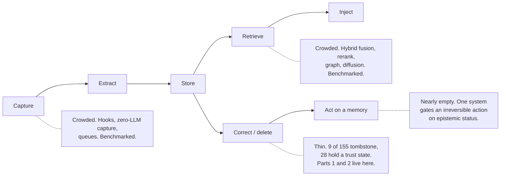

# What is actually new here — a novelty inventory

**Status:** first pass. A judgement list, not a count, and labelled as one.
**Origin:** written 2026-08-06 in answer to a plain question — *what are the most
novel ideas in the atlas?* — which the corpus can answer but no page assembles.
The [pattern library](../content/patterns/index.md) sorts by mechanism, the
[capability index](../content/capabilities.md) by mark, the
[verdicts](../content/verdicts.md) by system. Nothing sorts by *nobody else does
this*.

## What "novel" is allowed to mean in this note

Three different claims get made below and they carry very different weight:

1. **The atlas produced the framing.** The idea is not in the field's
   vocabulary — checked against the survey literature, not merely unseen by me.
   Strongest claim, smallest set.
2. **One implementation exists in the corpus.** A mechanism 1 of 155 systems
   carries. This is a claim about *inspectable code at pinned commits*, which is
   the usual limit: a closed system could hold any of these and this method would
   never know.
3. **The mechanism inverts a default.** Others do the same job the other way
   round, and the inversion is the interesting part.

None of these is a claim that the idea is *good*. Several are one implementation
because one implementation is all the idea deserves; the note says which.

And per [hazard 10](2026-07-28-methodology-hazards.md), everything here belongs
to the 284-judgement subset of the superlative audit — the part no query
verifies. The counts quoted are generated; the rankings are opinion.

## Part 1 — Framings the atlas produced

### The rejected-value tombstone

**What it does.** Records a refusal keyed on the **value**, not on the row, and
consults it on the *write* path. A later extraction proposing the same value
lands on the tombstone and is refused before it can become active. Almost
everything else corrects by hiding a row, which stops a reader seeing it and does
nothing to stop a writer recreating it.

**Why it is the strongest claim in the atlas.** The field's most comprehensive
survey of itself ([arXiv:2512.13564](https://arxiv.org/abs/2512.13564), 107
pages, 47 authors) contains none of *tombstone*, *rejected* or *negative*, while
its trustworthy-memory section asks for "verifiable forgetting and auditable
updates" as future work. So this is not a practice reported late. 9 of 155
systems carry it, one adopted it after this survey flagged its absence, and one
arrived at a weaker form keyed on exact text rather than a normalized value.

**What would falsify it.** A closed system holding the mechanism, or a survey
term the atlas failed to search for. The mechanism is also cheap to dismiss for
single-user CRUD memory, and the [pattern page](../content/patterns/rejected-value-tombstone.md)
now says so rather than gatekeeping.

### The layer below delete

**What it does.** Leaves the repository under review — the only finding in the
atlas that does — and reads the four vector engines the corpus depends on
(pgvector, Chroma + its hnswlib fork, Qdrant, LanceDB; named in 16, 11, 11 and 6
reports). Every `update/delete` cell in the matrix describes what a memory
system's *own code* does. This asks what happens one layer down.

**Why it matters.** Three findings, in ascending order of discomfort. The vector
is not returned by search in any of the four — the failure most often assumed
does not happen. The index *degrades*: a soft-deleted node keeps being traversed
and never returned, so recall drops for the surviving memories, which makes it a
cost paid specifically by the systems that correct most. And the embedding
survives: hnswlib's own comment says `markDelete` "does NOT really change the
current graph", `saveIndex` then writes the deleted vector to the index file
verbatim, and `unmarkDelete` restores it; LanceDB documents a seven-day floor as
a feature. pgvector is the exception that proves it is a choice — `VACUUM`
zeroes the element.

**The case that makes it land.** `memory-project` documents `purge()` for
"something that should never have been recorded in the first place (e.g.
accidentally jotted sensitive content)". It is `col.delete(ids=[doc_id])` on
Chroma. The function written for secrets is the one whose erasure is least
complete, and the memory system is faultless — it issued exactly the right call
to its store.

### The lying operation

**What it does.** Names a failure class: the call returns, the counter
increments, the audit row appends, and nothing happened.

**Why it needed a name.** Three independent teams shipped a fix for one each in a
four-week window — agentmemory `#1132` (a forget that deleted a nonexistent key,
counted it, and returned success), Hindsight `#3161` (a history row appended for
an `UPDATE` that changed zero rows), Mastra `#17910` (a memory list returning
empty on backend failure, indistinguishable from genuinely empty). It undercuts
every other question this atlas asks: "does a deleted value stay deleted"
presupposes the delete happened, and an audit row for a mutation that did not
occur is worse than no row. The test shape most projects write asserts that a
call returned; **the test that catches this reads the store back and compares**,
and it is rare. Three finds in a month from three unrelated teams suggests the
base rate is not low.

### "None found" is a claim about a search

**What it does.** Converts a reporting habit into a rule: before publishing any
sentence of the form *nothing does X*, grep the whole tree for X rather than the
part of it that ought to contain X.

**Why.** Two published negative claims failed on the same day —
[waku-agent](../content/systems/waku-agent.md) ("no correction path"; it was in
`waku/tools/`) and [Core Memory](../content/systems/core-memory.md) ("never
measured"; the assertion was in a test file outside the ten whose names tracked
the risky logic). Neither was stale; both were wrong when published. The
asymmetry is the point: **positive claims fail loudly**, because the code
contradicts them, while **negative ones fail silently**, because absence of
evidence in the wrong place is indistinguishable from absence.

### Labelling a pattern library by epistemic status

**What it does.** Splits the library three ways — *reporting* (many systems
already do this), *advocacy* (one or two instances; the atlas is arguing, not
reporting), and *established inside one category and unknown outside it*
(retrieval hysteresis and editable memory are mature in roleplay clients and
absent from every extraction-based system here).

**Why it counts as an idea.** A pattern library implies settled practice. Stating
that the pages the author thinks matter most are the ones resting on two
instances costs the library authority and is the only honest arrangement — a
reader adopting an advocacy pattern is acting on an argument, not a consensus,
and should know which.

## Part 2 — The mechanisms

Ranked by how close each comes to being the only one of its kind.

### 1. A durable record of a decision *not* to act — `agentic-context-engine`

**What it does.** The deduplicator pairs skills by cosine similarity and asks a
model to merge, update or keep them. A KEEP verdict is stored — the pair, the
reasoning, the similarity at the time — serialised with the skillbook and checked
in the detector's inner loop (`detector.py:234`) before the pair is ever offered
again.

**Why it is novel.** Every system here records what it did. This is the only one
that records what it declined to do *and consults the record*. Without it, two
skills that look alike and are not will look alike forever: every pass re-asks,
and a nondeterministic judge may answer differently each time. The general form —
negative decisions are as expensive to recompute as positive ones — is the same
insight as the tombstone, arrived at independently in a different phase.

### 2. Authority withdrawn by measured evidence — `agentrecall-x`

**What it does.** A human correction marked `authoritative` at severity p0 can
veto a proposed action. `isNoiseCandidate` then excludes a p0 from its own veto
once it has been surfaced at least three times and honoured under 30% of the
time.

**Why it is novel.** Everywhere else, provenance only *grants* standing —
user-stated outranks model-inferred, forever. This is the only mechanism in the
atlas where standing is granted, exercised, measured, and taken away, on the
stated reasoning that stale rules must not veto legitimate plans. The catch is
real and worth keeping attached to the idea: the precision driving the withdrawal
is judged by the same loop watching the agent, so the measurement is not
independent of what it measures.

### 3. The policy version stamped on every decision it made — `memledger`

**What it does.** Canonicalises `memory.policy.yaml` (RFC 8785), hashes it, and
records the hash in every event the policy influenced.

**Why it is novel.** Nothing else here can say which version of its own rules
produced a given call. Editing the policy never rewrites history; a decision
points at the rules that actually made it. The same report carries the atlas's
sharpest irony — the dedup lookup filters `status != 'deleted'`, so a fact the
user deleted is re-created on the next extraction. The most rigorous provenance
model in the corpus, and the one query that could act on it is written to skip
it.

### 4. The audit entry as a precondition, not a record — `palazzo`, `aura`

**What they do.** Palazzo's `log_strict` **fails the delete** when the write-ahead
entry cannot be durably appended, on the stated reasoning that the WAL is the
only trail — and the entry carries a text preview, so it says what was removed.
Aura keeps a SHA-256 chain beside its receipts (`seq`, `content_hash`,
`prev_hash`, `entry_hash`): deletion shows as a sequence gap, insertion as a
broken link, and verification re-hashes the on-disk bodies. I ran
`tests/test_audit_chain.py` — 16 passed, including modified-body, broken-link and
deleted-entry.

**Why they are novel together.** 39 of 155 systems carry an append-only mutation
audit. Every other one would read clean after being rewritten, and every other
one records a destruction that already happened. These two close the two
different holes in the same claim.

### 5. Erasure that does not break the proof — `aukora-kernel`, `lethe`

**What they do.** Aukora appends and fsyncs the receipt *before* the row, and
chains the **content hash** rather than the plaintext. Lethe signs the deletion:
an Ed25519 receipt over a Merkle root of the event log, verifiable by a third
party, with FTS5 deliberately not contentless so `DELETE` reaches the lexical
index by construction.

**Why they are novel.** The usual reading is that a tamper-evident log and a
right-to-be-forgotten are in tension. Hashing the hash dissolves it — erase the
plaintext, keep the chain. Lethe is the only system here that can hand you an
artifact a third party can check, which is the difference between an audit trail
and a claim about one.

### 6. Verifying the agent's claim about its own authorship — `csm`

**What it does.** Stores each file change as a before hash, an after hash and a
lineage manifest of per-line SHA-256 counts, then re-reads the file and
classifies the change `active | partially_superseded | superseded | reverted` by
comparing surviving line multiplicities. No model. No diff library. Line hashes
and set arithmetic.

**Why it is novel.** [Verify memory against its subject](../content/overview.md)
has four instances, and three of them check claims *about* an artifact. This one
checks a claim about the agent's own authorship of it, which catches a specific
and common failure: "I fixed the retry logic" in session three, when session five
rewrote the file. Every system here that stores a session summary carries that
risk and this is the only one that can answer it. Its own limit is stated —
survival in the file is a weaker claim than correctness.

### 7. Stochastic recall — `loongflow`

**What it does.** Samples a remembered solution from a Boltzmann distribution
over scores, with the temperature driven by the store's *measured* diversity and
bounded on both sides, so a collapsed store loosens selection until variety
returns.

**Why it is novel.** It names a failure nobody else here does: deterministic
top-*k* with a slightly wrong ranking function surfaces the same wrong memories
every time, and the alternatives are never seen. The only stochastic retrieval in
the atlas. It is right only where recall informs *what to try next* rather than
*what is true* — the same mechanism over facts about a person means the same
question gets different answers — and it gives up reproducibility, with no seed
or replay path for debugging a selection.

### 8. Trust that gates capability, graded by reversibility — `omi`, `openhuman`

**What they do.** Omi's `ACTION_POLICY` maps each epistemic status to a set of
permitted *uses*: `can_use_for_action` requires an `accepted` fact before an
irreversible action, so an unreviewed memory may answer a question with a
disclaimer and may not send, buy or delete. OpenHuman labels memories by **what
they may cause** rather than by how sure it is, with a taint lattice that
sanitization deliberately cannot launder — a redacted memory keeps its taint.

**Why they are novel.** 28 of 155 record a discrete trust state at all, and
nearly all of them spend it on ranking or filtering. These two spend it on
*permission*, which is the only use that changes what happens in the world.

### 9. Diffusion instead of traversal, and non-destructive entity resolution — `hipporag`

**What they do.** Seed a personalization vector with query-relevant nodes and run
Personalized PageRank over the whole graph, so multi-hop association is a
property of the diffusion rather than of a hop policy — with seed weights divided
by the entity's chunk count so hubs do not dominate, and low damping (0.5) to
keep relevance near the query's entities. Similar entities are linked with
weighted edges instead of being merged.

**Why they are novel.** Graphiti's own stated biggest risk is that
entity-resolution mistakes reshape a large portion of the graph. A synonymy edge
makes a wrong decision a weak spurious path instead of two destroyed identities.
Both fail the same way — cost (PPR runs over the whole graph per query),
attribution (no single signal explains a ranking), and blur once the graph is
dense.

### 10. Memory of what has not happened yet — `minecontext`, `memento`

**What they do.** MineContext separates event time from record time and **allows
event time to be in the future**. Memento's `status = 'sealed'` with a
`deliver_on` column puts an entry outside transcription, indexing and the
timeline entirely until a worker pass moves it into the normal pipeline.

**Why they are novel.** [Prospective memory](../content/overview.md) — a
commitment you have not kept yet — is the category almost nothing here models,
and a schema that forbids future timestamps cannot express it at all. Memento's
half is the better mechanism for a different reason: enforcement by *state*,
rather than by a predicate every query has to remember.

### 11. Honourable mentions, cheap enough to steal today

- **`echo-agent`'s `provenance_guard`** — the trust label belongs to the *write
  path* (`user_stated` 3, `consolidated` 2, `model_inferred` 1), so the model
  cannot nominate its own output as user-stated. Most trust models label the
  payload and are therefore forgeable by the thing they are meant to constrain.
- **`empryo`'s git co-change affinity** — a memory attached to files that
  historically change together with what you are editing surfaces without
  matching a query token, entered at RRF rank 5 so it stays behind a direct hit.
  A recall signal with no text in it.
- **`cosmonapse`'s failure vocabulary** — the only memory contract here that lets
  a backend decline, shed load, miss a deadline and roll back. Everywhere else
  the interface can only succeed or throw, so "I am overloaded" and "I have
  nothing" are the same answer.
- **`cambium`'s refusal to return an unearned pass** — its freshness tool prints
  `overdue=0 fresh=0` and concludes "NOTHING CHECKED… this is not evidence of
  freshness". A green check that means nothing was checked is the tooling version
  of the lying operation.

## Part 3 — What the list is shaped like

The mechanisms cluster, and the clustering is the finding.

Every novel idea in Part 2 sits on the right-hand side. The field competes on
capture and retrieval, where the work is measurable and a benchmark exists to win.
The originality shows up **after something has been believed** — refusing a
re-assertion, withdrawing standing, recording a decision not to act, proving a
deletion, deciding what a memory is allowed to *cause*. That is also where the
counts thin out, and the two facts are the same fact: nobody benchmarks the phase,
so nobody has to build it.

The second shape: seven of the eleven entries are about **refusal** — a write
refused, a veto revoked, a delete that fails when it cannot be logged, a backend
allowed to decline, a check that will not return a pass. This is the observation
[refusal as a lens](2026-07-28-refusal-as-a-lens.md) made from ten cases, holding
up on a set assembled for a different reason. Systems converge on architecture and
diverge on what they will not do.

## Part 4 — Drift found while assembling this

Two stale figures in [`content/overview.md`](../content/overview.md), both of the
kind [the superlative audit](2026-08-04-the-superlative-audit-first-pass.md)
predicted — a numerator nothing guards:

- **Line 61** — *"The atlas holds 148 reports across 147 repositories"*, beside
  generated lines throughout the same page reading *of 155*. `content/systems/`
  holds 155 files.
- **Line 115** — *"Seven systems in this entire atlas can record that a value was
  rejected"*, where the generated capability line at 1786 lists **nine** and
  names them. The sentence points the reader at the capability index for the live
  count, which is the right hedge and did not stop the number going stale in
  place.

Neither is corrected here; a note is not the place to change published counts.
Both are one-line fixes and the second is the atlas's most-quoted sentence.

## Follow-ups

- Decide whether Part 1 belongs on the site. It is the answer to *why should I
  read this rather than the survey*, and no page currently gives it.
- The count-claim checker proposed by the superlative audit would have caught both
  Part 4 items. Still unwritten.
- Part 2 entries 1, 2 and 3 are each one implementation. That is the profile of
  the tombstone before it had three, so the useful action is to watch for a second
  instance rather than to promote them now.
